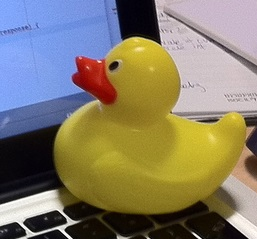

## Course Directory

### Return to the course outline

[← Back to AP CSA / 返回课程目录](../../index.html)

## Topic Intro

### Why Java?

What do <span class="term">Android phones</span>, <span class="term">Minecraft</span>, and <span class="term">Netflix</span> have in common? They all use <span class="term">Java</span> in real software systems.

::: {.tight-list}
- Java is a <span class="term">programming language</span> (编程语言) used worldwide to create software.
- AP CSA uses Java to study program structure, logic, and problem solving.
- App Inventor apps can be translated to Java before they run on phones or tablets.
:::

## Algorithms

### Step-by-step problem solving

<span class="term">Algorithms</span> (算法) define step-by-step processes for completing a task or solving a problem.

::: {.tight-list}
- A recipe is an algorithm for cooking a meal.
- Directions are an algorithm for getting to a place.
- In computer science, algorithms can sort, search, calculate, or control a game.
:::

<span class="term">Sequencing</span> (顺序执行) means steps are completed <span class="mark">one at a time in a specific order</span>.

## Planning Code

### English, diagrams, and pseudocode

Algorithms can be represented using:

::: {.tight-list}
- written language
- diagrams or flow charts
- <span class="term">pseudocode</span> (伪代码), simplified code written for planning
:::

The classroom test is practical: <span class="mark">each step should be precise enough to become a line of code</span>.

## Reorder Task

### Brushing teeth algorithm

Put the steps in a sensible sequence.

::: {.tight-list}
- Take the toothbrush.
- Put some toothpaste on the toothbrush.
- Put the brush in your mouth.
- Brush each section of your teeth.
- Rinse your mouth with water.
:::

Check your answer by asking whether a robot could follow the order without guessing.

## Student Response Task

### Peanut butter and jelly algorithm

Write an algorithm for someone, maybe a robot, to make a peanut butter and jelly sandwich.

::: {.tight-list}
- Include at least <span class="mark">5 precise steps</span>.
- Keep the steps in the order they must happen.
- Have another person act it out exactly as written.
- Revise any step that requires common-sense guessing.
:::

## First Java Program

### Class and main method

Every Java program is written as a <span class="term">class</span> (类). A <span class="term">method</span> (方法) is a block of code that performs a specific task.

```java
public class MyClass
{
    public static void main(String[] args)
    {
        // Put your code here!
    }
}
```

The Java run-time starts execution in the <span class="term">main method</span> (主方法).

## Code Task

### Print your name

Run the starter code, then change the string so it prints your own greeting.

```java
public class MyClass
{
    public static void main(String[] args)
    {
        System.out.println("Hi there!");
    }
}
```

Expected starter output:

```text
Hi there!
```

Keep the starting and ending double quotation marks.

## Compiling and Running

### Source file, compiler, IDE

::: {.tight-list}
- Java source code is saved in a <span class="term">source file</span> such as `MyClass.java`.
- If using your own files, the class name and file name must match.
- A <span class="term">compiler</span> (编译器) checks code for some errors and translates Java source files into class files.
- An <span class="term">IDE</span> (集成开发环境) provides tools to write, compile, and run code.
:::

Errors detectable by the compiler must be fixed <span class="mark">before the program can run</span>.

## Java Keywords

### Lowercase keywords, capitalized class names

<span class="term">Keywords</span> are reserved words with special meaning in Java.

::: {.tight-list}
- `public`, `class`, `static`, and `void` must be lowercase.
- `System` and `String` are class names and are capitalized.
- A complete action line is a <span class="term">statement</span> (语句).
- Most Java statements end with a <span class="mark">semicolon `;`</span>.
:::

## Reorder Task

### Build the main method header

Use the needed blocks to build the first line of the `main` method.

```text
public
static
void
main
(
String
[]
args
)
```

Correct line:

```java
public static void main(String[] args)
```

Distractors to reject: `Public`, `Static`, `Void`, and an extra `()`.

## Reorder Task

### Build a print statement

Use the needed blocks to create a statement that prints `Hi!`.

```text
System
.
out
.
println
(
"
Hi!
"
)
;
```

Correct statement:

```java
System.out.println("Hi!");
```

Reject `system` or `Out` because Java is <span class="mark">case-sensitive</span>.

## Syntax Errors

### Debugging is normal

A <span class="term">syntax error</span> (语法错误) means the program does not follow Java's writing rules.

::: {.tight-list}
- missing semicolon `;`
- open curly brace `{` without matching `}`
- open quote `"` without matching close quote
- wrong capitalization, such as `system` instead of `System`
:::

The process of finding and removing errors is <span class="term">debugging</span> (调试).

## Reading Error Messages

### Start with file, line, message, caret

```text
FirstClass.java:5: error: unclosed string literal
       System.out.println("Hi there!);
                          ^
1 error
```

::: {.tight-list}
- `FirstClass.java` gives the file.
- `5` gives the line where the compiler detected the problem.
- `unclosed string literal` says a string was opened but not closed.
- `^` points near where the compiler noticed the problem.
:::

The actual fix may be on the same line, earlier, or a little later.

## Debugging Task

### Compile-time error 1

Fix the code so it prints `Hi there!`.

```java
public class FirstClass
{
    public static void main(String[] args)
    {
        System.out.println("Hi there!);
    }
}
```

Expected output:

```text
Hi there!
```

Focus: pair the opening and closing double quotation marks.

## Debugging Task

### Compile-time error 2

Fix the code so it compiles and runs.

```java
public class SecondClass
{
    public static void main(String[] args)
    {
        System.out.println("Hi there!";
    }
}
```

Expected output:

```text
Hi there!
```

Focus: close every method call with the matching parenthesis.

## Debugging Task

### Compile-time error 3

This program has more than one error. Read the first compiler message, fix one issue, then compile again.

```java
public class ThirdClass
{
    public static void main(String[] args)
    {
        system.out.println("Hi there!")
    }
}
```

Expected output:

```text
Hi there!
```

Focus: `System` capitalization and the missing semicolon.

## Run-Time Errors

### Compiles first, fails while running

A <span class="term">run-time error</span> happens while the program is executing. An <span class="term">exception</span> interrupts normal execution.

```java
public class DivideByZero
{
    public static void main(String[] args)
    {
        System.out.println("It makes no sense to divide a number by zero!");
        System.out.println(3 / 0);
    }
}
```

After compilation succeeds, `3 / 0` causes an <span class="term">ArithmeticException</span>.

## Logic Errors

### Code can run and still be wrong

A <span class="term">logic error</span> is a mistake in the algorithm or program that causes incorrect behavior.

::: {.tight-list}
- The program may compile successfully.
- The program may run without crashing.
- Testing with specific data is how you detect the wrong outcome.
:::

This is why precise algorithms matter before writing Java code.

## Comments

### Notes for humans, skipped by the compiler

```java
/* MyClass.java
   Programmer: My Name
   Date:
*/

int max = 10; // this keeps track of the max score
```

::: {.tight-list}
- `//` starts a single-line comment.
- `/*` and `*/` surround a multi-line comment.
- Comments should explain intent or context, not repeat obvious syntax.
:::

## Groupwork Debugging Challenge

### Pair programming and rubber-duck debugging

{fig-align="left" width="16%"}

Work in pairs. One student is the <span class="term">driver</span> who edits code; the other is the <span class="term">navigator</span> who reads messages and checks logic. Switch roles often.

```java
public class Challenge1_1
{
    public static void main(String[] args)
    {
        System.out.print("Good morning! ")
        system.out.print("Good afternoon!);
        System.Print " And good evening!";
}
```

Expected output contains:

```text
Good morning! Good afternoon! And good evening
```

## Classroom Check

### A complete answer should...

::: {.tight-list}
- define an <span class="term">algorithm</span> as a step-by-step process
- explain <span class="term">sequencing</span> as completing steps one at a time in order
- identify the <span class="term">class</span> and <span class="term">main method</span> in a basic Java program
- state that a <span class="term">compiler</span> translates Java and catches some errors before running
- read a compiler message using file, line, error message, and caret
- distinguish <span class="term">syntax errors</span>, <span class="term">run-time errors</span>, <span class="term">logic errors</span>, and <span class="term">comments</span>
:::

## End

### Return to the course outline

[← Back to AP CSA / 返回课程目录](../../index.html)
