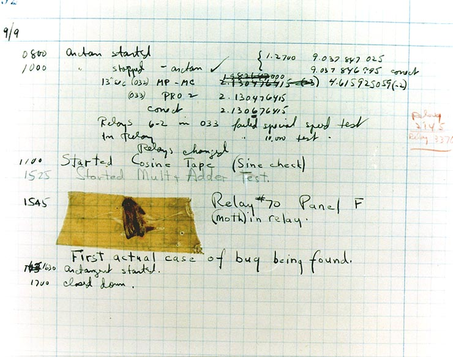

## Course Directory

### Return to the course outline

[← Back to AP CSA / 返回课程目录](../../index.html)

## Why Java?

### Real software, not toy context

What do <span class="term">Android phones</span>, <span class="term">Minecraft</span>, and <span class="term">Netflix</span> have in common? They all use <span class="term">Java</span> in real software systems.

::: {.tight-list}
- Java is a <span class="term">programming language</span> (编程语言) used worldwide.
- AP CSA uses Java as the language for learning program structure and problem solving.
- The course starts from <span class="mark">real applications</span>, then moves into syntax and logic.
:::

## Algorithms

### Step-by-step problem solving

An <span class="term">algorithm</span> (算法) is a step-by-step process for completing a task or solving a problem.

::: {.tight-list}
- A recipe is an algorithm.
- Directions to a friend's house are an algorithm.
- In computing, algorithms can sort, search, calculate, or control software behavior.
:::

<span class="term">Sequencing</span> (顺序执行) means the steps are completed in a specific order, one at a time.

## Algorithms

### Planning before coding

Before writing Java, we often describe the process in:

::: {.tight-list}
- plain English
- a diagram or flow
- <span class="term">pseudocode</span> (伪代码)
:::

The practical test for a good algorithm is simple: <span class="mark">each step should be precise enough to become code</span>.

## Classroom Task

### Keep the algorithm concrete

A classroom-ready warm-up from the textbook:

::: {.tight-list}
- reorder the steps for <span class="mark">brushing your teeth</span>
- write at least <span class="mark">5 precise steps</span> for making a peanut butter and jelly sandwich
- then ask: <span class="term">Could a robot actually follow these steps?</span>
:::

This is the bridge from everyday instructions to formal programming logic.

## First Java Program

### Class and main method

```java
public class MyClass
{
    public static void main(String[] args)
    {
        System.out.println("Hi there!");
    }
}
```

::: {.tight-list}
- Every Java program is written as a <span class="term">class</span> (类).
- Execution starts in the <span class="term">main method</span> (主方法).
- Curly braces <span class="mark">{ }</span> must match.
:::

## Compiling and Running

### From source file to runnable code

::: {.tight-list}
- Java source code is saved in a <span class="term">source file</span> such as `MyClass.java`.
- The class name and file name must match.
- A <span class="term">compiler</span> (编译器) translates Java into code the machine can run.
- An <span class="term">IDE</span> (集成开发环境) helps write, compile, and run programs.
:::

The key idea is <span class="mark">Java is written for humans first, then compiled for computers</span>.

## Keywords and Statements

### Read the structure carefully

Important Java words in this first lesson include:

::: {.tight-list}
- `public`
- `class`
- `static`
- `void`
- `String`
- `System.out.println(...)`
:::

A complete action line is a <span class="term">statement</span> (语句), and most Java statements end with a <span class="mark">semicolon `;`</span>.

## Debugging

### Syntax, compile-time messages, and run-time failures

::: {.tight-list}
- A <span class="term">syntax error</span> means the program breaks Java's writing rules.
- A <span class="term">compile-time error</span> is detected by the compiler before the program runs.
- A <span class="term">run-time error</span> happens while the program is executing.
- An <span class="term">exception</span> is a run-time error that interrupts normal execution, such as `ArithmeticException`.
:::

Read the error message in the pattern <span class="mark">file : line : error</span>, then look at the caret `^`.

## Debugging

### Bugs are normal

{fig-align="center" width="46%"}

::: {.figure-note}
The textbook uses Grace Hopper's famous logbook example to normalize debugging: bugs are expected, and careful reading beats panic.
:::

Use <span class="term">comments</span> such as `// single-line` and `/* multi-line */` to explain intent, and use pair discussion or rubber-duck explanation when stuck.

## Classroom Check

### A complete answer should...

::: {.tight-list}
- define an <span class="term">algorithm</span> as a step-by-step process
- explain <span class="term">sequencing</span> as doing steps in order
- identify <span class="term">class</span> and <span class="term">main method</span> in a basic Java program
- state that a <span class="term">compiler</span> translates Java and catches some errors before running
- distinguish <span class="term">syntax errors</span>, <span class="term">run-time errors</span>, and <span class="term">comments</span>
:::

## End

### Return to the course outline

[← Back to AP CSA / 返回课程目录](../../index.html)
