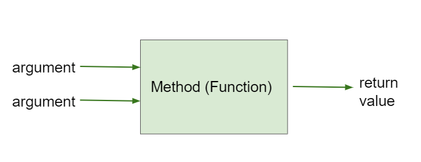
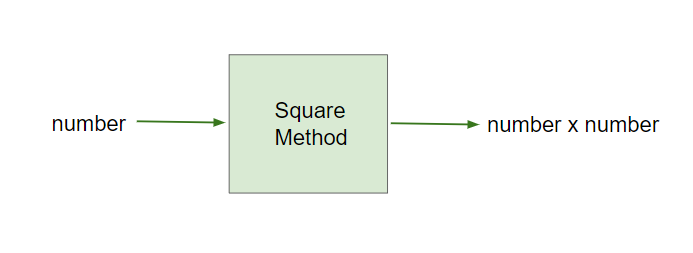
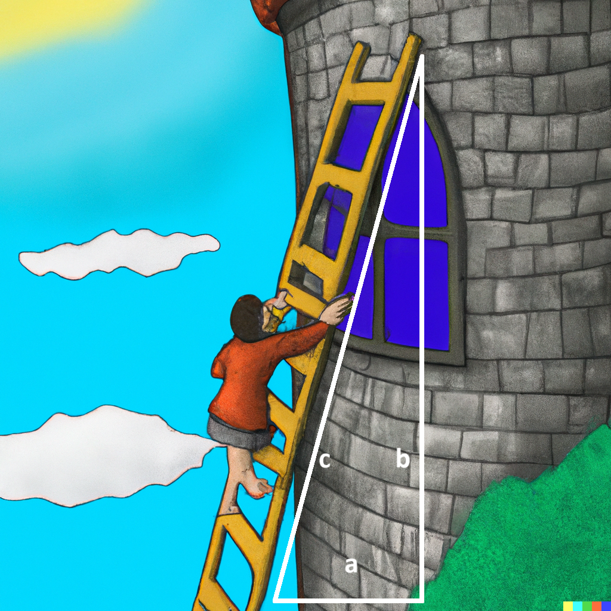

## Course Directory

### Return to the course outline

[← Back to AP CSA / 返回课程目录](../../index.html)

## Topic Intro

### Static methods belong to the class

Most methods used so far are <span class="term">static methods</span>, also called <span class="term">class methods</span> (类方法).

```java
public static returnType methodName(parameters)
{
    // method body
}
```

The keyword `static` appears before the return type. The `main` method is always static.

## Void and Non-Void

### Some methods return a value

Most early methods were <span class="term">void methods</span>, which do not return a value. Many methods calculate and return a value.

{fig-align="center" width="42%"}

A <span class="term">non-void method</span> (非 void 方法) returns a value whose type matches the return type in the method header.

## Square Method

### Header, body, and return

{fig-align="center" width="44%"}

```java
public static int square(int number)
{
    int result = number * number;
    return result;
}
```

`static int` means this class method returns an `int`.

## Return Statement

### Send a value back to the caller

The <span class="term">return statement</span> sends a value back to the method call.

::: {.tight-list}
- The return value must match the declared return type.
- A return statement ends the method execution.
- Code after a return statement in the same path is not executed.
:::

In `square(5)`, the method returns `25`.

## Using Returned Values

### Store it or use it in an expression

When a method returns a value, use that value.

```java
int y = square(5);
System.out.println(y);

System.out.println(square(4));
```

Common error: calling a non-void method and ignoring the returned value when the value is needed later.

## Code Task

### Add another square call

Add another call to `square` in `main` that prints the square of `6`.

```java
public class SquareMethod
{
    public static int square(int number)
    {
        int result = number * number;
        return result;
    }

    public static void main(String[] args)
    {
        System.out.println("5 squared is " + square(5));
        // Call square to print the square of 6.
    }
}
```

Expected output should include `36`.

## Trace Task

### Returned values inside an expression

What does this code print?

```{.java .smaller}
public class MethodTrace
{
    public static int square(int x)
    {
        return x * x;
    }

    public static int divide(int x, int y)
    {
        return x / y;
    }

    public static void main(String[] args)
    {
        System.out.println(square(3) + divide(5, 2));
    }
}
```

Answer: `11`, because `square(3)` returns `9` and `divide(5, 2)` returns `2`.

## Common Errors

### Match types, count, and order

Common errors with non-void methods include:

::: {.tight-list}
- forgetting to use the returned value
- saving a returned `double` in an `int`
- passing too many or too few arguments
- passing arguments in the wrong order
- passing values with incompatible types
:::

Use the method signature to check every call.

## Debugging Task

### Fix method calls and return types

Do not change the methods except `main`.

```{.java .smaller}
public class MathMethods
{
    public static int square(int number)
    {
        return number * number;
    }

    public static double divide(double x, double y)
    {
        return x / y;
    }

    public static void main(String[] args)
    {
        int result1 = square(4.0, 2);
        int result2 = divide(2, 5);
        System.out.println("4 squared is " + result1);
        System.out.println("5 divided by 2 is " + result2);
    }
}
```

## Debugging Task

### Target fix

The corrected calls should use:

```java
int result1 = square(4);
double result2 = divide(5, 2);
```

Expected output:

```text
4 squared is 16
5 divided by 2 is 2.5
```

Notice that the return type of `divide` is `double`, so `result2` must be `double`.

## Methods Outside the Class

### Use the class name with dot operator

Inside the class that defines a static method, the class name is optional. From another class, include the class name.

```java
ClassName.methodName(arguments)
```

Examples:

```java
Math.sqrt(9);
Math.pow(3, 2);
```

This is why Java library class methods are usually called with `ClassName.methodName(arguments)`.

## Math Preview

### `sqrt` and `pow`

The next topic uses the `Math` class.

```java
double x = Math.pow(3, 2);
double y = Math.sqrt(9);
```

::: {.tight-list}
- `Math.pow(3, 2)` returns `9.0`
- `Math.sqrt(9)` returns `3.0`
:::

Both are class methods, and both return `double` values.

## Groupwork Challenge

### Ladder on Tower

{fig-align="left" width="18%"}

Use the Pythagorean theorem to compute the ladder length.

```text
c = sqrt(a^2 + b^2)
```

where `a` and `b` are the triangle's legs, and `c` is the hypotenuse.

Correct Java expressions include:

```java
Math.sqrt(a * a + b * b)
Math.sqrt(Math.pow(a, 2) + Math.pow(b, 2))
```

## Groupwork Challenge

### Ladder starter code

Complete `ladderSizeNeeded`, then call it with height `30` and width `40`.

```{.java .smaller}
public class LadderHelper
{
    public static double ladderSizeNeeded(double height, double width)
    {
        double ladderSize;
        // Calculate ladderSize using Math.sqrt and Math.pow or multiplication.

        return ladderSize;
    }

    public static void main(String[] argv)
    {
        double size;
        // Call ladderSizeNeeded with height 30 and width 40.

        System.out.println("Beloved, I need a " + size + " foot ladder!");
    }
}
```

Expected output:

```text
Beloved, I need a 50.0 foot ladder!
```

## AP-Style Quick Check

### Which call compiles?

Given this method:

```java
public static double calculatePizzaBoxes(int numOfPeople, double slicesPerBox)
{
    // implementation not shown
}
```

Which line compiles in the same class?

```java
double result = calculatePizzaBoxes(45, 9.0);
```

Reason: the arguments match `int, double`, and the returned `double` is stored in a `double`.

## AP-Style Trace Check

### Static method calls from another static method

```java
public static void inchesToCentimeters(double i)
{
    double c = i * 2.54;
    printInCentimeters(i, c);
}

public static void printInCentimeters(double inches, double centimeters)
{
    System.out.print(inches + "-->" + centimeters);
}
```

If `inchesToCentimeters(10)` is called, the output is:

```text
10.0-->25.4
```

## Classroom Check

### A complete answer should...

::: {.tight-list}
- define class methods as <span class="term">static</span> methods associated with the class
- distinguish <span class="term">void</span> methods from <span class="term">non-void</span> methods
- explain that a non-void method returns a value matching its return type
- use or store a returned value correctly
- match method calls by argument number, type, and order
- call methods in other classes with `ClassName.methodName(arguments)`
- use `Math.sqrt` and `Math.pow` inside a returned-value calculation
:::

## End

### Return to the course outline

[← Back to AP CSA / 返回课程目录](../../index.html)
