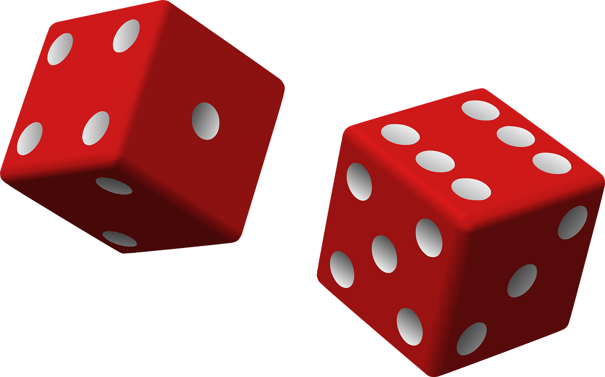
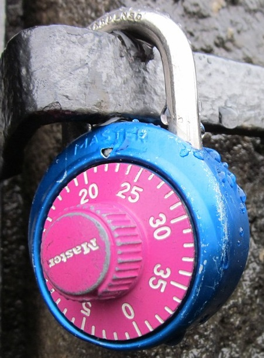

## Course Directory

### Return to the course outline

[← Back to AP CSA / 返回课程目录](../../index.html)

## Math Class

### Built-in static methods in `java.lang`

The Java `Math` class is part of <span class="term">`java.lang`</span>, so it is available by default.

These are <span class="term">class methods</span>, so they are called with the class name:

::: {.tight-list}
- `Math.abs(...)`
- `Math.pow(...)`
- `Math.sqrt(...)`
- `Math.random()`
:::

## Mathematical Functions

### What each AP subset method does

::: {.tight-list}
- `abs` returns absolute value
- `pow(base, exponent)` returns a power
- `sqrt(number)` returns the positive square root
- `random()` returns a `double` from <span class="mark">0.0 inclusive to 1.0 exclusive</span>
:::

These methods return values, so the caller must print them, store them, or use them in expressions.

## Distance with `abs`

### Absolute difference on a number line

{fig-align="center" width="72%"}

The distance between two numbers can be written as:

```java
Math.abs(a - b)
```

This is a good example of combining arithmetic with a class method.

## Random Numbers

### Why games need unpredictability

{fig-align="center" width="18%"}

`Math.random()` gives a decimal value in the interval:

`0.0 <= value < 1.0`

Important point: it can return `0.0`, but it never returns exactly `1.0`.

## Random Numbers

### Stretch, cast, then shift

```java
int rnd1 = (int)(Math.random() * 10);      // 0 to 9
int rnd2 = (int)(Math.random() * 10) + 1;  // 1 to 10
int rnd3 = (int)(Math.random() * 6) + 5;   // 5 to 10
```

Recipe:

::: {.tight-list}
- multiply to stretch the range
- cast to `int` to drop decimals
- add the minimum value to shift the range
:::

## Classroom Task

### Random combination lock challenge

{fig-align="center" width="18%"}

Retained classroom work for this topic includes:

::: {.tight-list}
- trying `abs`, `pow`, and `sqrt`
- building distance formulas
- generating random integers in specific ranges
- <span class="term">1.11.3 Coding Challenge: Random Numbers</span>
:::

## Classroom Check

### A complete answer should...

::: {.tight-list}
- call `Math` methods with the class name
- explain what `abs`, `pow`, and `sqrt` return
- state the range of `Math.random()`
- convert a random `double` into a bounded random `int`
- use `Math.abs(a - b)` for numeric distance
:::

## End

### Return to the course outline

[← Back to AP CSA / 返回课程目录](../../index.html)
