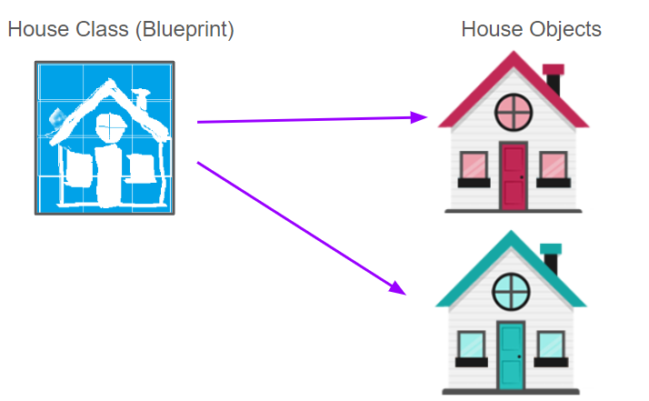
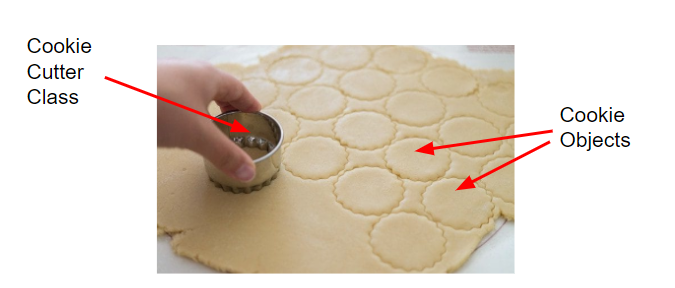
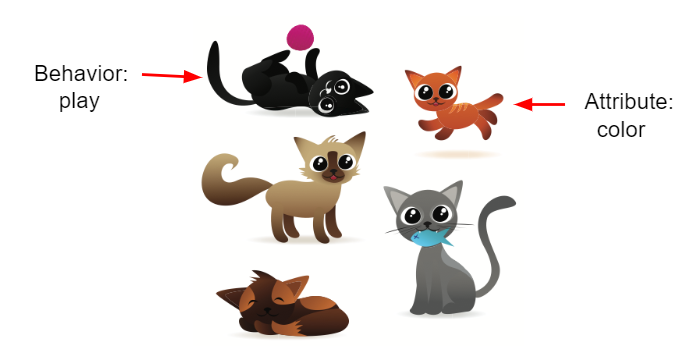
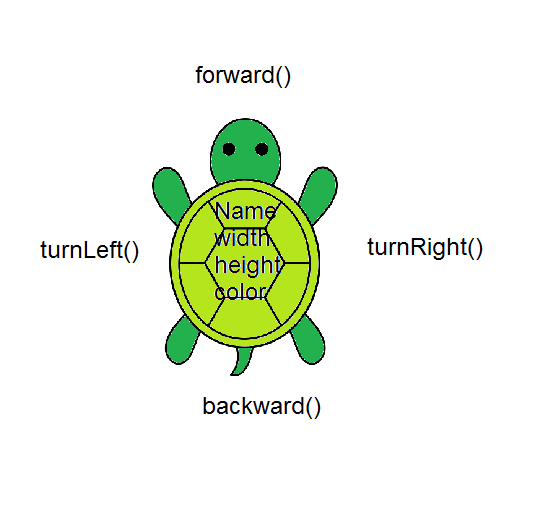
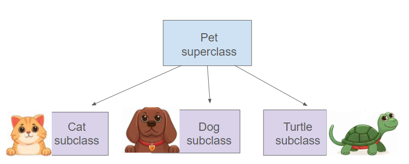
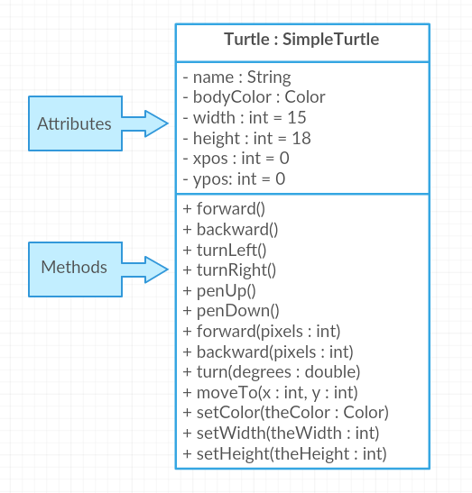
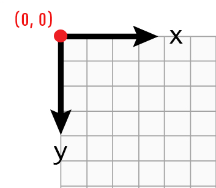

## Course Directory

### Return to the course outline

[← Back to AP CSA / 返回课程目录](../../index.html)

## Topic Intro

### Java is object-oriented

Java is an <span class="term">object-oriented programming</span> language. One main way to design Java programs is in terms of <span class="term">objects</span> (对象).

Objects combine:

::: {.tight-list}
- data
- code that operates on that data
:::

To create objects, Java first defines a <span class="term">class</span> (类), which provides a blueprint for creating objects.

## Classes and Objects

### Blueprint and instance

{width="36%"}
{width="52%"}

A class is like a blueprint or cookie cutter. An object is a specific thing created from that class.

Objects are <span class="term">instances</span> (实例) of the class.

## Class as Data Type

### Reference types can declare variables

A class can define a new data type. The `Turtle` class can be used to declare turtle variables.

```java
Turtle yertle;
Turtle myrtle;
```

Just as `int` variables hold numbers, `Turtle` variables can refer to animated turtle objects.

Class-type variables are <span class="term">reference variables</span>.

## Attributes and Behaviors

### What an object knows and does

A class defines the <span class="term">attributes</span> and <span class="term">behaviors</span> that objects of that class can have.

::: {.tight-list}
- Attributes are data or properties an object knows about itself.
- Behaviors are actions an object can do.
- Behaviors are implemented by methods.
- Each object has its own values for attributes.
:::

Example: a turtle object has color and position, and it can move or turn.

## Cat Objects

### Same class, different attribute values

{fig-align="center" width="66%"}

Student response task:

::: {.tight-list}
- Name at least 3 cat attributes.
- Name at least 3 cat behaviors.
- For one visible cat, give an attribute value.
:::

Attributes are often nouns or adjectives; behaviors are often verbs.

## Turtle Object Model

### Concrete object-oriented vocabulary

{fig-align="center" width="48%"}

::: {.tight-list}
- `name`, `width`, `height`, and color are attributes.
- `forward()`, `backward()`, `turnLeft()`, and `turnRight()` are methods.
- Methods define behavior.
:::

The `Turtle` class makes object state and behavior visible.

## Vocabulary Check

### Match the concept

| Definition | Concept |
|---|---|
| a specific instance of a class with defined attributes | object |
| defines a new data type and acts like a blueprint | class |
| what the object knows about itself | attributes or instance variables |
| what an object can do | behaviors or methods |

Use this vocabulary before writing Turtle code.

## Quick Checks

### Class and object reasoning

| Question | Answer |
|---|---|
| How many objects can you create from a class? | as many as needed |
| What specifies object behavior in Java? | methods |
| What are object data or properties called? | attributes |

One class definition can create many objects.

## Turtle Class

### Create and use a turtle object

```java
import java.awt.*;
import java.util.*;

public class TurtleTest
{
    public static void main(String[] args)
    {
        World habitat = new World(300, 300);
        Turtle yertle = new Turtle(habitat);

        yertle.forward();
        yertle.turnLeft();
        yertle.forward();

        habitat.show(true);
    }
}
```

`yertle` is an object created from the `Turtle` class.

## Dot Operator

### Ask an object to execute a method

The <span class="term">dot operator</span> `.` runs an object's method.

```java
yertle.forward();
yertle.forward(50);
```

::: {.tight-list}
- `yertle.forward()` asks `yertle` to move forward by the default amount.
- `yertle.forward(50)` passes an argument and asks `yertle` to move 50 pixels.
- Parentheses are required even when the argument list is empty.
:::

## Code Task

### Change the turtle movement

In the starter code, `yertle` goes forward and turns left. Change it to make `yertle` go `forward` twice and then `turnRight`.

```java
World habitat = new World(300, 300);
Turtle yertle = new Turtle(habitat);

yertle.forward();
yertle.turnLeft();

habitat.show(true);
```

Completion checks:

::: {.tight-list}
- at least two `yertle.forward()` calls
- at least one `yertle.turnRight()` call
:::

## Reference Variables

### Object variables hold references

A variable of a reference type such as `Turtle` holds an object reference, which can be thought of as the memory address of that object.

```java
Turtle yertle = new Turtle(habitat);
```

Contrast:

::: {.tight-list}
- primitive variables such as `int` hold one simple value
- object references point to complex objects with many attributes
:::

## Creating Multiple Objects

### One class, many instances

Use the pattern:

```java
ClassName variableName = new ClassName(arguments);
```

Example:

```java
World habitat = new World(300, 300);
Turtle yertle = new Turtle(habitat);
Turtle myrtle = new Turtle(habitat);
```

Each turtle can move independently while sharing the same class definition.

## Code Task

### Add another turtle

Add a third turtle object to this program.

```java
World habitat = new World(300, 300);
Turtle yertle = new Turtle(habitat);
Turtle myrtle = new Turtle(habitat);

yertle.forward();
yertle.turnLeft();
yertle.forward();

myrtle.turnRight();
myrtle.forward();

habitat.show(true);
```

Completion check: at least three occurrences of `new Turtle(habitat)`.

## Inheritance Boundary

### Useful vocabulary, not the main AP focus here

{fig-align="center" width="56%"}

<span class="term">Inheritance</span> lets a subclass reuse attributes and behaviors from a superclass.

::: {.tight-list}
- superclass: more general class
- subclass: more specific class
- all Java classes are subclasses of `Object`
:::

Designing and implementing inheritance relationships is outside the AP CSA course and exam scope here.

## Turtle Methods

### Class diagram and method list

{fig-align="center" width="52%"}

Use the class diagram to identify:

::: {.tight-list}
- attributes stored by the turtle
- methods the turtle can execute
- which methods require arguments
:::

## Turtle Coordinates

### Screen coordinates are not Cartesian

{fig-align="center" width="30%"}

The Turtle world uses screen coordinates.

::: {.tight-list}
- `(0, 0)` is at the top-left corner.
- `x` increases to the right.
- `y` increases downward.
- A new turtle begins facing north, toward the top of the page.
:::

## Mixed-Up Code

### Draw a digital 7

Put the code blocks in order. The turtle should draw a line upward, turn left, and draw another line.

```java
public class Draw7
{
    public static void main(String[] args)
    {
        World habitat = new World(300, 300);
        Turtle yertle = new Turtle(habitat);
        yertle.forward();
        yertle.turnLeft();
        yertle.forward();
        habitat.show(true);
    }
}
```

Remember: a turtle starts facing north.

## Code Task

### Type the digital 7 program

After ordering the blocks, type the same movement into the starter program.

```java
import java.awt.*;
import java.util.*;

public class TurtleDraw7
{
    public static void main(String[] args)
    {
        World habitat = new World(300, 300);
        Turtle yertle = new Turtle(habitat);

        // Make yertle draw a 7.

        habitat.show(true);
    }
}
```

Required sequence: `forward`, `turnLeft`, `forward`.

## Code Task

### Draw a digital 8

Make `yertle` draw the digital number `8` as two squares stacked on top of each other.

```java
import java.awt.*;
import java.util.*;

public class TurtleDraw8
{
    public static void main(String[] args)
    {
        World habitat = new World(500, 500);
        Turtle yertle = new Turtle(habitat);

        yertle.forward();

        habitat.show(true);
    }
}
```

Completion checks: at least 7 calls to `forward` and at least 5 turns.

## Groupwork Coding Challenge

### Draw letters

Working in pairs, use a turtle to draw simple block-style initials using straight lines.

Allowed methods:

::: {.tight-list}
- `forward()`
- `turnLeft()`
- `turnRight()`
- `backward()`
- `penUp()`
- `penDown()`
:::

Act out the code as the turtle before running it.

## Groupwork Coding Challenge

### Turtle Letter starter

```java
import java.awt.*;
import java.util.*;

public class TurtleLetter
{
    public static void main(String[] args)
    {
        World habitat = new World(300, 300);
        // Create a turtle object.

        // Have it draw your initials.

        habitat.show(true);
    }
}
```

A strong solution should create a turtle object and contain at least 20 lines of code, including meaningful movement and pen commands.

## AP-Style Quick Checks

### Object vocabulary

Dog class example:

::: {.tight-list}
- `breed`, `age`, and `name` are attributes.
- an object `pet` declared as type `Dog` is an instance of the `Dog` class.
:::

Party class example:

::: {.tight-list}
- `numOfPeople`, `discoLightsOn`, and `partyStarted` are attributes.
- `myParty` is an instance of the `Party` class.
:::

Do not confuse an object's name with one of its attributes.

## Classroom Check

### A complete answer should...

::: {.tight-list}
- define <span class="term">class</span>, <span class="term">object</span>, and <span class="term">instance</span>
- explain that a class defines a new reference type
- distinguish <span class="term">attributes</span> from <span class="term">behaviors</span>
- explain that object variables hold references
- use `new ClassName(arguments)` to create an object
- use the dot operator to call an object's methods
- read Turtle screen coordinates correctly
- explain inheritance vocabulary while keeping it outside the main AP implementation focus
:::

## End

### Return to the course outline

[← Back to AP CSA / 返回课程目录](../../index.html)
