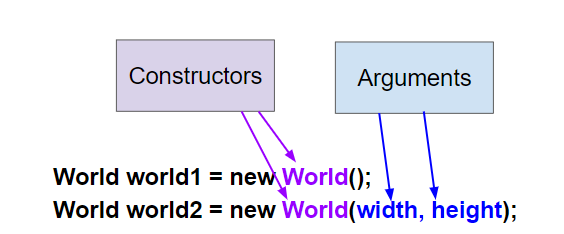

## Course Directory

### Return to the course outline

[← Back to AP CSA / 返回课程目录](../../index.html)

## Topic Intro

### Constructors initialize new objects

A Java class defines what objects of the class know, which are **attributes**, and what they can do, which are **behaviors**.

Each class has **constructors** (构造器), which are used to initialize the attributes in a newly created object.

**Constructors** have the same name as the class.

## Creating New Objects

### `new ClassName(arguments)`

A new object is created with the `new` keyword followed by the class name, which is a call to the constructor.

```java
// To create a new object and call a constructor write:
// ClassName variableName = new ClassName(arguments);
World habitat = new World();    // create a new World object
Turtle t = new Turtle(habitat); // create a new Turtle object
```

The new object is saved in a variable of a **reference type**.

## World Constructors

### More than one constructor

There can be more than one constructor defined in a class.

This is called **overloading** (重载) the constructor.

The `World` class has the `2` constructors shown below.

{fig-align="center" width="50%"}

## World Constructors

### No-argument and width-height forms

The **no-argument constructor** `World()` has no arguments inside the parentheses following the name of the constructor.

It creates a graphical window with a default size of `640x480` pixels.

The second constructor, `World(int width, int height)`, takes two integer arguments and initializes the `World` object's width and height.

```java
World world1 = new World(); // creates a default size 640x480 world
World world2 = new World(300,400); // creates a 300x400 world
```

## Quick Check

### `mchoice:: mcq_world_constructor`

Which of these is valid syntax for creating and initializing a `World` object?

::: {.tight-list}
- A. `World w = null;`
- B. `World w = new World;`
- C. `World w = new World();`
- D. `World w = World();`
- E. `World w = new World(300,500);`
:::

## Answer Reasoning

### Correct answers: C and E

::: {.tight-list}
- A declares a variable `w`, but it does not create or initialize a `World` object.
- B is not correct: parentheses `()` are required to call a constructor.
- C is correct: use `new`, the class name, and parentheses.
- D is not correct: the `new` keyword is required.
- E is correct: this creates a `World` object with size `300x500` pixels.
:::

## Overloaded Constructors

### Same class name, different parameter lists

Which of these is overloading the constructor?

::: {.tight-list}
- A. When a constructor takes one argument.
- B. When a constructor takes more than one argument.
- C. When one constructor is defined in a class.
- D. When more than one constructor is defined in a class.
:::

Correct answer: D.

Overloading means that there is more than one constructor. The parameter lists must differ in number, order, or type of parameters.

## Turtle Constructors

### World required

The `Turtle` class also has multiple constructors, although it always requires a world as an argument in order to have a place to draw the turtle.

The default location for the turtle is right in the middle of the world.

There is another `Turtle` constructor that places the turtle at a certain `(x,y)` location in the world.

```java
Turtle t1 = new Turtle(world1);
Turtle t2 = new Turtle(50, 100, world1);
```

## Argument Order

### `(x, y, world)`

Notice that the order of the arguments matters.

The `Turtle` constructor takes `(x, y, world)` as arguments in that order.

If you mix up the order of the arguments, it will cause an error, because the arguments will not be the data types that it expects.

This is one reason why programming languages have data types: to allow for error-checking.

## Quick Check

### `mchoice:: const_turtle`

Which of these is valid syntax for creating and initializing a `Turtle` object in `world1`?

::: {.tight-list}
- A. `Turtle t = Turtle(world1);`
- B. `Turtle t = new Turtle();`
- C. `Turtle t = new Turtle(world1, 100, 100);`
- D. `Turtle t = new Turtle(100, 100, world1);`
:::

Correct answer: D. This creates a new `Turtle` object in the passed world at location `(100,100)`.

## Coding Exercise

### `activecode:: TurtleConstructorTest`

Try changing the code below to create a `World` object with `300x400` pixels.

Where is the turtle placed by default?

What arguments do you need to pass to the `Turtle` constructor to put the turtle at the top right corner?

Experiment and find out.

What happens if you mix up the order of the arguments?

## Starter Code

### `TurtleConstructorTest`

```java
import java.awt.*;
import java.util.*;

public class TurtleConstructorTest
{
    public static void main(String[] args)
    {
        // TODO: Change the World constructor to 300x400
        World world1 = new World(300, 300);

        // TODO: Change the Turtle constructor to put the turtle in the top right
        // corner
        Turtle t1 = new Turtle(world1);

        t1.turnLeft();
        world1.show(true);
    }
}
```

## Test Requirement

### Preserved Runestone check

Runestone checks that the starter code has changed from the original.

The intended edits are:

::: {.tight-list}
- change the `World` constructor to create a `300x400` world
- change the `Turtle` constructor to put the turtle at the top right corner
- keep constructor argument order compatible with the constructor signature
:::

## Classroom Check

### A complete answer should include

::: {.tight-list}
- define a constructor as code that initializes a new object
- call a constructor with `new ClassName(arguments)`
- identify a no-argument constructor
- explain constructor overloading
- match argument number, type, and order to a constructor
- use `World` and `Turtle` constructor calls correctly
:::

## End

### 1.13 Part 1 complete

Part 2 continues with object references, signatures, parameters, and arguments.
