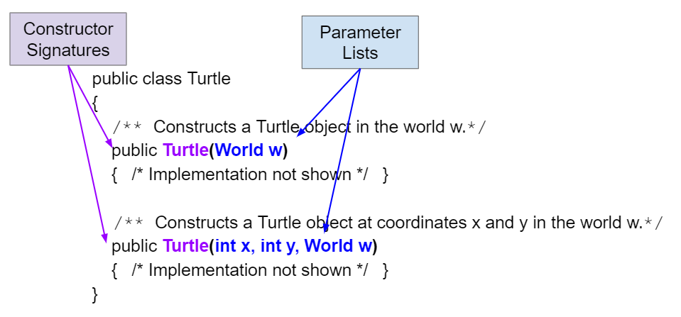
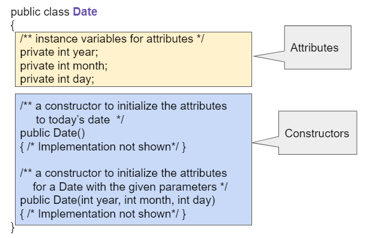

## Course Directory

### Return to the course outline

[← Back to AP CSA / 返回课程目录](../../index.html)

## Object Variables and References

### A way to find an object

New objects are saved in variables of a **reference type**, which holds a reference to an object.

A **reference** is a way to find the object in memory.

It is like a tracking number that you can use to track the location of a package in the mail.

## `null`

### No object yet

A special reference value **null**, which means none, can be used when a variable does not refer to any object.

For instance:

```java
Turtle t1 = null;
```

means the variable does not refer to any object yet.

## Reference Example

### Declare first, initialize later

The code `Turtle t1 = null;` creates a variable `t1` that refers to a `Turtle` object, but `null` means it does not refer to an object yet.

You could later create the object and set the object variable to refer to that new object.

```java
World world1 = new World();
Turtle t1 = null;
t1 = new Turtle(world1);

// declare and initialize t2
Turtle t2 = new Turtle(world1);
```

## Constructor Signatures

### Documentation lists signatures

When you use a class that someone has already written for you in a **library**, you can look up how to use the constructors and methods in the documentation for that class.

The documentation will list the **signatures** or headers of the constructors or methods.

The signature tells you the constructor name and parameter list.

## Parameter Lists

### Ordered variable declarations

The **parameter list**, in the header of a constructor, is an ordered list of variable declarations which includes data types.

The parameter variables store the argument values passed into the constructor.

## Overloaded Constructors

### Different signatures

Constructors are said to be **overloaded** when there are multiple constructors, but the constructors have different signatures.

They can differ in:

::: {.tight-list}
- number of parameters
- type of parameters
- order of parameters
:::

## Turtle Constructor Signatures

### Two constructor headers

Here are two constructors for the `Turtle` class that take different parameters.

{fig-align="center" width="76%"}

## Quick Check

### `mchoice:: TurtleClass1`

Given the `Turtle` class in the figure above and a `World` object `world1`, which code segment will correctly create a `Turtle` object at `(x,y)` coordinates `(50,150)`?

::: {.tight-list}
- A. `Turtle t = new Turtle();`
- B. `Turtle t = new Turtle(50,150);`
- C. `Turtle t = new Turtle(world1);`
- D. `Turtle t = new Turtle(world1,50,150);`
- E. `Turtle t = new Turtle(50,150,world1);`
:::

## Answer Reasoning

### Correct answer: E

::: {.tight-list}
- A is not correct: no `Turtle` constructor takes no arguments.
- B is not correct: no `Turtle` constructor takes `2` arguments.
- C creates a `Turtle` in the middle of the world, not necessarily at `(50,150)`.
- D has the arguments in the wrong order.
- E matches the constructor parameters `x`, `y`, and `world`.
:::

## Date Class

### Reading a class definition

In Unit 3, you will learn to write your own classes.

However, if you see a class definition on the AP exam, like the one below for a class called `Date`, you should be able to pick out the attributes, instance variables, and constructors and know how to use them.

{fig-align="center" width="66%"}

## Constructor Headers

### `clickablearea:: date_constructor`

Click on the constructor headers, or signatures.

```java
public class Date {
    private int year;
    private int month;
    private int day;

    public Date()
        { /** Implementation not shown */ }

    public Date(int year, int month, int day)
        { /** Implementation not shown */ }

    public void print()
        { /** Implementation not shown */ }
}
```

The constructor headers are public and have the same name as the class.

## Quick Check

### `mchoice:: DateClass1`

Given the `Date` class in the figure above and assuming months are numbered starting at `1`, which code segment will create a `Date` object for September 20, 2020 using the correct constructor?

::: {.tight-list}
- A. `Date d = new Date();`
- B. `Date d = new Date(9,20);`
- C. `Date d = new Date(9,20,2020);`
- D. `Date d = new Date(2020,9,20);`
- E. `Date d = new Date(2020,20,9);`
:::

## Answer Reasoning

### Correct answer: D

::: {.tight-list}
- A uses the no-argument constructor, which may not be September 20, 2020.
- B is not correct: no `Date` constructor takes `2` arguments.
- C is not correct: the constructor comment says the first argument must be the year.
- D matches the parameters `year`, `month`, `day`.
- E has month and day in the wrong order.
:::

## Classroom Check

### A complete answer should include

::: {.tight-list}
- explain that a reference is a way to find an object in memory
- use `null` for a variable that does not refer to an object yet
- identify a constructor signature by name and parameter list
- use documentation or a class diagram to match constructor calls
- distinguish constructor headers from methods like `print()`
- match constructor argument order exactly
:::

## End

### 1.13 Part 2 complete

Part 3 continues with parameters, arguments, call by value, and constructor debugging.
