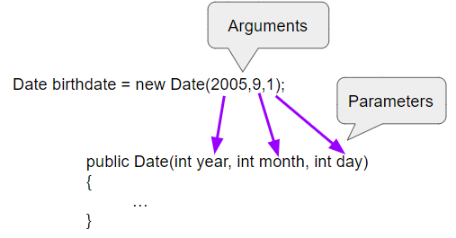

## Course Directory

### Return to the course outline

[← Back to AP CSA / 返回课程目录](../../index.html)

## Arguments and Parameters

### Constructor call

When a constructor like `Date(2005,9,1)` is called, the **parameters**, `year`, `month`, and `day`, are set to copies of the **arguments**, `2005`, `9`, and `1`.

This is **call by value** (按值调用), which means that copies of the argument values are passed to the constructor.

These values are used to initialize the object's attributes.

## Flow of Control

### Constructor call interrupts sequential execution

A constructor call interrupts the sequential execution of statements.

The program executes the statements in the constructor before continuing.

Once the last statement in the constructor has been executed, the flow of control is returned to the point immediately following where the constructor was called.

{fig-align="center" width="56%"}

## Type and Order Must Match

### Constructor arguments

The type of the values being passed in as arguments have to match the type of the parameter variables.

We cannot give a constructor a `String` object when it is expecting an `int`.

The order of the arguments also matters.

If you mix up the month and day in the `Date` constructor, you will get a completely different date, for example January 9th `(1/9)` instead of September 1st `(9/1)`.

## Quick Check

### `mchoice:: mcq_params`

In `public World(int width, int height)`, what are `width` and `height`?

::: {.tight-list}
- A. objects
- B. classes
- C. parameters
- D. arguments
:::

Correct answer: C. The parameters are in the constructor's signature.

## Quick Check

### `mchoice:: mcq_arguments`

In `new World(150, 200)`, what are `150` and `200`?

::: {.tight-list}
- A. objects
- B. classes
- C. parameters
- D. arguments
:::

Correct answer: D. An argument is the value that is passed into the constructor.

## Debugging Task

### `activecode:: TurtleConstructorDebug`

Debug the following code.

## Broken Code

### `TurtleConstructorDebug`

```java
import java.awt.*;
import java.util.*;

public class TurtleConstructorDebug
{
    public static void main(String[] args)
    {
        World w = new World(300,0);
        turtle t0;
        Turtle t1 = new Turtle();
        Turtle t2 = new Turtle(world, 100, 50)
        t0.forward();
        t1.turnRight();
        t2.turnLeft();
        world.show(true);
    }
}
```

## Test Requirement

### Preserved Runestone check

Runestone checks that the code changed from the original broken starter.

Use the constructor signatures and reference-variable rules from this topic to debug the program.

## Bridge

### Vocabulary continues

This lesson introduces a lot of vocabulary.

You will learn more about how this all works in later units when you write your own classes and constructors.

You will see parameters again with methods in the next lessons.

## Classroom Check

### A complete answer should include

::: {.tight-list}
- distinguish parameters in a constructor signature from arguments in a call
- explain call by value as copied argument values
- match argument types to parameter types
- keep argument order compatible with the signature
- trace control from constructor call into constructor body and back
- debug constructor calls using the available constructor signatures
:::

## End

### 1.13 Part 3 complete

Part 4 continues with the Custom Turtles challenge.
