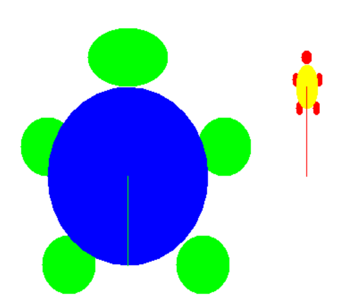

## Course Directory

### Return to the course outline

[← Back to AP CSA / 返回课程目录](../../index.html)

## Coding Challenge

### `Groupwork | Custom Turtles`

Working in pairs, you will now look at a new class called `CustomTurtle` and design some colorful turtles with its constructors.

The `CustomTurtle` class in the ActiveCode below inherits many of its attributes and methods from the `Turtle` class.

However, it has some new constructors with more parameters to customize a turtle with its body color, shell color, width, and height.

{fig-align="center" width="34%"}

## Constructor Signatures

### `CustomTurtle` has 3 constructors

```java
/** Constructs a CustomTurtle in the middle of the world */
public CustomTurtle(World w)

/** Constructs a CustomTurtle with a specific body color,
    shell color, and width and height in the middle of the world */
public CustomTurtle(World w, Color body, Color shell, int w, int h)

/** Constructs a CustomTurtle with a specific body color,
    shell color, and width and height at position (x,y) in the world */
public CustomTurtle(int x, int y, World w, Color body, Color shell, int w, int h)
```

## Challenge Tasks

### Use the constructor(s)

You will use the constructor(s) to create the `CustomTurtles` below.

You can specify colors like `Color.red` by using the `Color` class in Java.

::: {.tight-list}
- Create a large `150x200` CustomTurtle with a green body (`Color.green`) and a blue shell (`Color.blue`) at position `(150,300)`.
- Create a small `25x50` CustomTurtle with a red body and a yellow shell at position `(350,200)`.
- Create a CustomTurtle of your own design.
:::

## Code Task

### `activecode:: challenge-CustomTurtles`

Use the `CustomTurtle` constructors to create the following turtles.

Datafile: `turtleClasses.jar`

Keep the starter shape. Add the constructor calls in `main`, then move each turtle forward to see it.

## Starter Code

### `challenge-CustomTurtles`

::: {.code-scroll .compact}
```java
import java.awt.*;
import java.util.*;

public class CustomTurtleRunner
{
    public static void main(String[] args)
    {
        World world1 = new World(400, 400);

        // TODO 1. Change the constructor call below to create a large
        // 150x200 CustomTurtle with a green body (Color.green)
        // and a blue shell (Color.blue) at position (150,300).
        // Move it forward to see it.
        CustomTurtle turtle1 = new CustomTurtle(world1);
        turtle1.forward();

        // TODO 2. Create a small 25x50 CustomTurtle with a red body
        // and a yellow shell at position (350,200)
        // Move it forward to see it.

        // TODO 3. Create a CustomTurtle of your own design

        world1.show(true);
    }
}

class CustomTurtle extends Turtle
{
    private int x;
    private int y;
    private World w;
    private Color bodycolor;
    private Color shellcolor;
    private int width;
    private int height;

    /**
     * Constructor that takes the model display
     *
     * @param modelDisplay the thing that displays the model or world
     */
    public CustomTurtle(ModelDisplay modelDisplay)
    {
        // let the parent constructor handle it
        super(modelDisplay);
    }

    /**
     * Constructor that takes the model display to draw it on and custom
     * colors and size
     *
     * @param m the world
     * @param body : the body color
     * @param shell : the shell color
     * @param w: width
     * @param h: height
     */
    public CustomTurtle(
            ModelDisplay m, Color body, Color shell, int w, int h)
            {
        // let the parent constructor handle it
        super(m);
        bodycolor = body;
        setBodyColor(body);
        shellcolor = shell;
        setShellColor(shell);
        height = h;
        width = w;
        setHeight(h);
        setWidth(w);
    }

    /**
     * Constructor that takes the x and y and a model display to draw it on
     * and custom colors and size
     *
     * @param x the starting x position
     * @param y the starting y position
     * @param m the world
     * @param body : the body color
     * @param shell : the shell color
     * @param w: width
     * @param h: height
     */
    public CustomTurtle(
            int x,
            int y,
            ModelDisplay m,
            Color body,
            Color shell,
            int w,
            int h)
            {
        // let the parent constructor handle it
        super(x, y, m);
        bodycolor = body;
        setBodyColor(body);
        shellcolor = shell;
        setShellColor(shell);
        height = h;
        width = w;
        setHeight(h);
        setWidth(w);
    }
}
```
:::

## Focused Constructor Call

### Match arguments to the signature

Use the third constructor when the task gives a position, body color, shell color, width, and height.

```java
public CustomTurtle(int x, int y, World w,
                    Color body, Color shell, int w, int h)
```

The first two arguments are the starting position `(x, y)`.

The `World` argument comes before the body color, shell color, width, and height.

## Test Requirements

### Large turtle target

Runestone checks that the code contains a constructor for a large `150x200` `CustomTurtle` with a green body and a blue shell at position `(150,300)` in `world1`.

```java
new CustomTurtle(150,300,world1, Color.green, Color.blue, 150, 200)
```

## Test Requirements

### Small turtle target

Runestone checks that the code contains a constructor for a small `25x50` `CustomTurtle` with a red body and a yellow shell at position `(350,200)` in `world1`.

```java
new CustomTurtle(350,200,world1, Color.red, Color.yellow, 25, 50)
```

## Classroom Check

### A complete answer should include

::: {.tight-list}
- select the constructor whose parameter list matches the task
- pass `x`, `y`, `world1`, body color, shell color, width, and height in the correct order
- keep the starter `CustomTurtle` class definitions unchanged
- move created turtles forward to see them
- add a third `CustomTurtle` design with valid constructor arguments
:::

## End

### 1.13 complete

Next topic: 1.14 Calling Instance Methods.
