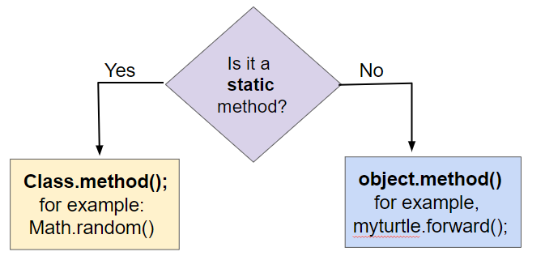
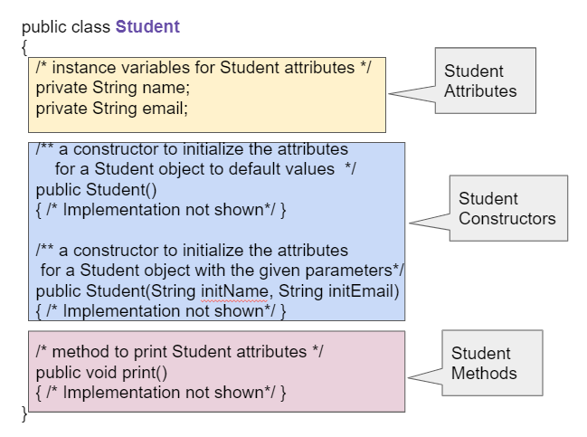
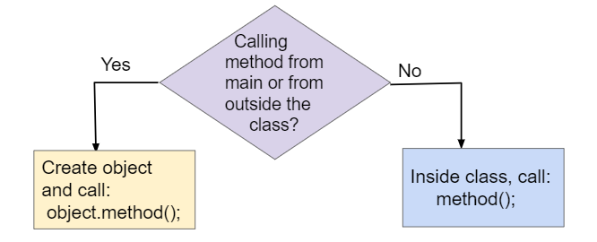
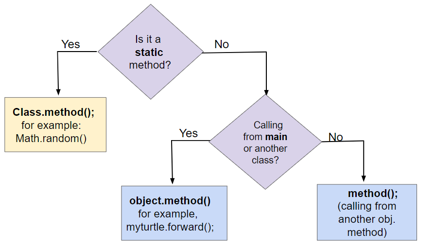
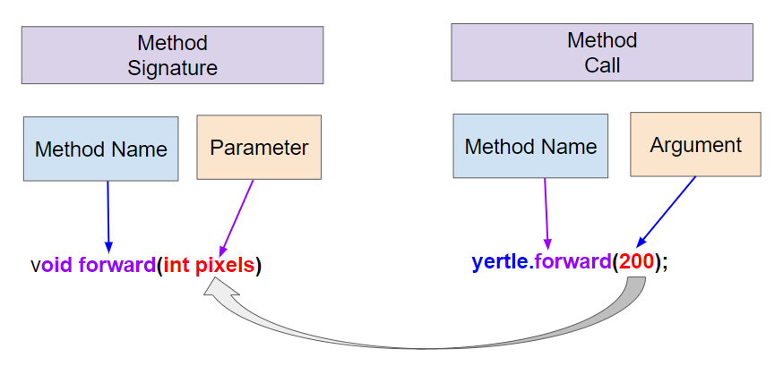
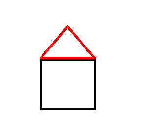

## Course Directory

### Return to the course outline

[← Back to AP CSA / 返回课程目录](../../index.html)

## Topic Intro

### Objects do work through instance methods

An <span class="term">instance method</span> (实例方法) belongs to an object. Calling it can ask the object for information or tell the object to change its state.

```java
Turtle yertle = new Turtle(world);
yertle.forward();
yertle.turnRight();
```

The object before the dot is the <span class="term">object receiver</span>: it receives the method call.

## Static vs Instance

### Class methods and object methods have different receivers

{fig-align="center" width="72%"}

::: {.tight-list}
- A static method is called on the class: `Math.sqrt(25)`.
- An instance method is called on an object: `yertle.forward()`.
- Instance methods can use or change the object's attribute values.
:::

## Method Signatures

### Documentation tells you what can be called

{fig-align="center" width="58%"}

Example signatures:

```java
public String getName()
public void print()
```

To call an instance method from another class, use an object variable, a dot, and the method name.

## Calling Instance Methods

### Use `object.methodName(arguments)`

{fig-align="center" width="68%"}

```java
Student s = new Student("Ada", "Lovelace", 11);
String name = s.getName();
s.print();
```

The method call must match the method signature's name, return type, and parameter list.

## Runtime Error Check

### Do not call methods on `null`

```java
World habitat = new World(300, 300);
Turtle yertle = null;
yertle.forward();
```

This code throws a <span class="term">NullPointerException</span> because `yertle` does not refer to a turtle object.

Fix:

```java
Turtle yertle = new Turtle(habitat);
yertle.forward();
```

## Calling Flow

### Control moves to the method and returns

{fig-align="center" width="62%"}

When a method is called:

::: {.tight-list}
- Java evaluates the object receiver.
- Java runs the matching method.
- When the method finishes, control returns to the next statement after the call.
:::

## Methods with Arguments

### Arguments are copied into parameters

{fig-align="center" width="62%"}

```java
yertle.forward(200);
yertle.turn(30);
```

`200` and `30` are <span class="term">arguments</span> in the calls. The method's parameter variables receive copies of those values.

## Vocabulary Check

### Match the term to the code

```java
yertle.forward(200);
```

::: {.tight-list}
- object receiver: `yertle`
- method name: `forward`
- argument: `200`
- full method call: `yertle.forward(200)`
:::

This vocabulary is also used when reading constructor calls.

## Overloaded Instance Methods

### Same method name, different parameter lists

{fig-align="center" width="58%"}

Examples:

```java
yertle.forward();
yertle.forward(100);
```

Java chooses the method whose parameter list matches the arguments.

## Code Task

### Draw with turtle methods

Start from a simple turtle program and add movement.

```java
import java.awt.*;

public class TurtleTestMethods1 {
    public static void main(String[] args) {
        World world = new World(400, 400);
        Turtle yertle = new Turtle(world);

        yertle.setColor(Color.blue);
        yertle.forward(100);
        yertle.turn(90);
        yertle.forward(100);

        world.show(true);
    }
}
```

Classroom goal: draw a square and a triangle using at least three colors.

## Mixed-Up Code

### Reorder the house drawing

{fig-align="center" width="32%"}

Place these actions in an order that draws the square walls first and then the red roof.

::: {.tight-list}
- create `World` and `Turtle`
- set the turtle color for the wall
- draw four equal sides with four turns
- set the turtle color to red
- turn and draw the two roof sides
- show the world
:::

## Void and Non-Void Methods

### Some methods perform actions, some return values

```java
yertle.forward(100);        // void: moves the turtle
int x = yertle.getXPos();   // returns an int
int y = yertle.getYPos();   // returns an int
```

::: {.tight-list}
- A `void` method does not return a value.
- A non-void method returns a value that can be stored, printed, or used in an expression.
- Getter methods often return object state.
:::

## Getter Trace

### Track state before and after movement

```java
World world = new World(300, 300);
Turtle yertle = new Turtle(world);

System.out.println(yertle.getXPos());
System.out.println(yertle.getYPos());

yertle.forward(50);
yertle.turn(90);

System.out.println(yertle.getXPos());
System.out.println(yertle.getYPos());
```

Trace the values printed before and after the movement.

## Debugging Task

### Store and print a returned value

Broken code:

```java
int area;
yertle.getWidth() * getHeight;
System.out.println("Yertle's area is: ");
```

Corrected code:

```java
int area = yertle.getWidth() * yertle.getHeight();
System.out.println("Yertle's area is: " + area);
```

If width is `15` and height is `18`, the area is `270`.

## Trace Check

### Method return values in expressions

```java
Circle c = new Circle(10);
System.out.println(c.getArea());
```

If `getArea()` returns `3.14159 * radius * radius`, the output is approximately `314.159`.

Student task: identify which value is the object state and which value is returned by the method.

## Trace Check

### Object state can change before a getter call

```java
Rectangle r = new Rectangle(10, 15);
r.resize(5);
System.out.println(r.getArea());
```

If `resize(5)` increases the width by `5`, the new dimensions are `15` by `15`.

The printed area is `225`.

## Trace Check

### Follow nested method calls

```java
public static int square(int x) {
    return x * x;
}

public static int divide(int a, int b) {
    return a / b;
}

System.out.println(square(2) + divide(6, 2));
```

Answer: `4 + 3`, so the output is `7`.

## Code Task

### Distance from one turtle to another point

Use the turtle getter methods.

```java
World world = new World(400, 400);
Turtle yertle = new Turtle(world);

System.out.println(yertle.getXPos());
System.out.println(yertle.getYPos());
System.out.println(yertle.getDistance(0, 0));
```

Extend the program:

::: {.tight-list}
- create another turtle
- move at least one turtle
- print the distance between the two turtles
:::

## Groupwork

### Turtle House

Use instance methods to draw a house.

Required method types:

::: {.tight-list}
- movement: `forward`, `turn`, `moveTo`
- pen control: `penUp`, `penDown`
- style: `setColor`
- getter or distance check: one method that returns a value
:::

The drawing should use different colors for at least two house parts.

## Classroom Check

### A complete answer should...

::: {.tight-list}
- call instance methods with <span class="mark">`object.methodName(arguments)`</span>
- distinguish class method calls from instance method calls
- identify object receiver, method name, and arguments
- avoid method calls on `null`
- explain overloaded methods by parameter list
- use returned values from non-void methods correctly
:::

## End

### Return to the course outline

[← Back to AP CSA / 返回课程目录](../../index.html)
