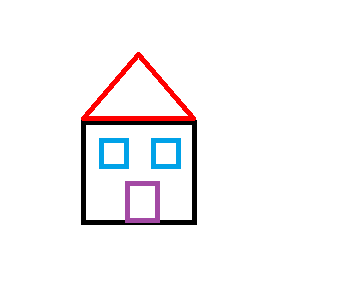

## Course Directory

### Return to the course outline

[← Back to AP CSA / 返回课程目录](../../index.html)

## Turtle Distance

### Returned distance from a point

The `Turtle` class has a method called `getDistance(x,y)` which will return the turtle's distance from a point `(x,y)`.

Can you find `yertle`'s distance from the point `(0,0)`?

In the exercise below, add another turtle and make both turtles move.

Then find the distance between them.

You must use the `getXPos` and `getYPos` methods as well as the `getDistance` method.

## Coding Exercise

### `activecode:: TurtleDistance`

Use the `getXPos`, `getYPos`, and `getDistance(x,y)` methods to find `yertle`'s distance from the point `(0,0)`.

Add another turtle, move both turtles to different positions, and find the distance between the two turtles.

Datafile: `turtleClasses.jar`

## Starter Code

### `TurtleDistance`

```java
import java.awt.*;
import java.util.*;

public class TurtleTestDistance
{
    public static void main(String[] args)
    {
        World world = new World(300, 300);
        Turtle yertle = new Turtle(world);

        // TODO: Can you find yertle's distance from the point (0,0)?

        // TODO: Can you find the distance between 2 turtles?

        world.show(true);
    }
}
```

## Test Requirements

### `TurtleDistance`

Runestone checks:

::: {.tight-list}
- calls `.getXPos()` at least `1` time
- calls `.getYPos()` at least `1` time
- calls `.getDistance(` at least `2` times
- calls `.getDistance(0,0)` at least `1` time
:::

The second distance should use one turtle's `getXPos()` and `getYPos()` values as arguments for another turtle's `getDistance(x,y)`.

## Groupwork Coding Challenge

### Turtle House

This creative challenge is fun to do collaboratively in pairs.

Design a house and have the turtle draw it with different colors below.

Can you add windows and a door?

Come up with your own house design as a team.

{fig-align="center" width="34%"}

## Moving Without Drawing

### Window planning

To draw a window, you will need to call `penUp` and `moveTo` to walk the turtle into position without drawing.

```java
t.penUp();
t.moveTo(120,200);
t.penDown();
```

It may help to act out the code pretending you are the turtle.

## Coordinate Planning

### Facing direction and screen coordinates

Remember that the angles you turn depend on which direction you are facing.

The turtle begins facing up.

When planning your coordinates for the house, remember that the turtle starts at the center of the screen `(150,150)`.

The top left corner is `(0,0)`.

## Coding Challenge

### `activecode:: challenge-TurtleHouse`

Draw a Turtle House!

Make sure you use `forward`, `turn`, `penUp`, `penDown`, `moveTo` methods as well as different colors.

Have fun!

Datafile: `turtleClasses.jar`

## Starter Code

### `challenge-TurtleHouse`

```java
import java.awt.*;
import java.util.*;

public class TurtleHouse
{
    public static void main(String[] args)
    {
        World world = new World(300, 300);
        Turtle t = new Turtle(world);
        // TODO: Use t to draw a house


        // keep this line at the end of your code to show the drawing
        world.show(true);
    }
}
```

## Test Requirements

### `TurtleHouse`

Runestone checks:

::: {.tight-list}
- calls `moveTo(` at least `1` time
- calls `.penUp()` at least `1` time
- calls `.penDown(` at least `1` time
- calls `.turn` at least `6` times
- calls `.forward(` at least `6` times
:::

## Classroom Check

### A complete answer should include

::: {.tight-list}
- use `getDistance(x,y)` to find distance from `(0,0)`
- use `getXPos()` and `getYPos()` to pass one turtle's position to another method call
- create and move a second turtle before measuring distance between turtles
- use `penUp`, `moveTo`, and `penDown` to reposition for windows or a door
- keep `world.show(true)` at the end of the drawing program
- use enough turns and forward movements to draw a house with multiple parts
:::

## End

### 1.14 complete

Next topic: 1.15 String Manipulation.
