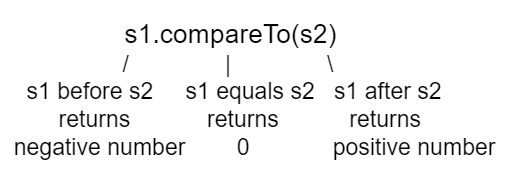

## Course Directory

### Return to the course outline

[← Back to AP CSA / 返回课程目录](../../index.html)

## CompareTo and Equals

### Reference types need methods

We can compare primitive types like `int` and `double` using operators like `==` and `<` or `>`, which you will learn about in the next unit.

However, with reference types like `String`, you must use the methods `equals` and `compareTo`, not `==` or `<` or `>`.

## `compareTo`

### Character-by-character comparison

The method `compareTo` compares two strings character by character.

If they are equal, it returns `0`.

If the first string is alphabetically ordered before the second string, which is the argument of `compareTo`, it returns a negative number.

If the first string is alphabetically ordered after the second string, it returns a positive number.

## `compareTo` Figure

### Source figure

The actual number that `compareTo` returns does not matter, but it is the distance in the first letter that is different.

For example, `A` is 7 letters away from `H`.

{fig-align="center" width="52%"}

## `equals`

### Same characters, same order

The `equals` method compares the two strings character by character and returns `true` or `false`.

Both `compareTo` and `equals` are case-sensitive.

There are case-insensitive versions of these methods, `compareToIgnoreCase` and `equalsIgnoreCase`, which are not on the AP exam.

## Code Example

### `activecode:: lcsm2`

Run the example below to see the output from `compareTo` and `equals`.

Since `"Hello!"` would be alphabetically ordered after `"And"`, `compareTo` returns a positive number.

Since `"Hello!"` would be alphabetically ordered before `"Zoo"`, `compareTo` returns a negative number.

Notice that `equals` is case-sensitive.

## Starter Code

### `lcsm2`

```java
public class Test2
{
    public static void main(String[] args)
    {
        String message = "Hello!";
        // TODO: trace each compareTo and equals result before running.

        System.out.println(message.compareTo("Hello!"));
        System.out.println(message.compareTo("And"));
        System.out.println(message.compareTo("Zoo"));

        System.out.println(message.equals("Hello!"));
        System.out.println(message.equals("hello!"));
    }
}
```

## Expected Output

### `lcsm2`

```text
0
7
-18
true
false
```

## Vocabulary Check

### `dragndrop:: ch4_str1`

Drag the definition from the left and drop it on the correct concept on the right.

| Definition | Concept |
|---|---|
| the position of a character in a string | index |
| a new string that is a part of another string with 0 to all characters copied from the original string | substring |
| doesn't change | immutable |
| the number of characters in a string | length |

## Vocabulary Check

### `dragndrop:: ch4_str2`

Drag the definition from the left and drop it on the correct method on the right.

| Definition | Method |
|---|---|
| Returns true if the characters in two strings are the same | equals |
| Returns the position of one string in another or `-1` | indexOf |
| Returns a number to indicate if one string is less than, equal to, or greater than another | compareTo |
| Returns a string representing the object that is passed to this method | toString |

## Quick Check

### `mchoice:: qsb_8-new`

What is the value of `answer` after the following code executes?

```java
String s1 = "Hi";
String s2 = "Bye";
int answer = s1.compareTo(s2);
```

::: {.tight-list}
- A. positive (`> 0`)
- B. `0`
- C. negative (`< 0`)
:::

Correct answer: A. positive (`> 0`)

`H` is after `B` in the alphabet, so `s1` is greater than `s2`.

## Common Mistakes with Strings

### Debugging setup

The following code shows some common mistakes with strings.

Fix the code to use the string methods correctly.

## Broken Starter Code

### `activecode:: stringMistakes`

::: {.code-scroll .compact}
```java
public class StringMistakes
{
    public static void main(String[] args)
    {
        String str1 = "Hello!";

        // Print out the first letter?
        System.out.println(
                "The first letter in " + str1 + ":" + str1.substring(1, 1));

        // Print out the last character?
        System.out.println(
                "The last char. in " + str1 + ":" + str1.substring(8));

        // Print str1 in lower case? Will str1 change?
        str1.toLowerCase();
        System.out.println("In lowercase: " + str1);
        // TODO: fix substring bounds and use the returned lowercase string
    }
}
```
:::

## Expected Output

### `stringMistakes`

Runestone checks that the output contains:

```text
The first letter in Hello!:H
The last char. in Hello!:!
In lowercase: hello!
```

## Common Mistakes List

### Source list

::: {.tight-list}
- Thinking that substrings include the character at the last index when they don't.
- Thinking that strings can change when they can't. They are immutable.
- Trying to access part of a string that is not between index `0` and `length - 1`.
- Trying to call a method like `indexOf` on a string reference that is `null`.
- Using `==` to test if two strings are equal.
- Treating upper and lower case characters the same in Java.
:::

## Classroom Check

### A complete answer should include

::: {.tight-list}
- use `equals` to compare string contents
- use `compareTo` to get negative, zero, or positive ordering results
- explain that `equals` and `compareTo` are case-sensitive
- avoid using `==` when the goal is same characters in same order
- trace substring bounds as start-inclusive and end-exclusive
- store or print the returned value from `toLowerCase`
:::

## End

### 1.15 Part 4 complete

Part 5 continues with the Pig Latin challenge.
