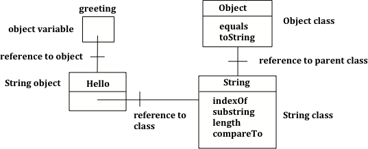

## Course Directory

### Return to the course outline

[← Back to AP CSA / 返回课程目录](../../index.html)

## Strings

### Topic intro

**Strings** in Java are objects of the `String` class.

Strings represent sequences of characters and are used to store text like names, addresses, or messages.

The `String` class is part of the `java.lang` package, which is available by default in all Java programs.

## Source Note

### Class type vs. primitive type

Class names in Java, like `String`, begin with a capital letter.

All primitive types, `int`, `double`, and `boolean`, begin with a lowercase letter.

This is one easy way to tell the difference between primitive types and class types.

## String References

### `activecode:: lcsb1`

Run the following code. What does it print?

```java
public class Test1
{
    public static void main(String[] args)
    {
        String greeting = null;
        System.out.println(greeting);
    }
}
```

## Expected Output

### `lcsb1`

```text
null
```

The code declares an object variable named `greeting` and sets the value of `greeting` to the Java keyword `null` to show that it doesn't refer to any object yet.

So `System.out.println(greeting);` will print `null`.

## Object References

### A way to find the object

Object variables **refer** to objects in memory.

A reference is a way to find the actual object, like adding a contact to your phone lets you reach someone without knowing exactly where they are.

The value of `greeting` is `null` since the string object has not been created yet.

{fig-align="center" width="18%"}

## Creating Strings

### Constructor form

In Java there are two ways to create an object of the `String` class.

You can use the `new` keyword followed by a space and then the class constructor.

In parentheses you can include values used to initialize the fields of the object.

This is the standard way to create a new object of a class in Java.

```java
String greeting = new String("Hello");
```

## Creating Strings

### String literal form

In Java you can also use just a **string literal**, which is a set of characters enclosed in double quotes (`"`), to create a `String` object.

```java
String greeting = "Hello";
```

In both cases an object of the `String` class will be created in memory and the value of the variable `greeting` will be set to an object reference, a way to find that object.

## Coding Exercise

### `activecode:: lcsbnew`

The code below creates two greeting strings: one using a string literal and the other using `new` and the `String` constructor.

Change the code to add 2 new strings called `firstName` and `lastName`, one using a string literal and the other using `new`, and print them out with the greetings.

## Starter Code

### `lcsbnew`

```java
public class StringTest
{
    public static void main(String[] args)
    {
        String greeting1 = "Hello!";
        String greeting2 = new String("Welcome!");
        // TODO: add firstName and lastName strings
        System.out.println(greeting1);
        System.out.println(greeting2);
        // TODO: print the new strings with the greetings
    }
}
```

## Test Requirement

### Preserved Runestone check

Runestone checks that the code changed from the original `StringTest` starter.

Keep one new string literal and one new `String` constructor call in the edited program.

## String Class Object

### `activecode:: lcsb2`

Now that `greeting` refers to an actual object we can ask the object what class created it.

Try the following. What does it print?

```java
public class Test2
{
    public static void main(String[] args)
    {
        String greeting = "Hello";
        Class currClass = greeting.getClass();
        System.out.println(currClass);
        Class parentClass = currClass.getSuperclass();
        System.out.println(parentClass);
    }
}
```

## Expected Output

### `lcsb2`

```text
class java.lang.String
class java.lang.Object
```

The code first prints class `java.lang.String` since `greeting` was created by the `String` class.

The full name for the `String` class is `java.lang.String`. The `java.lang` part is the **package** name.

## Package, Parent Class, Superclass

### Source explanation

Every class in the Java language is in a package and the standard classes like `String` are in the `java.lang` package.

Every object in Java knows the class that created it.

Also, every class knows its **parent** class. In Java a class can only have one parent.

A class can `inherit` object fields and methods from a parent class.

The last print statement prints `class java.lang.Object` because the parent class (**superclass**) of the `String` class is the `Object` class.

## String and Object

### Source figure

All classes in Java inherit from the `Object` class at some point in their ancestry.

{fig-align="center" width="66%"}

## Classroom Check

### A complete answer should include

::: {.tight-list}
- identify `String` as a class in `java.lang`
- distinguish `String` class type from primitive types by naming convention
- explain that a `String` variable can hold `null`
- create a `String` with `new String("text")`
- create a `String` with a string literal like `"text"`
- explain that `String` inherits from `Object`
:::

## End

### 1.15 Part 1 complete

Part 2 continues with String operators and concatenation.
