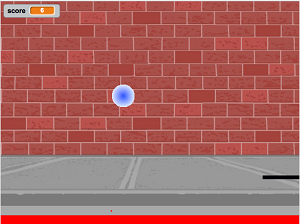

## Course Directory

### Return to the course outline

[← Back to AP CSA / 返回课程目录](../../index.html)

## Topic Intro

### What is a variable?

A <span class="term">variable</span> (变量) is a memory location in the computer that stores a value that can change while the program runs.

{fig-align="center" width="42%"}

Scores often start at `0` and increase, so a score is a natural example of data stored in a variable.

## Data Types

### Name plus kind of value

Every variable has a <span class="term">name</span> and a <span class="term">data type</span> (数据类型). The type determines what kind of value the variable can hold.

::: {.tight-list}
- `int`: whole numbers such as `3`, `0`, `-76`
- `double`: decimal numbers such as `6.3`, `-0.9`
- `boolean`: only `true` or `false`
- `String`: a sequence of characters inside double quotes, such as `"Hello"`
:::

## Primitive and Reference Types

### AP CSA vocabulary

::: {.tight-list}
- <span class="term">Primitive variables</span> hold primitive values directly.
- AP CSA primitive types in this topic are `int`, `double`, and `boolean`.
- <span class="term">Reference variables</span> hold a reference to an object.
- `String` is a reference type and the name of a Java class.
:::

A data type is a set of values and a set of operations on those values.

## Quick Check

### Choose the right type

For each situation, choose `int`, `double`, `boolean`, or `String`.

| Data to store | Best type | Reason |
|---|---:|---|
| average grade for a course | `double` | averages may have decimals |
| number of people in a household | `int` | people are counted as whole numbers |
| first name of a person | `String` | names are text |
| whether it is raining | `boolean` | only true or false |
| amount of money | `double` | cents may require decimals |

## Declaring Variables

### Type first, then name

To <span class="term">declare</span> (声明) a variable, write the type, at least one space, the variable name, and a semicolon.

```java
int score;
```

To <span class="term">initialize</span> (初始化) a variable, give it its first value.

```java
int score;
score = 4;

int lives = 3;
```

## Memory and Type Size

### Java reserves enough bits

{fig-align="center" width="72%"}

::: {.tight-list}
- A <span class="term">bit</span> stores `0` or `1`.
- An `int` uses <span class="mark">32 bits</span>.
- A `double` uses <span class="mark">64 bits</span>.
- Type affects storage and the operations Java allows.
:::

## Printing Variables

### Print the value, not the name

Run the code and predict each output line.

```java
public class Test2
{
    public static void main(String[] args)
    {
        int score;
        score = 0;
        System.out.print("The score is ");
        System.out.println(score);

        double price = 23.25;
        System.out.println("The price is " + price);

        boolean won = false;
        System.out.println(won);
        won = true;
        System.out.println(won);

        String name = "Jose";
        System.out.println("Hi " + name);
    }
}
```

## Printing Variables

### Expected output and common mistake

Expected output:

```text
The score is 0
The price is 23.25
false
true
Hi Jose
```

Never put variables inside quotes if you want their values. `"name"` prints the letters `name`; `name` prints the value stored in the variable.

## Identify Declarations

### Which lines create variables?

Find all variable declarations in the code.

```java
public class Test2
{
    public static void main(String[] args)
    {
        int numLives;
        numLives = 0;
        System.out.println(numLives);
        double health;
        health = 8.5;
        System.out.println(health);
        boolean powerUp;
        powerUp = true;
        System.out.println(powerUp);
    }
}
```

Correct declaration lines: `int numLives;`, `double health;`, `boolean powerUp;`.

## Identify Initializations

### Which lines give the first value?

Find all variable initializations in the code.

```java
public class Test2
{
    public static void main(String[] args)
    {
        int numLives;
        numLives = 0;
        System.out.println(numLives);
        double health = 8.5;
        System.out.println(health);
        boolean powerUp = true;
        System.out.println(powerUp);
    }
}
```

Correct initialization lines: `numLives = 0;`, `double health = 8.5;`, `boolean powerUp = true;`.

## Assignment Direction

### Variable on the left, value on the right

In Java, `=` means "copy the value on the right into the memory location named on the left."

Fix the assignment order.

```java
public class Test3
{
    public static void main(String[] args)
    {
        int score;
        4 = score;
        System.out.println(score);
    }
}
```

Expected output:

```text
4
```

## Trace Checkpoints

### Fill the blanks

Complete each checkpoint before writing code.

::: {.tight-list}
- `[blank] age = [blank];` declares `age` as an integer and sets it to `5`.
- What type should you use for a shoe size like `8.5`?
- What type should you use for a number of tickets?
:::

Answers: `int age = 5;`, `double`, `int`.

## Mixed-Up Code

### Declare three variables in order

Build the correct declarations for number of visits, temperature, and insurance status.

Needed blocks:

```java
int numVisits = 5;
double temp = 101.2;
boolean hasInsurance = false;
```

Distractors:

```java
Int numVisits = 5;
Double temp = 101.2;
Boolean hasInsurance = false;
```

Reject the distractors because Java primitive type keywords are lowercase.

## Naming Variables

### Valid, meaningful, and readable

::: {.tight-list}
- Start with a letter.
- Use letters, digits, and `_`.
- Use one word with no spaces.
- Do not use Java keywords such as `for`, `if`, `class`, `static`, `int`, or `double`.
- Choose meaningful names; `score` is clearer than `x`.
:::

Java convention is <span class="term">camelCase</span> (驼峰命名), such as `gameScore`.

## Case Sensitivity

### Spelling and capitalization must match

Java is <span class="mark">case-sensitive</span>. `gameScore` and `gamescore` are different names.

Fix the code.

```java
public class CaseSensitiveClass
{
    public static void main(String[] args)
    {
        int gameScore = 0;
        System.out.println("gameScore is " + gamescore);
    }
}
```

Expected output:

```text
gameScore is 0
```

## Camel Case Check

### Name the variable

Give the camelCase variable name.

::: {.tight-list}
- variable that represents a shoe size
- variable that represents the top score
:::

Answers:

```text
shoeSize
topScore
```

Start with lowercase, then uppercase the first letter of each additional word.

## Debugging Challenge

### Weather Report starter code

Debug the code. Make sure data types match the values, names match exactly, strings close correctly, and statements end correctly.

```java
public class Challenge1_2_weather
{
    public static void main(String[] args)
    {
        int temperature = 70.5;
        double tvChannel = 101;
        boolean sunny = 1

        System.out.print("Welcome to the weather report on Channel ")
        System.out.println(TVchannel);
        System.out.print("The temperature today is );
        System.out.println(tempurature);
        System.out.print("Is it sunny today? ");
        System.out.println(sunny);
    }
}
```

## Debugging Challenge

### Weather Report target output

Your corrected program should produce this output.

```text
Welcome to the weather report on Channel 101
The temperature today is 70.5
Is it sunny today? true
```

Checklist:

::: {.tight-list}
- `temperature` should be a type that can store `70.5`.
- `tvChannel` should print as `101`, not `101.0`.
- `sunny` should be `true` or `false`.
- `tvChannel` and `temperature` must be spelled and capitalized consistently.
:::

## Coding Challenge

### Mad Libs starter code

Replace each `"Replace"` value with a word that matches the variable name, then create another silly story using at least five new `String` variables.

```java
public class MadLibs1
{
    public static void main(String[] args)
    {
        String pluralnoun1 = "Replace";
        String color1 = "Replace";
        String color2 = "Replace";
        String food = "Replace";
        String pluralnoun2 = "Replace";

        System.out.println("Roses are " + color1);
        System.out.println(pluralnoun1 + " are " + color2);
        System.out.println("I like " + food);
        System.out.println("Do " + pluralnoun2 + " like them too?");

        // Now come up with your own silly poem!
    }
}
```

## Coding Challenge

### Mad Libs completion checks

A successful classroom version should:

::: {.tight-list}
- replace all five `"Replace"` placeholders
- keep the variables outside quotes when printing their values
- print four poem lines from the starter
- add a new short story or poem using at least <span class="mark">5 new `String` variables</span>
- use meaningful variable names such as `animal`, `placeName`, or `favoriteFood`
:::

## Classroom Check

### A complete answer should...

::: {.tight-list}
- define a <span class="term">variable</span> as a named memory location whose value can change
- identify `int`, `double`, `boolean`, and `String` from the data being stored
- distinguish <span class="term">primitive</span> and <span class="term">reference</span> types
- declare and initialize a variable using valid Java syntax
- explain why the variable must be on the left side of `=`
- print variable values without placing variable names inside quotes
- use meaningful <span class="term">camelCase</span> names with exact capitalization
:::

## End

### Return to the course outline

[← Back to AP CSA / 返回课程目录](../../index.html)
