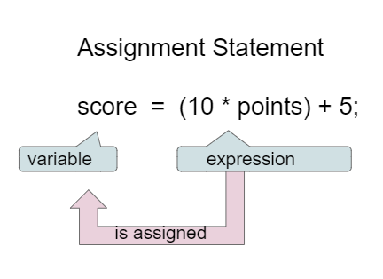

## Course Directory

### Return to the course outline

[← Back to AP CSA / 返回课程目录](../../index.html)

## Assignment Statements

### `=` means “gets assigned”

An <span class="term">assignment statement</span> (赋值语句) stores the value of the right-hand expression into the variable on the left.

{fig-align="center" width="44%"}

Read `score = points * 10 + 5;` as <span class="mark">“score gets ...”</span>, not as a math equation.

## Assignment and Memory

### Values are copied, not magically linked

```java
int x = 3;
int y = 2;
x = y;
y = 5;
```

After `x = y;`, the current value of `y` is copied into `x`. Changing `y` later does <span class="mark">not</span> change `x`.

This is one of the first major tracing ideas in AP CSA.

## Assignment and Types

### The stored type must be compatible

::: {.tight-list}
- every variable must be assigned before it is used
- the expression on the right produces one value with one type
- that value must fit the variable on the left
:::

Example: if an expression evaluates to `double`, the destination usually must also be `double`.

## Reference Variables

### `null` is a real value for references

```java
String str = null;
str = "new object";
```

For reference types such as `String`, <span class="term">`null`</span> means the variable is currently not associated with an object.

This is different from an empty string `""`.

## Updating a Variable

### Reuse the current value

```java
int score = 0;
score = score + 1;
```

This looks strange in math, but it is normal in code:

::: {.tight-list}
- evaluate the right side first
- then store the new result back into `score`
:::

This update pattern prepares students for loops and counters.

## Input with Variables

### One algorithm, different user values

Input can be:

::: {.tight-list}
- tactile
- audio
- visual
- text from the keyboard
:::

The textbook uses Java's <span class="term">`Scanner`</span> class to read typed text input and store it in variables.

## Input with Variables

### Useful, but not an AP exam target

```java
Scanner scan = new Scanner(System.in);
String name = scan.nextLine();
System.out.println("Hello " + name);
```

The practical point is not the full API. It is that <span class="mark">variables let the same program behave differently for different inputs</span>.

Keyboard input itself is useful for class, even though it is not a direct AP CSA exam focus.

## Classroom Tasks

### Practice worth keeping

Retained classroom work for this topic:

::: {.tight-list}
- assignment tracing checks
- incompatible-type fix tasks
- increment-by-one pattern practice
- <span class="term">1.4.5 Coding Challenge: Dog Years</span>
:::

The Dog Years task is a good first formula-building exercise with multiple variables.

## Classroom Check

### A complete answer should...

::: {.tight-list}
- explain assignment as storing the right-side value into the left-side variable
- trace copied values through multiple assignment steps
- require type compatibility before using a variable in an expression
- recognize `score = score + 1` as a valid update
- explain that `Scanner` is one way to store keyboard input in variables
:::

## End

### Return to the course outline

[← Back to AP CSA / 返回课程目录](../../index.html)
