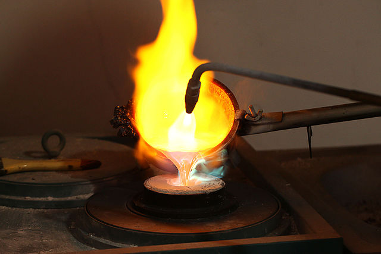

## Course Directory

### Return to the course outline

[← Back to AP CSA / 返回课程目录](../../index.html)

## Topic Intro

### Type casting changes the value type

In Java, <span class="term">type casting</span> (类型转换) converts a value from one type to another.

{fig-align="center" width="34%"}

The <span class="term">cast operator</span> is written before an expression, such as `(int)` or `(double)`.

## Cast Operators

### `(int)` and `(double)`

The cast operator produces a value of the requested type.

```java
(double) 1 / 3
(int) 3.6
```

::: {.tight-list}
- `(double) 1 / 3` evaluates to a `double` value instead of truncated integer division.
- `(int) 3.6` evaluates to `3`.
- Casting a `double` to an `int` truncates the digits to the right of the decimal point.
:::

Truncation is <span class="mark">not</span> rounding.

## Code Task

### Division with casts

Predict each output line, then add a line that divides `5` by `2` using a `(double)` cast.

```java
public class Casting
{
    public static void main(String[] args)
    {
        System.out.println(3 / 4);
        System.out.println(3.0 / 4);
        System.out.println(3 / 4.0);
        System.out.println((double) 3 / 4);
        System.out.println((int) 3.0 / 4);

        // Add a line that prints 5 divided by 2 using a (double) cast.
    }
}
```

## Code Task

### Expected casting output

Expected output after adding the final line:

```text
0
0.75
0.75
0.75
0
2.5
```

Key reading:

::: {.tight-list}
- `int / int` produces an `int`.
- If any operand is `double`, the expression produces a `double`.
- `(int) 3.0 / 4` casts `3.0` to `3`, then performs integer division.
:::

## Widening Conversion

### `double` is contagious in expressions

When Java evaluates an expression involving a `double`, `int` values are automatically widened to `double` values.

```java
9.0 / 10
```

This is evaluated like:

```java
9.0 / 10.0
```

and produces:

```text
0.9
```

A conversion from `int` to `double` is called a <span class="term">widening conversion</span>.

## Average Pattern

### Cast before division

When `total` and `count` are both `int`, cast before dividing.

```java
int total;
int count;

double average = (double) total / count;
```

This avoids losing the fractional part before the result is stored in `average`.

Important contrast:

```java
(double) (total / count)
```

This performs integer division first, then casts the already-truncated result.

## Rounding

### Add or subtract `0.5`, then cast

Values of type `double` in the `int` range can be rounded to the nearest `int`.

```java
double number;
double negNumber;

int nearestInt = (int) (number + 0.5);
int nearestNegInt = (int) (negNumber - 0.5);
```

For example, `7.0 / 4.0` is `1.75`; `(int) 1.75` truncates to `1`, but `(int) (1.75 + 0.5)` produces `2`.

## Code Task

### Rounding by casting

Run the code mentally, then add a line that rounds `number + 2.3` to the nearest `int`.

```java
public class NearestInt
{
    public static void main(String[] args)
    {
        double number = 5.0 / 3;
        int nearestInt = (int) (number + 0.5);
        System.out.println("5.0/3 = " + number);
        System.out.println("5/3 truncated: " + (int) number);
        System.out.println("5.0/3 rounded to nearest int: " + nearestInt);
        double negNumber = -number;
        int nearestNegInt = (int) (negNumber - 0.5);
        System.out.println("-5.0/3 rounded to nearest negative int: " + nearestNegInt);
    }
}
```

## Quick Check

### Rounding and casting

Answer true or false.

| Statement | Answer | Reason |
|---|---:|---|
| Java rounds up automatically when you do integer division. | `false` | integer division truncates |
| Casting always results in a `double` type. | `false` | the result type is the type named in the cast |

Use the exact cast operator to decide the resulting type.

## Range of Values

### `int` has minimum and maximum values

`int` values are stored using <span class="mark">4 bytes</span> of memory.

::: {.tight-list}
- `Integer.MAX_VALUE` is `2147483647`.
- `Integer.MIN_VALUE` is `-2147483648`.
- Values in an `int` variable must stay within this inclusive range.
:::

If an expression would evaluate outside the allowed range, an <span class="term">integer overflow</span> (整数溢出) occurs.

## Debugging Task

### Integer overflow

The code tries to store values outside the `int` range. Fix the overflow by deleting the last `0` in each number.

```java
public class TestOverflow
{
    public static void main(String[] args)
    {
        int id = 2147483650;
        int negative = -2147483650;
        System.out.println(id);
        System.out.println(negative);
    }
}
```

Expected fixed output:

```text
214748365
-214748365
```

## Double Precision

### Limited digits can cause round-off error

Computers allot memory based on data type. A `double` uses 8 bytes, but it still cannot store unlimited precision.

::: {.tight-list}
- Repeating decimals are cut off after about 14-15 digits.
- If a mathematical value needs more precision than can be stored, <span class="term">round-off error</span> occurs.
- To avoid unwanted display noise, round to the precision needed.
:::

This is representation error, not necessarily a logic error.

## Formatting Demo

### Show fewer decimal places

`printf` can format long decimal numbers for display. This is useful in class, but not a required AP exam target.

```java
public class TestFormat
{
    public static void main(String[] args)
    {
        double number = 10.0 / 3;
        System.out.println("Number cut off after 15 digits: " + number);
        System.out.println("Number as an int: " + (int) number);
        System.out.printf("Formatted number: %.2f", number);
        System.out.printf("\nFormatted number: $%.2f\n", number);
    }
}
```

Add `2.0 / 3` formatted to show two digits after the decimal point.

## Quick Check

### Correct average expression

Which expression returns the correct average for a `total` that is the sum of 3 `int` values?

```java
(double) (total / 3)
total / 3
(double) total / 3
(int) total / 3
```

Correct answer:

```java
(double) total / 3
```

Reason: it converts `total` to `double` before division happens.

## Groupwork Coding Challenge {.fit-xsmall}

### Average 3 Numbers starter

Write a program that declares three `int` grades, sums them, and reports the average as a `double`.

::: {.code-scroll .compact}
```java
public class Challenge1_5 {
    public static void main(String[] args) {
        // 1. Declare int variables grade1, grade2, grade3.
        // 2. Declare an int variable called sum.
        // 3. Declare a double variable called average.
        // 4. Calculate the sum of the three grades.
        // 5. Calculate the average using casting.
        // 6. Print the average.
    }
}
```
:::

## Groupwork Coding Challenge {.fit-xsmall}

### Average 3 Numbers checks

For grades `90`, `100`, and `94`, the sum is `284`.

The average should use this pattern:

```java
int sum = grade1 + grade2 + grade3;
double average = (double) sum / 3;
```

A strong solution should:

::: {.tight-list}
- declare exactly three grade variables
- declare `average` as `double`
- use the variables in the sum formula
- include `(double)` before division
- print a decimal result, such as `94.66666666666667`
:::

## Classroom Check

### A complete answer should...

::: {.tight-list}
- define <span class="term">type casting</span> as converting a value to another type
- use `(int)` and `(double)` correctly
- explain why `(double) total / count` avoids truncating division
- distinguish truncation from rounding
- round positive and negative `double` values using `0.5` before casting
- identify `Integer.MAX_VALUE`, `Integer.MIN_VALUE`, and integer overflow
- describe round-off error as a precision limit for `double`
:::

## End

### Return to the course outline

[← Back to AP CSA / 返回课程目录](../../index.html)
