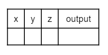
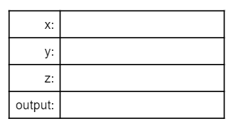

## Course Directory

### Return to the course outline

[← Back to AP CSA / 返回课程目录](../../index.html)

## Topic Intro

### Check Your Understanding

This deck keeps the textbook <span class="term">Check Your Understanding</span> questions and the <span class="term">Code Tracing Challenge</span> for compound assignment operators.

Use the quick checks to trace `++`, `--`, `+=`, `/`, and `%` updates before moving to the groupwork tracing task.

## Quick Check

### `mchoice:: q_trace_increment`

What are the values of `x`, `y`, and `z` after the following code executes?

```java
int x = 0;
int y = 1;
int z = 2;
x--;
y++;
z+=y;
```

::: {.tight-list}
- A. `x = -1, y = 1, z = 4`
- B. `x = -1, y = 2, z = 3`
- C. `x = -1, y = 2, z = 2`
- D. `x = 0, y = 1, z = 2`
- E. `x = -1, y = 2, z = 4`
:::

## Answer Reasoning

### `q_trace_increment`

Correct answer: <span class="mark">E. `x = -1, y = 2, z = 4`</span>

This code subtracts one from `x`, adds one to `y`, and then sets `z` to the value in `z` plus the current value of `y`.

```text
x--   -> x = -1
y++   -> y = 2
z+=y  -> z = 2 + 2 = 4
```

## Quick Check

### `mchoice:: q_trace_increment2`

What are the values of `x`, `y`, and `z` after the following code executes?

```java
int x = 3;
int y = 5;
int z = 2;
x = z * 2;
y = y / 2;
z++;
```

::: {.tight-list}
- A. `x = 6, y = 2.5, z = 2`
- B. `x = 4, y = 2.5, z = 2`
- C. `x = 6, y = 2, z = 3`
- D. `x = 4, y = 2.5, z = 3`
- E. `x = 4, y = 2, z = 3`
:::

## Answer Reasoning

### `q_trace_increment2`

Correct answer: <span class="mark">E. `x = 4, y = 2, z = 3`</span>

This code sets `x` to `z * 2`, sets `y` to `y` divided by `2`, and increments `z`.

```text
x = z * 2  -> x = 4
y = y / 2  -> y = 5 / 2 = 2
z++        -> z = 3
```

## Groupwork

### Code Tracing Challenge

Use paper and pencil or the question response area to trace through the following program to determine the values of the variables at the end.

<span class="term">Code Tracing</span> (代码跟踪) is a technique used to simulate a dry run through the code or pseudocode line by line by hand as if you are the computer executing the code.

Tracing can be used for debugging, for proving that your program runs correctly, or for figuring out what the code actually does.

## Trace Tables

### Track values as they change

Trace tables can be used to track the values of variables as they change throughout a program.

To trace through code, write down a variable in each column or row in a table and keep track of its value throughout the program.

Some trace tables also keep track of the output and the line number you are currently tracing.

## Trace Table Formats {.image-fit}

### Column table or inline table

::: columns
::: {.column width="50%"}
{fig-align="center" width="55%"}
:::

::: {.column width="50%"}
{fig-align="center" width="80%"}
:::
:::

## Trace Code

### Trace through the following code

```java
int x = 0;
int y = 5;
int z = 1;
x++;
y -= 3;
z = x + z;
x = y * z;
y %= 2;
z--;
```

## Student Response Task

### `shortanswer:: challenge1-6`

Write your trace table for `x`, `y`, and `z` here showing their results after each line of code.

Use one row per executed line or one column per variable, matching one of the trace-table formats from the previous slide.

## Classroom Check

### A complete answer should include

::: {.tight-list}
- choose the final `x`, `y`, and `z` values for both quick checks
- explain that `5 / 2` uses integer division and produces `2`
- trace `x++`, `y -= 3`, `y %= 2`, and `z--` one line at a time
- record variable values after each line of the tracing challenge
- use a trace table to make every value change visible
:::

## End

### 1.6 complete

The next topic begins APIs and libraries.
