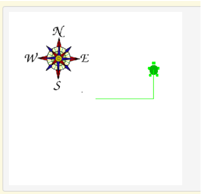

## Course Directory

### Return to the course outline

[← Back to AP CSA / 返回课程目录](../../index.html)

## Topic Intro

### Practice with Turtle method calls

This deck keeps the textbook mixed-up code task for drawing a sideways capital `L`, then the groupwork Turtle Drawing challenge.

The focus is correct object-method syntax:

```java
yertle.forward();
yertle.turnLeft();
yertle.turnRight();
```

## Mixed-Up Code

### `parsonsprob:: parsons_TurtleL`

{fig-align="right" width="28%"}

The following program uses a turtle to draw a sideways capital `L` as seen in the image, but the lines are mixed up.

The program should do all necessary set-up. Then it should ask the turtle to turn right, go forward, turn left, and then go forward `50` pixels.

Next, it should ask the habitat to show itself.

## Mixed Blocks

### Needed blocks plus two extras

```text
import java.util.*;
import java.awt.*;
public class TurtleTest {
    public static void main(String[] args) {
        World habitat = new World(300,300);
        Turtle yertle = new Turtle(habitat);
        yertle.turnRight();
        yertle.right();          // extra
        yertle.forward();
        yertle.forward()         // extra
        yertle.turnLeft();
        yertle.forward(50);
        habitat.show(true);
    } // end main
} // end class
```

## Correct Order

### `parsons_TurtleL`

```java
import java.util.*;
import java.awt.*;

public class TurtleTest {
    public static void main(String[] args) {
        World habitat = new World(300,300);
        Turtle yertle = new Turtle(habitat);
        yertle.turnRight();
        yertle.forward();
        yertle.turnLeft();
        yertle.forward(50);
        habitat.show(true);
    } // end main
} // end class
```

Reject `yertle.right();` and `yertle.forward()` without the semicolon.

## Groupwork

### Coding Challenge: Turtle Drawing

Make `yertle` the Turtle draw a shape.

For example, have it draw a square, a zigzag shape, or a block letter by calling the `forward` method and a turn method multiple times.

The textbook encourages working in pairs for this challenge.

## Turtle Methods

### Simple methods for the challenge

Use these Turtle method calls:

```java
yertle.forward();
yertle.turnLeft();
yertle.turnRight();
yertle.backward();
yertle.penUp();
yertle.penDown();
```

## Code Task

### `activecode:: challenge1-7-TurtleShape`

Textbook prompt: Have `yertle` draw a shape, for example a square or a zigzag shape or a block letter, by calling the `forward` method and a turn method multiple times.

## Starter Code

### `challenge1-7-TurtleShape`

```java
import java.awt.*;
import java.util.*;

public class TurtleShape
{
    public static void main(String[] args)
    {
        World habitat = new World(500, 500);
        Turtle yertle = new Turtle(habitat);

        // Use yertle's forward and turnRight or turnLeft methods to draw a shape
        // Add your drawing code here

        // Do not change the line below!
        habitat.show(true);
    }
}
```

## Test Requirements

### `challenge1-7-TurtleShape`

Runestone checks the code for these requirements:

::: {.tight-list}
- at least `3+ turns` using `.turnRight()` or `.turnLeft()`
- at least `4+ moves` using `.forward` or `.backward`
- at least `25+ line(s)` of code
:::

The starter context should stay intact: `World habitat`, `Turtle yertle`, and `habitat.show(true)`.

## Classroom Check

### A complete answer should include

::: {.tight-list}
- order the sideways `L` program with imports, class, `main`, setup, method calls, and `show`
- reject `yertle.right();` because it is not the textbook Turtle method call
- reject `yertle.forward()` without a semicolon
- use `object.method();` syntax for every Turtle command
- keep the Turtle Drawing starter and add drawing commands where the comment asks for them
- meet the `3+ turns`, `4+ moves`, and `25+ lines` test requirements
:::

## End

### 1.7 complete

The next topic begins documentation with comments.
