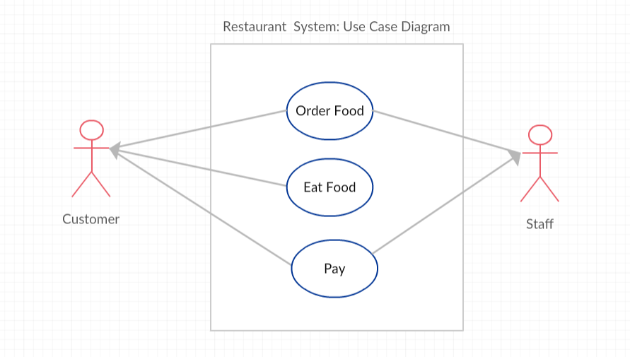

## Course Directory

### Return to the course outline

[← Back to AP CSA / 返回课程目录](../../index.html)

## Topic Intro

### Comments are written for people

Comments make code easier to read, maintain, and revisit later.

::: {.tight-list}
- Comments are ignored by the compiler.
- Comments do not execute when the program runs.
- Comments help the original programmer, classmates, teachers, and future maintainers understand intent.
:::

In commercial software, commenting matters because code is usually maintained by a team for years.

## Comment Types

### Three common Java forms

| Comment type | Syntax | Typical use |
|---|---|---|
| single-line comment | `// comment` | short note on one line |
| multi-line comment | `/* comment */` | block comment across lines |
| documentation comment | `/** comment */` | Javadoc-style API documentation |

Most IDEs format comments differently so they are easier to spot.

## Documentation Comments {.smaller}

### Javadoc-style metadata

Documentation comments often appear before classes, methods, and instance variables.

Common tags:

::: {.tight-list}
- `@author`: author of the program
- `@since`: date released
- `@version`: version of the program
- `@param`: parameter of a method
- `@return`: return value from a method
:::

The AP exam does not require full Javadoc, but it does require reading and reasoning from documentation.

## Comment Example

### Explain intent and sections

```java
/**
 * MyClass.java
 * @author My Name
 * @since Date
 * This class keeps track of the max score.
 */
public class MyClass
{
    private int max = 10; // this keeps track of the max score

    /* The print method prints out the max. */
    public void print()
    {
        System.out.println(max);
    }
}
```

Good comments clarify purpose, assumptions, or non-obvious code.

## Code Task

### Add useful comments

Add a multi-line comment above the class. Then add single-line comments above each section: read input, calculate, and print.

```{.java .smaller}
import java.util.Scanner;

public class Multiply
{
    public static void main(String[] args)
    {
        Scanner scan = new Scanner(System.in);
        int num1 = scan.nextInt();
        int num2 = scan.nextInt();

        int result = num1 * num2;

        System.out.println(num1 + " x " + num2 + " = " + result);
        scan.close();
    }
}
```

Completion checks: include `/*` and `//` comments.

## Preconditions

### What must be true before code runs

A <span class="term">precondition</span> (前置条件) is a condition that must be true just before a method or section of code runs for it to behave as expected.

::: {.tight-list}
- The method may depend on the caller to satisfy the precondition.
- The method is not always required to check the precondition.
- Preconditions often describe legal parameter values.
:::

Example: divisors cannot be zero for integer division.

## Postconditions

### What must be true after code runs

A <span class="term">postcondition</span> (后置条件) describes what must be true after a method or section of code finishes.

Postconditions can describe:

::: {.tight-list}
- the value returned by a method
- changes to an object's state
- output produced by a method
- guarantees the caller can rely on
:::

Good documentation tells callers what a method expects and what it promises.

## Code Task

### `Math.sqrt` precondition

The square root method has a precondition: the number should not be negative for normal real-number results.

```java
public class SqRoot
{
    public static void main(String[] args)
    {
        double num = -4;
        System.out.println(Math.sqrt(num));
    }
}
```

Fix `num` so the output is not `NaN`.

`NaN` means "not a number".

## Turtle Preconditions

### Documenting expected ranges

The Turtle `forward` method can be documented with preconditions and postconditions.

```java
/**
 * Method to move the turtle forward the given number of pixels.
 * @param pixels the number of pixels to walk forward in the heading direction
 * Preconditions: pixels is between 0 and the width and height of the world.
 * Postconditions: the turtle is moved forward by pixels amount
 * but stays within the width and height of the world.
 */
public void forward(int pixels)
{
    /* code to move the turtle forward */
}
```

The documentation tells the caller what values are expected.

## Code Task

### Try to break a precondition

Change `forward(100)` to test the Turtle method's precondition.

```{.java .smaller}
import java.awt.*;
import java.util.*;

public class TurtlePreconditions
{
    public static void main(String[] args)
    {
        World habitat = new World(300, 300);
        Turtle yertle = new Turtle(habitat);

        yertle.forward(100);

        yertle.turnLeft();
        yertle.forward();
        yertle.turnLeft();
        yertle.forward();

        habitat.show(true);
    }
}
```

Try a larger number and a negative number; observe what the method does.

## Software Validity

### Preconditions support testing

<span class="term">Software validity</span> asks whether software does what it is supposed to do before release.

Preconditions and postconditions help testers decide:

::: {.tight-list}
- normal inputs to try
- boundary cases to try
- invalid inputs to try
- expected results after each action
:::

Good testers intentionally try to break assumptions.

## Use Cases

### Preconditions in user interactions

{fig-align="center" width="62%"}

A <span class="term">use-case</span> describes a specific user interaction with a system.

Example:

::: {.tight-list}
- Precondition for "Eat Food": the customer has already ordered food and staff has delivered it.
- Postcondition for "Eat Food": the customer eats the food.
:::

## Student Response Task

### Pay for food use-case

Write the preconditions and postconditions for the use-case "Pay for food".

A strong answer should connect it to earlier use-cases:

::: {.tight-list}
- possible precondition: customer has ordered food
- possible precondition: staff has delivered food or prepared the bill
- possible postcondition: payment is completed
- possible postcondition: order is marked paid
:::

Use-case conditions should be concrete enough to test.

## Groupwork Challenge

### Preconditions in Algorithms

In pairs or groups, design four steps a user must do to purchase a product online.

For each step, list:

::: {.tight-list}
- the user action
- at least one precondition
- at least one postcondition
:::

Example product: a Java book in an online store.

Optional drawing tools are not required; the important work is precise conditions.

## AP-Style Quick Check

### Reasonable preconditions

Consider the method.

```java
/** method to add extra-credit to the score **/
public double computeScore(double score, double extraCredit)
{
    double totalScore = score + extraCredit;
    return totalScore;
}
```

Reasonable preconditions:

```java
/* Precondition: score >= 0 */
/* Precondition: extraCredit >= 0 */
```

Both values should be non-negative for a normal scoring model.

## Classroom Check

### A complete answer should...

::: {.tight-list}
- identify `//`, `/* comment */`, and `/** comment */`
- explain that comments help people, not program execution
- use comments to clarify purpose, sections, or assumptions
- define <span class="term">precondition</span> as what must be true before execution
- define <span class="term">postcondition</span> as what must be true after execution
- apply precondition thinking to method calls such as `Math.sqrt` or `Turtle.forward`
- connect preconditions and postconditions to testing and software validity
:::

## End

### Return to the course outline

[← Back to AP CSA / 返回课程目录](../../index.html)
