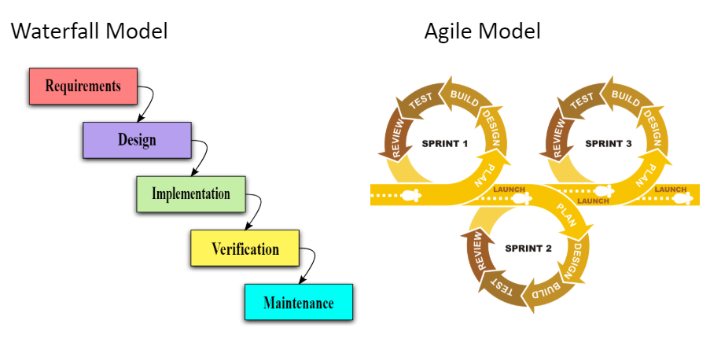

## Course Directory

### Return to the course outline

[← Back to AP CSA / 返回课程目录](../../index.html)

## Comments

### Code for people, not the compiler

Comments make code easier to read, maintain, and revisit later.

Java supports three common forms:

::: {.tight-list}
- `//` single-line comment
- `/* ... */` multi-line block comment
- `/** ... */` documentation comment for generated docs
:::

Comments are ignored by the compiler, but useful to programmers.

## Documentation Comments

### Javadoc-style metadata

Documentation comments often appear before classes, methods, or instance variables.

Common tags include:

::: {.tight-list}
- `@author`
- `@since`
- `@version`
- `@param`
- `@return`
:::

The AP exam will not require full Javadoc, but the habit of documenting intent is still valuable.

## Preconditions and Postconditions

### What must be true before and after a method runs

::: {.tight-list}
- a precondition must be true before the method is called
- a postcondition describes what is true after the method finishes
:::

Examples:

::: {.tight-list}
- dividing by zero breaks a math precondition
- `Math.sqrt(num)` is only meaningful for non-negative inputs in normal classroom use
- a turtle movement method expects values within a usable screen range
:::

## Preconditions in Design

### Stronger reasoning, stronger testing

Good preconditions and postconditions help with:

::: {.tight-list}
- method usage
- debugging
- test-case design
- software validity checks
:::

Students should get comfortable asking: What must be true before this method call?

## Use Cases

### User interactions can become method-level thinking

{fig-align="center" width="70%"}

A use-case describes a specific user interaction with a system. Preconditions and postconditions can be attached to each use-case, not just to methods.

## Agile Development

### Planning is iterative, not just linear

{fig-align="center" width="70%"}

The textbook keeps this as professional context:

::: {.tight-list}
- waterfall: finish one phase, then move on
- agile: short iterations, testing, feedback, revision
:::

For classroom use, the key takeaway is that software quality improves through frequent feedback and revision.

## Classroom Tasks

### Practice worth keeping

Retained classroom work for this topic:

::: {.tight-list}
- classify comment types
- add comments to a short multiplication program
- reason about method preconditions with `Math.sqrt` and turtle movement
- 1.8.5 Coding Challenge: Preconditions in Algorithms
:::

## Classroom Check

### A complete answer should...

::: {.tight-list}
- identify the three common Java comment forms
- explain that comments help people, not program execution
- define precondition and postcondition
- apply precondition thinking to method calls such as `Math.sqrt` or turtle movement
- connect documentation to testing and software validity
:::

## End

### Return to the course outline

[← Back to AP CSA / 返回课程目录](../../index.html)
