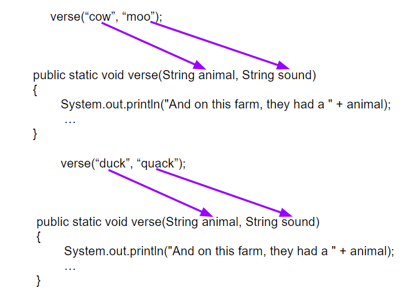

## Course Directory

### Return to the course outline

[← Back to AP CSA / 返回课程目录](../../index.html)

## Procedural Abstraction

### Break big work into named smaller tasks

A <span class="term">method</span> is a named block of code that performs a task when it is called.

<span class="term">Procedural abstraction</span> means we can use a method without worrying about every internal detail of how it works.

That is how large programs stay readable.

## Method Calls

### Flow of control moves between methods

When a method is called:

::: {.tight-list}
- execution jumps to that method
- the statements in that method run
- control returns to the line after the call
:::

The textbook uses repeated-song examples because repeated code is the clearest signal that a new method should exist.

## Method Signature

### What the caller needs to know

{fig-align="center" width="62%"}

The method header includes:

::: {.tight-list}
- method name
- return type
- parameter list
:::

The <span class="term">signature</span> is the method name plus the ordered parameter types.

## Parameters and Arguments

### Header variables versus call-time values

```java
void println(String x)   // parameter
println("Hello World");  // argument
```

The <span class="term">parameter</span> is declared in the method header.  
The <span class="term">argument</span> is the actual value passed in the call.

Arguments can be literals, variables, or expressions of compatible type.

## Matching Arguments to Parameters

### Method calls must fit the signature

{fig-align="center" width="68%"}

Java matches a method call by checking:

::: {.tight-list}
- method name
- number of arguments
- argument types
- parameter order
:::

Java also uses <span class="term">call by value</span>: parameters receive copies of argument values.

## Overloading

### Same method name, different signatures

Methods are <span class="term">overloaded</span> when they share a name but differ in parameter count or parameter types.

Examples from `println`:

::: {.tight-list}
- `println()`
- `println(String x)`
- `println(int x)`
:::

The compiler decides which version to call from the signature match.

## Classroom Tasks

### Practice worth keeping

Retained classroom work for this topic:

::: {.tight-list}
- repeated-code identification in song structure
- adding new method calls to an existing program
- tracing argument-to-parameter matching
- <span class="term">1.9.5 Coding Challenge: Song with Parameters</span>
:::

## Classroom Check

### A complete answer should...

::: {.tight-list}
- define a <span class="term">method</span> as a named task block
- explain the jump-and-return flow of control in a method call
- identify the parts of a method header
- distinguish parameters from arguments
- explain <span class="term">overloading</span> as same name with different signatures
:::

## End

### Return to the course outline

[← Back to AP CSA / 返回课程目录](../../index.html)
