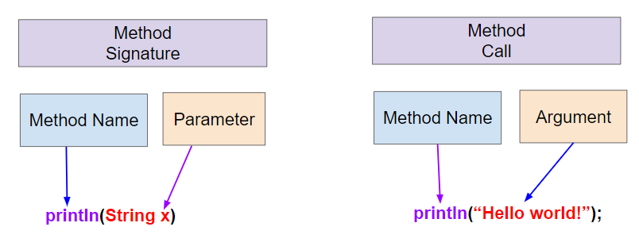

## Course Directory

### Return to the course outline

[← Back to AP CSA / 返回课程目录](../../index.html)

## Topic Intro

### Reading method documentation

When using methods in a library or API, we can look up the <span class="term">method signature</span> or <span class="term">method header</span> in its documentation.

These details tell us the method name, what value is returned, and what values must be passed in.

## Method Header

### First line of a method

A <span class="term">method header</span> is the first line of a method.

It includes:

::: {.tight-list}
- the method name
- the return type
- the parameter list of parameters and their data types
:::

The <span class="term">return type</span> is the type of value that the method returns.

In this lesson, we look at `void` return types, which means the method does not return anything.

## Method Signature

### Header without the return type

The <span class="term">method signature</span> is the method header without the return type.

It is just the method name and its parameter list.

The <span class="term">parameter list</span> is a list of variables and their data types that are passed to the method when it is called.

The parameter list is enclosed in parentheses and separated by commas.

## Empty Parameter Lists

### Parentheses are still required

The parameter list can be empty with no parameters, although the parentheses must be present.

Examples from `PrintStream` signatures for `println`:

::: {.tight-list}
- `void println()` has an empty parameter list with no parameters
- `void println(String x)` prints a `String` value
- `void println(int x)` prints an `int` value
:::

## Arguments

### Actual values in the method call

We can call these methods with the appropriate <span class="term">arguments</span> to print out the value we want.

The argument is the actual value that is passed to the method when it is called.

```java
System.out.println();              // prints a newline
System.out.println("Hello World"); // prints a String
System.out.println(42);            // prints an int
```

## Signature and Call {.image-fit}

### `println(String x)` and `println("Hello World")`

{fig-align="center" width="62%"}

The method signature contains the method name and the parameter type and variable.

The method call contains only the method name and the argument value.

## Parameter and Argument

### Compatible type required

The argument must be compatible with the data type of the parameter in the method signature.

The argument is saved in the parameter variable when the method is called.

Many people use the terms <span class="term">parameter</span> and <span class="term">argument</span> interchangeably.

## Find the Different Words

### `clickablearea:: different-code-old-mcdonald`

Click on the words that are different in the lines that are repeated.

```text
And on this farm, they had a cow.
With a moo moo here and a moo moo there
Here a moo, there a moo, everywhere a moo moo

And on this farm, they had a duck.
With a quack quack here and a quack quack there
Here a quack, there a quack, everywhere a quack quack
```

## Different Words Answer

### Parameters to add

Did you notice that there are lines that are identical except for the animal name and the sound that they make?

The changing values are:

::: {.tight-list}
- animal: `cow`, `duck`
- sound: `moo`, `quack`
:::

These are the values that the method needs to do its job.

## Parameters

### Formal parameters in a method header

We can make methods even more powerful and more abstract by giving them parameters for data that they need to do their job.

A <span class="term">parameter</span>, sometimes called a <span class="term">formal parameter</span>, is a variable declared in the header of a method or constructor and can be used inside the body of the method.

This allows values or arguments to be passed and used by a method.

## Arguments

### Actual parameters in a method call

An <span class="term">argument</span>, sometimes called an <span class="term">actual parameter</span>, is a value that is passed into a method when the method is called and is saved in the parameter variable.

We can make a method called `verse` that takes the animal and its sound to print out any verse.

The parameter variables `animal` and `sound` will hold different values when the method is called.

## Method with Parameters

### `verse(String animal, String sound)`

```java
/* This method prints out a verse for any given animal and sound.
   @param animal - the name of the animal
   @param sound - the sound the animal makes
*/
public static void verse(String animal, String sound)
{
    System.out.println("And on this farm, they had a " + animal);
    chorus();
    System.out.println("With a " + sound + " " + sound
                   + " here and a " + sound + " " + sound + " there");
    System.out.println("Here a " + sound
                   + ", there a " + sound
                   + ", everywhere a " + sound + " " + sound);
}
```

## Main as an Outline

### Calls to `intro()` and `verse()`

The `main` method can now just consist of calls to the `intro()` and `verse()` methods.

Main methods often look like an outline for the program, calling methods to do the work.

```java
public static void main(String[] args)
{
    intro();
    verse("cow", "moo");
    intro();
    verse("duck", "quack");
    intro();
}
```

## Argument Flow

### Arguments saved in parameter variables

Step through this version of the code and watch how the arguments are saved in the parameter variables with each call to the `verse` method.

::: {.tight-list}
- `verse("cow", "moo")` saves `"cow"` in `animal` and `"moo"` in `sound`
- `verse("duck", "quack")` saves `"duck"` in `animal` and `"quack"` in `sound`
:::

## Classroom Check

### A complete answer should include

::: {.tight-list}
- distinguish method header from method signature
- identify method name, return type, and parameter list in a header
- explain that `void` means no return value
- match `println` signatures with compatible calls
- distinguish parameters from arguments
- identify `animal` and `sound` as parameters for the `verse` method
:::

## End

### Continue to call by value

The next deck covers matching arguments to parameters, call by value, and overloaded methods.
