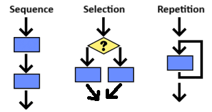
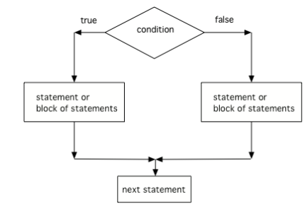

## Course Directory

### Return to the course outline

[← Back to AP CSA / 返回课程目录](../../index.html)

## Topic Intro

### Algorithms can choose and repeat

An <span class="term">algorithm</span> (算法) is a step-by-step process for solving a problem. Unit 2 adds two control moves that make algorithms less linear:

::: {.tight-list}
- <span class="term">selection</span> (选择): execute steps only when a condition is true
- <span class="term">repetition</span> (重复): execute steps again until the work is finished
:::

{fig-align="center" width="44%"}

## Selection

### A branch depends on a Boolean decision

Selection phrases usually include a condition:

::: {.tight-list}
- If there is a text from your friend, answer it.
- If it is cold, wear a sweater.
- Check if you have homework due. If so, pack it.
- Put on sunglasses if it is sunny.
:::

The next action depends on whether the condition evaluates to <span class="mark">true or false</span>.

## Repetition

### A loop keeps doing work

Repetition phrases describe repeated action:

::: {.tight-list}
- Keep waking up and snoozing for the next 15 minutes.
- If there is a text from your friend, answer it for all texts.
- Repeat packing items until your bag is ready.
:::

In Java, repetition is implemented with <span class="term">loops</span>, especially `while` and `for`.

## Pseudocode and Flowcharts

### Plan the control flow before Java syntax

::: {.two-col}
::: {}
{width="100%"}
:::
::: {.soft-box}
Use pseudocode and flowcharts to:

- show the order of actions
- mark branch points
- mark repeated work
- test the algorithm before coding
:::
:::

## Mixed-Up Algorithm

### Buying a birthday gift

Reorder the pseudocode. Indent the buying rules inside the repetition.

```text
Initialize total amount of money.
Repeat while still money in total:
    If total more than $25, buy a gift card and subtract 25.
    If total more than $10, buy a small cake and subtract 10.
    If total more than $5, buy some candy and subtract 5.
    If total more than $1, buy a card and subtract 1.
    Otherwise, give them the change.
```

Class focus: the repeated loop contains several selection checks.

## Quick Check

### Trace the gift algorithm with $16

Given the gift algorithm, assume `total = 16`. What is the outcome?

::: {.tight-list}
- A. gift card, small cake, candy, card
- B. small cake and candy
- C. small cake, candy, and card
- D. two cakes and candy
:::

Answer: <span class="mark">C</span>. The algorithm buys a $10 cake, then $5 candy, then a $1 card.

## Quick Check

### Trace the gift algorithm with $22

Given the same algorithm, assume `total = 22`. What is the outcome?

::: {.tight-list}
- A. gift card, small cake, candy, card
- B. small cake and candy
- C. small cake, candy, and card
- D. two cakes, a card, and $1 change
:::

Answer: <span class="mark">D</span>. The repetition allows the $10 cake rule to run twice.

## Student Response Task

### Snack algorithm

Write pseudocode for choosing a snack. It must include both:

::: {.tight-list}
- one selection rule using `if`
- one repetition rule using `repeat`, `while`, `until`, `all`, or `keep`
:::

Example starting point:

```text
Repeat while I am still hungry:
    If the snack is healthy, choose it.
    Otherwise, look for another snack.
```

## Classroom Check

### A complete answer should...

::: {.tight-list}
- define <span class="term">selection</span> as choosing a path based on true or false
- define <span class="term">repetition</span> as repeating steps until a stopping condition is met
- distinguish sequential steps from branch and loop steps
- trace how repeated selection can change an algorithm result
- use pseudocode or a flowchart to show control flow before Java syntax
:::

## End

### Return to the course outline

[← Back to AP CSA / 返回课程目录](../../index.html)
