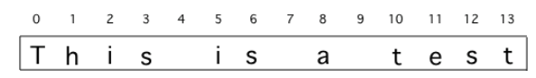

## Course Directory

### Return to the course outline

[← Back to AP CSA / 返回课程目录](../../index.html)

## Topic Intro

### String traversal and string processing

Loops are often used for <span class="term">String Traversals</span> or <span class="term">String Processing</span> algorithms where the code steps through a string character by character.

In previous lessons, we learned to use `String` objects and built-in string methods to process strings.

In this lesson, we will write our own loops to process strings.

## Standard String Algorithms

### Loops can be used to

::: {.tight-list}
- find if one or more substrings has a particular property
- determine the number of substrings that meet specific criteria
- create a new string with the characters reversed
:::

## String Indices

### Positions start at 0

Remember that strings are a sequence of characters where each character is at a position or <span class="term">index</span> starting at `0`.

::: {.image-fit}
{fig-align="center" width="70%"}
:::

The first character in a Java `String` is at index `0` and the last character is at `length() - 1`, so loops processing strings should start at `0`.

## String Methods

### Methods often used to process strings

::: {.tight-list}
- `int length()` returns the number of characters in a `String` object.
- `int indexOf(String str)` returns the index of the first occurrence of `str` or `-1` if `str` is not found.
- `String substring(int from, int to)` returns the substring beginning at index `from` and ending at index `to - 1`.
- `String substring(int from)` returns `substring(from, length())`.
:::

Note that `s.substring(i,i+1)` returns the character at index `i`.

## While Find and Replace Loop

### `indexOf` controls the loop

A while loop can be used with the `String` `indexOf` method to find certain characters in a string and process them, usually using the `substring` method.

```java
String s = "example";
int i = 0;
// while there is an a in s
while (s.indexOf("a") >= 0)
{
  // Find and save the next index for an a
  i = s.indexOf("a");
  // Process the string at that index
  String ithLetter = s.substring(i,i+1);
  // process the letter or rebuild the string here
}
```

## Mixed-Up Code

### `parsonsprob:: removeA`

Textbook prompt: The following program removes all the `a`'s from a string, but the code is mixed up.

Drag the blocks from the left area into the correct order in the right area.

## Mixed Blocks

### `parsonsprob:: removeA`

::: {.code-scroll}
```java
public static void main(String[] args)
{
```

```java
   String s = "are apples tasty without an a?";
   int index = 0;
   System.out.println("Original string: " + s);
```

```java
   // while there is an a in s
   while (s.indexOf("a") >= 0)
   {
```

```java
      // Find the next index for an a
      index = s.indexOf("a");
```

```java
      // Remove the a at index by concatenating
      // substring up to index and then rest of the string.
      s = s.substring(0,index) +
          s.substring(index+1);
```

```java
   } // end loop
```

```java
   System.out.println("String with a's removed:" + s);
```

```java
} // end method
```
:::

## Correct Order

### `parsonsprob:: removeA`

::: {.code-scroll}
```java
public static void main(String[] args)
{
   String s = "are apples tasty without an a?";
   int index = 0;
   System.out.println("Original string: " + s);

   // while there is an a in s
   while (s.indexOf("a") >= 0)
   {
      // Find the next index for an a
      index = s.indexOf("a");
      // Remove the a at index by concatenating
      // substring up to index and then rest of the string.
      s = s.substring(0,index) +
          s.substring(index+1);
   } // end loop

   System.out.println("String with a's removed:" + s);
} // end method
```
:::

## Find and Replace

### Scanning mistakes

Google has been scanning old books and then using software to read the scanned text.

But, the software can get things mixed up like using the number `1` for the letter `l`.

The following code loops through a string replacing all `1`'s with `l`'s.

Trace through the code below with a partner and explain how it works on the given message.

## Code Task

### `activecode:: string-replace1`

Textbook prompt: Change the code to add code for a counter variable to count the number of `1`'s replaced in the message and print it out.

Change the message to have more mistakes with `1`'s to test it.

## Code Window

### `activecode:: string-replace1`

::: {.code-scroll}
```java
public class FindAndReplace
{
    public static void main(String[] args)
    {
        String message = "Have a 1ong and happy 1ife";
        int index = 0;

        // while more 1's in the message
        while (message.indexOf("1") >= 0)
        {
            // Find the next index for 1
            index = message.indexOf("1");
            System.out.println("Found a 1 at index: " + index);
            // Replace the 1 with a l at index by concatenating substring up to
            // index and then the rest of the string.
            String firstpart = message.substring(0, index);
            String lastpart = message.substring(index + 1);
            message = firstpart + "l" + lastpart;
            System.out.println("Replaced 1 with l at index " + index);
            System.out.println(
                    "The message is currently "
                            + message
                            + " but we aren't done looping yet!");
        }
        System.out.println("Cleaned text: " + message);
    }
}
```
:::

## Test Requirements

### `activecode:: string-replace1`

Runestone's original trace output for the starting message is:

::: {.scroll-block}
```text
Found a 1 at index: 7
Replaced 1 with l at index 7
The message is currently Have a long and happy 1ife but we aren't done looping yet!
Found a 1 at index: 22
Replaced 1 with l at index 22
The message is currently Have a long and happy life but we aren't done looping yet!
Cleaned text: Have a long and happy life
```
:::

The test expects the final submitted output to be different because the prompt asks you to add a counter and change the message to have more `1` mistakes.

## Classroom Check

### A complete answer should include

::: {.tight-list}
- identify `indexOf` as the loop test for repeated find-and-replace
- use `indexOf("a") >= 0` or `indexOf("1") >= 0` to keep searching while a target remains
- use `substring(0,index)` and `substring(index+1)` to remove a character
- rebuild a string by concatenating the prefix, replacement, and suffix
- explain why the next `indexOf` search can find the next occurrence after the string changes
- add a counter update inside the replacement loop
:::

## End

### Continue to Part 2

[Next: Reverse and Cats/Dogs Challenge →](2-10-part-2-reverse-and-cats-dogs-challenge.html)
