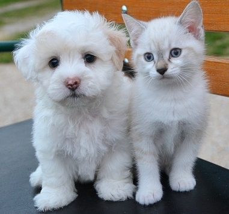

## Course Directory

### Return to the course outline

[← Back to AP CSA / 返回课程目录](../../index.html)

## For Loops over Strings

### Visit every character

`for` loops can also be used to process strings, especially in situations where you know you will visit every character.

`while` loops are often used with strings when you are looking for a certain character or substring in a string and do not know how many times the loop needs to run.

`for` loops are used when you know you want to visit every character.

## For Loop Pattern

### Start at 0, stop before `length()`

`for` loops with strings usually start at `0` and use the string's `length()` for the ending condition to step through the string character by character.

```java
String s = "example";
// loop through the string from 0 to length
for(int i=0; i < s.length(); i++)
{
   String ithLetter = s.substring(i,i+1);
   // Process the string at that index
}
```

## Mixed-Up Code

### `parsonsprob:: countEs`

Textbook prompt: The following main method has the correct code to count the number of `e`'s in a string, but the code is mixed up.

Drag the blocks from the left area into the correct order in the right area.

## Mixed Blocks

### `parsonsprob:: countEs`

::: {.code-scroll}
```java
public static void main(String[] args)
{
```

```java
   String message = "e is the most frequent English letter.";
   int count = 0;
```

```java
   for(int i=0; i < message.length(); i++)
   {
```

```java
      if (message.substring(i,i+1).equalsIgnoreCase("e"))
```

```java
         count++;
```

```java
   }
```

```java
   System.out.println(count);
```

```java
}
```
:::

## Correct Order

### `parsonsprob:: countEs`

```java
public static void main(String[] args)
{
   String message = "e is the most frequent English letter.";
   int count = 0;
   for(int i=0; i < message.length(); i++)
   {
      if (message.substring(i,i+1).equalsIgnoreCase("e"))
         count++;
   }
   System.out.println(count);
}
```

## Reverse String

### Build a new string

Here is a `for` loop that creates a new string that reverses the string `s`.

We start with a blank string `sReversed` and build up our reversed string in that variable by copying in characters from the string `s`.

## Code Task

### `activecode:: reverseString`

Textbook prompt:

::: {.tight-list}
- What would happen if you started the loop at `1` instead?
- What would happen if you used `<=` instead of `<`?
- What would happen if you changed the order in which you added the `ithLetter` in line 12?
:::

## Code Window

### `activecode:: reverseString`

```java
public class ReverseString
{
    public static void main(String[] args)
    {
        String s = "Hello";
        String sReversed = "";
        String ithLetter;

        for (int i = 0; i < s.length(); i++)
        {
            ithLetter = s.substring(i, i + 1);
            // add the letter at index i to what's already reversed.
            sReversed = ithLetter + sReversed;
        }
        System.out.println(s + " reversed is " + sReversed);
    }
}
```

## Test Requirements

### `activecode:: reverseString`

Runestone checks that the submitted code has changed from the original starter code.

Use the prompt questions to test how loop start, loop condition, and concatenation order change the result.

## Groupwork Coding Challenge

### String Replacement Cats and Dogs

::: {.image-fit}
{fig-align="center" width="22%"}
:::

Are you a cat person or a dog person? The code below prints a nice message about cats, but if you're a dog person, you might not agree.

## Challenge Steps

### Required and optional tasks

::: {.tight-list}
1. Write some code below that changes every occurrence of `"cat"` to `"dog"` in the message. This code will be more like the first program in this lesson where we replaced `1`'s with `l`'s.
2. Optional, not autograded: add a counter to count the number of replacements and print it out.
3. Optional, challenging, not autograded: after you replace `"cat"` with `"dog"`, add another loop that looks for the word `"dogs"` and adds `" and cats"` to it. Do not replace `"dog"`, just replace `"dogs"`.
:::

## Optional Extension Note

### `indexOf(String target, int fromIndex)`

For the challenging optional loop, you will need to use a special version of `indexOf` that searches from a given index, so that you don't end up with an infinite loop that keeps finding the first `"dogs"`.

Make sure you add a variable `fromIndex` that is initialized to `0` and that is changed each time through the loop to skip over the last word that was found.

`int indexOf(String target, int fromIndex)` searches left-to-right for the target substring, but starts the search at the given `fromIndex`.

## Code Task

### `activecode:: challenge-string-replace`

Textbook prompt: Write a while loop that replaces every occurrence of `"cat"` in the message with `"dog"` using the `indexOf` and `substring` methods.

## Code Window

### `activecode:: challenge-string-replace`

::: {.code-scroll}
```java
public class ChallengeReplace
{
    public static void main(String[] args)
    {
        String message =
                "I love cats! I have a cat named Coco. My cat's very smart!";

        // Write a loop here that replaces every occurrence of "cat"
        // in the message with "dog", using indexOf and substring.

        System.out.println(message);
    }
}
```
:::

## Test Requirements

### `activecode:: challenge-string-replace`

Runestone checks that:

::: {.tight-list}
- `main` output equals the original message after replacing all `"cat"` substrings with `"dog"`
- the code contains a `while` loop
- the code contains `substring(`
- the code does not contain shortcut `.replace`
:::

## Classroom Check

### A complete answer should include

::: {.tight-list}
- use `for` when every string index should be visited
- use `substring(i,i+1)` to get the one-character substring at index `i`
- count matching letters with an `if` inside the loop
- explain why `sReversed = ithLetter + sReversed` reverses the order
- replace every `"cat"` using repeated `indexOf` and `substring`
- avoid `.replace` in the Cats and Dogs challenge
:::

## End

### Return to the course outline

[← Back to AP CSA / 返回课程目录](../../index.html)
