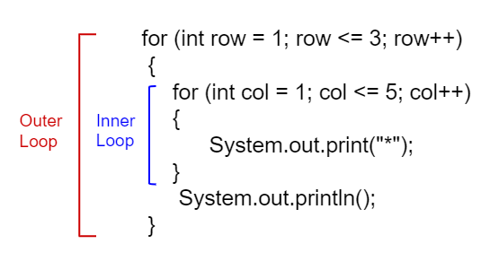

## Course Directory

### Return to the course outline

[← Back to AP CSA / 返回课程目录](../../index.html)

## Topic Intro

### A loop can contain another loop

<span class="term">Nested iteration</span> (嵌套迭代) means one loop is placed inside another loop.

{fig-align="center" width="38%"}

The outer loop controls how many groups are produced. The inner loop controls what happens inside each group.

## Rectangle Pattern

### Outer loop rows, inner loop columns

```java
for (int row = 1; row <= 3; row++)
{
    for (int col = 1; col <= 5; col++)
    {
        System.out.print("*");
    }
    System.out.println();
}
```

Output:

```text
*****
*****
*****
```

## Code Task

### Change rows and columns

Modify the rectangle code to print `10` rows and `8` columns.

```java
for (int row = 1; row <= 10; row++)
{
    for (int col = 1; col <= 8; col++)
    {
        System.out.print("*");
    }
    System.out.println();
}
```

The total number of stars is `10 * 8 = 80`.

## Quick Check

### Count nested-loop output

What does this print?

```java
for (int i = 1; i < 7; i++)
{
    for (int y = 1; y <= 5; y++)
    {
        System.out.print("*");
    }
    System.out.println();
}
```

Answer: `6` rows with `5` stars per row.

## Quick Check

### Count down inside each row

```java
for (int i = 0; i < 5; i++)
{
    for (int j = 3; j >= 1; j--)
    {
        System.out.print("*");
    }
    System.out.println();
}
```

Answer: `5` rows with `3` stars per row.

## Mixed-Up Code

### Ten rows, five stars each

```java
public class Test1
{
    public static void main(String[] args)
    {
        for (int x = 0; x < 10; x++)
        {
            for (int y = 0; y < 5; y++)
            {
                System.out.print("*");
            }
            System.out.println();
        }
    }
}
```

Watch for the extra wrong block `y <= 5`, which would print six stars.

## Turtle Nested Loop

### Repeat a shape, then turn

::: {.code-scroll .compact}
```java
World world = new World(300, 300);
Turtle yertle = new Turtle(world);
yertle.setColor(Color.blue);

for (int i = 1; i <= 12; i++)
{
    for (int sides = 1; sides <= 4; sides++)
    {
        yertle.forward();
        yertle.turn(90);
    }
    yertle.turn(30);
}

world.show(true);
```
:::

The inner loop draws one square; the outer loop repeats squares around the center.

## Groupwork Coding Challenge

### Turtle snowflakes

Use nested `for` loops to draw repeated polygons.

```java
int n = 6;
int turnAmount = 360 / n;

for (int shape = 1; shape <= n; shape++)
{
    for (int side = 1; side <= n; side++)
    {
        yertle.forward(30);
        yertle.turn(turnAmount);
    }
    yertle.turn(turnAmount);
}
```

Change `n` to test different polygon snowflakes.

## Classroom Check

### A complete answer should...

::: {.tight-list}
- explain which loop is outer and which loop is inner
- connect rows and columns to nested loop counts
- compute total iterations by multiplying loop counts for rectangular loops
- trace nested loops that increment or decrement
- explain how nested turtle loops separate drawing a shape from repeating the shape
:::

## End

### Return to the course outline

[← Back to AP CSA / 返回课程目录](../../index.html)
