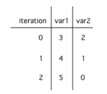

## Course Directory

### Return to the course outline

[← Back to AP CSA / 返回课程目录](../../index.html)

## Topic Intro

### Trace loops and count runs

In this lesson, you will practice tracing through code with loops and analyzing loops to determine how many times they run.

## Tracing Loops

### Keep track of variables, iterations, and output

Let's practice tracing through loops with many variables.

Remember to make a tracing table to keep track of all the variables, the iterations, and the output.

## Code Task

### `activecode:: example_trace_loop`

Textbook prompt: Here is a complex loop.

See if you can trace the code on paper by making a tracing table to predict what the code will do when you run it.

Add output statements before the loop and inside the loop at the end to keep track of the variables and run.

```java
System.out.println("var1: " + var1 + " var2: " + var2);
```

## Code Window

### `activecode:: example_trace_loop`

```java
public class Trace
{
    public static void main(String[] args)
    {
        int var1 = 3;
        int var2 = 2;

        while ((var2 != 0) && ((var1 / var2) >= 0))
        {
            var1 = var1 + 1;
            var2 = var2 - 1;
        }
    }
}
```

## Test Requirements

### `activecode:: example_trace_loop`

Runestone expects this output after adding the requested print statements:

```text
var1: 3 var2: 2
var1: 4 var2: 1
var1: 5 var2: 0
```

## Trace Table

### `example_trace_loop`

Did your trace table look like the following?

::: {.image-fit}
{fig-align="center" width="34%"}
:::

The `0` means before the first loop.

## Quick Check

### `mchoice:: loop-trace-count`

What are the values of `var1` and `var2` when the code finishes executing?

```java
int var1 = 0;
int var2 = 2;

while ((var2 != 0) && ((var1 / var2) >= 0))
{
   var1 = var1 + 1;
   var2 = var2 -1;
}
```

## Quick Check Choices

### `mchoice:: loop-trace-count`

::: {.tight-list}
- A. `var1 = 1, var2 = 1`
- B. `var1 = 2, var2 = 0`
- C. `var1 = 3, var2 = -1`
- D. `var1 = 0, var2 = 2`
- E. The loop will cause a run-time error with a division by zero
:::

## Answer Reasoning

### `mchoice:: loop-trace-count`

Correct answer: <span class="mark">B. `var1 = 2, var2 = 0`</span>

The loop stopped because `var2 = 0`.

After the first execution of the loop `var1 = 1` and `var2 = 1`. After the second execution, `var1 = 2` and `var2 = 0`.

This does not cause a run-time error because of short-circuit evaluation: when `var2` is `0`, the first condition in the `&&` is false, so the second condition is not executed.

## Quick Check

### `mchoice:: loop-trace-count2`

What are the values of `x` and `y` when the code finishes executing?

```java
int x = 2;
int y = 5;

while (y > 2 && x < y)
{
   x = x + 1;
   y = y - 1;
}
```

## Quick Check Choices

### `mchoice:: loop-trace-count2`

::: {.tight-list}
- A. `x = 5, y = 2`
- B. `x = 2, y = 5`
- C. `x = 5, y = 2`
- D. `x = 3, y = 4`
- E. `x = 4, y = 3`
:::

## Answer Reasoning

### `mchoice:: loop-trace-count2`

Correct answer: <span class="mark">E. `x = 4, y = 3`</span>

The first time the loop changes to `x = 3`, `y = 4`.

The second time `x = 4`, `y = 3`, and then the loop stops since `x` is not less than `y` anymore.

## Counting Loop Iterations

### Statement execution count

Loops can be also analyzed to determine how many times they run.

This is called <span class="term">run-time analysis</span> or a <span class="term">statement execution count</span>.

A statement execution count indicates the number of times a statement is executed by the program.

Statement execution counts are often calculated informally through tracing and analysis of the iterative statements.

## Code Task

### `activecode:: countstars1`

Textbook prompt: How many stars are printed out in this loop?

How many times does the loop run?

Figure it out on paper before you run the code.

## Code Window

### `activecode:: countstars1`

```java
public class CountLoop
{

    public static void main(String[] args)
    {
        for (int i = 3; i < 7; i++)
        {
            System.out.print("*");
        }
    }
}
```

## Test Requirements

### `activecode:: countstars1`

Runestone expects the output:

```text
****
```

## Counting Formula

### Largest value minus smallest value plus one

If you made a trace table, you would know that the loop runs when `i = 3`, `4`, `5`, `6` but finishes as soon as `i` becomes `7` since that is not less than `7`.

So, the loop runs 4 times.

The number of times a loop executes can be calculated by:

```text
largestValue - smallestValue + 1
```

## Counting Formula

### `<` and `<=`

::: {.tight-list}
- If the loop uses `counter <= limit`, `limit` is the largest value.
- If the loop uses `counter < limit`, `limit - 1` is the largest value that allows the loop to run.
:::

In the code above the largest value that allows the loop to run is `6`, the largest value less than `7`, and the smallest value that allows the loop to execute is `3`.

So this loop executes `6 - 3 + 1 = 4` times.

## Classroom Check

### A complete answer should include

::: {.tight-list}
- make a tracing table for variables, iterations, and output
- explain why short-circuit evaluation prevents division by zero in the trace check
- distinguish loop tracing from simply reading the final condition
- define statement execution count
- count a single loop using the actual counter values that enter the body
- apply `largestValue - smallestValue + 1` with `<` and `<=` correctly
:::

## End

### Continue to Part 2

[Next: Nested loop runtime →](2-12-part-2-nested-loop-runtime.html)
