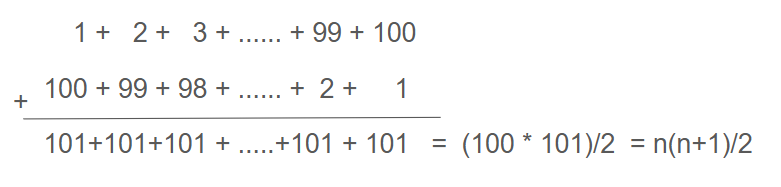

## Course Directory

### Return to the course outline

[← Back to AP CSA / 返回课程目录](../../index.html)

## Analyzing Nested Loops

### Outer runs times inner runs

Nested loops are loops within loops.

The number of times a nested loop runs is the number of times the outer loop runs <span class="mark">times</span> the number of times the inner loop runs.

Here is an example of a nested loop that prints a rectangle of stars.

## Code Task

### `activecode:: countstars`

Textbook prompt: How many stars are printed out by the following loops?

How many times do the loops run?

Calculate on paper before you run the code.

## Code Window

### `activecode:: countstars`

```java
public class NestedLoops
{

    public static void main(String[] args)
    {
        for (int row = 0; row < 5; row++)
        {
            for (int col = 0; col < 10; col++)
            {
                System.out.print("*");
            }
            System.out.println();
        }
    }
}
```

## Test Requirements

### `activecode:: countstars`

Runestone expects:

::: {.scroll-block}
```text
**********
**********
**********
**********
**********
```
:::

## Rectangular Nested Loop Count

### Multiply loop counts

The number of times a nested for loop body is executed is:

```text
outer loop runs * inner loop runs
```

For the example above, the outer loop executes `4 - 0 + 1 = 5` times.

The inner loop executes `9 - 0 + 1 = 10` times.

The total is `5 * 10 = 50`.

## Non-Rectangular Nested Loops

### Inner count depends on the outer variable

In the nested loops we have seen so far, the inner loop always runs a set number of times.

However, nested loops can be <span class="term">non-rectangular</span> where the number of times the inner loop runs is dependent on the outer loop's variable.

Notice the `j <= i` ending condition in the inner loop.

```java
for (int i = 1; i <= 4; i++)
{
     for (int j = 1; j <= i; j++)
     {
          System.out.print("*");
     }
     System.out.println();
}
```

## Triangle Output

### Inner loop runs `i` times

This code will print a triangle of stars instead of a rectangle because the inner loop runs `i` times.

It prints 1 star when `i=1`, 2 stars when `i=2`, and so on.

```text
*
**
***
****
```

## Code Task

### `activecode:: triangle-stars`

Textbook prompt: How many stars are printed out by the following non-rectangular loops?

Trace through it with the Code Lens button.

Then, can you change the code so that the triangle is upside down where the first row has `5` stars and the last row has `1` star?

Hint: make the inner loop count from `row` up to `5`.

## Code Window

### `activecode:: triangle-stars`

```java
public class NestedLoops
{

    public static void main(String[] args)
    {
        for (int row = 0; row < 5; row++)
        {
            // Change the inner loop to count from row up to 5
            for (int col = 0; col <= row; col++)
            {
                System.out.print("*");
            }
            System.out.println();
        }
    }
}
```

## Test Requirements

### `activecode:: triangle-stars`

Runestone expects the edited output:

```text
*****
****
***
**
*
```

It also checks that the code contains `col=row`.

## Non-Rectangular Count

### Sum the row counts

How many stars are printed out?

How many times do the loops iterate?

The outer loop runs `5` times and the inner loop runs `0`, `1`, `2`, `3`, `4`, `5` times respectively.

So, the number of stars printed are:

```text
0 + 1 + 2 + 3 + 4 + 5 = 15
```

## Sum Formula

### `n(n+1)/2`

There is a neat formula to calculate the sum of `n` natural numbers:

```text
n(n+1)/2
```

where `n` is the number of times the outer loop runs or the maximum number of times the inner loop runs.

For `n=5`, the inner loop runs:

```text
5(5+1)/2 = 15
```

## Gauss Formula

### Pairing numbers

Gauss quickly discovered the pattern that the sum of the first and last numbers is `1 + 100 = 101`, the sum of the second and second-to-last numbers is `2 + 99 = 101`, and so on.

If you write the series `1` to `100` twice and pair things up, you have `100` pairs that sum to `101` each and then divide `100*101` by `2` to get down to just one series.

::: {.image-fit}
{fig-align="center" width="46%"}
:::

## Non-Rectangular Note

### Sum of natural numbers

In non-rectangular loops, the number of times the inner loop runs can be calculated with the sum of natural numbers formula:

```text
n(n+1)/2
```

where `n` is the number of times the outer loop runs or the maximum number of times the inner loop runs.

## Classroom Check

### A complete answer should include

::: {.tight-list}
- multiply outer and inner counts for rectangular nested loops
- identify when an inner loop has a fixed count
- identify when an inner loop count depends on the outer loop variable
- trace a triangle pattern by listing each row count
- use `n(n+1)/2` for non-rectangular loop totals
- distinguish expected printed shape from total statement execution count
:::

## End

### Continue to Part 3

[Next: POGIL Analyzing Loops →](2-12-part-3-pogil-analyzing-loops.html)
