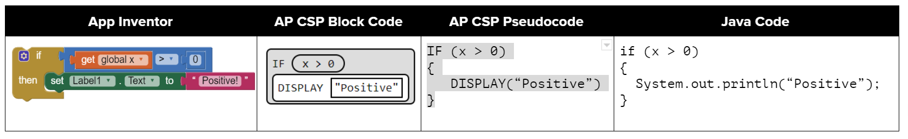
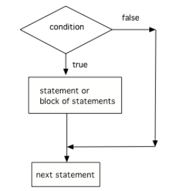
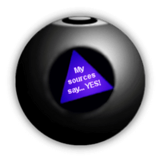

## Course Directory

### Return to the course outline

[← Back to AP CSA / 返回课程目录](../../index.html)

## Topic Intro

### `if` statements implement one-way selection

An <span class="term">if statement</span> (条件语句) checks a Boolean expression and runs a block only when the expression is true.

::: {.two-col}
::: {}
{width="100%"}
:::
::: {}
```java
if (isRaining)
{
    System.out.println("Bring an umbrella");
}
```
:::
:::

## One-Way Selection

### False means skip the block

{fig-align="center" width="32%"}

```java
boolean isRaining = false;
if (isRaining)
{
    System.out.println("Take an umbrella");
}
System.out.println("Leave home");
```

Only `Leave home` prints because the condition is false.

## Relational Operators in `if`

### The condition can be a comparison

```java
int age = 16;
if (age >= 16)
{
    System.out.println("You can apply for a driver's license.");
}
```

The body must be inside braces when it contains more than one statement. This course uses braces even for one-line bodies.

## Quick Check

### Trace one-way selection

What is printed?

```java
int temp = 72;
if (temp < 70)
{
    System.out.println("Wear a jacket");
}
System.out.println("Go outside");
```

Answer:

```text
Go outside
```

Reason: `72 < 70` is false, so the first print is skipped.

## Two-Way Selection

### `if else` handles both outcomes

{fig-align="center" width="34%"}

```java
if (heads)
{
    System.out.println("Heads");
}
else
{
    System.out.println("Tails");
}
```

Exactly one branch runs.

## Code Task

### License age

Complete the `else` branch.

```java
public class LicenseCheck
{
    public static void main(String[] args)
    {
        int age = 15;
        if (age >= 16)
        {
            System.out.println("Can apply for a license");
        }
        else
        {
            System.out.println("Wait until age 16");
        }
    }
}
```

Expected output: `Wait until age 16`.

## Mixed-Up Code

### Even or odd

Reorder the statements to print whether `num` is even.

```java
public class EvenOdd
{
    public static void main(String[] args)
    {
        int num = 12;
        if (num % 2 == 0)
        {
            System.out.println("even");
        }
        else
        {
            System.out.println("odd");
        }
    }
}
```

Key condition: `num % 2 == 0`.

## Common Error

### Missing braces can change the logic

```java
if (score >= 90)
    System.out.println("A");
    System.out.println("Excellent");
```

Only the first print is controlled by the `if`. The second print always runs.

Preferred classroom form:

```java
if (score >= 90)
{
    System.out.println("A");
    System.out.println("Excellent");
}
```

## Groupwork Coding Challenge

### Magic 8 Ball

{fig-align="center" width="22%"}

Starter idea:

```java
int answer = (int)(Math.random() * 8) + 1;
if (answer == 1)
{
    System.out.println("It is certain");
}
else
{
    System.out.println("Ask again later");
}
```

Extend it so several different random answers can print.

## Classroom Check

### A complete answer should...

::: {.tight-list}
- explain when an `if` body runs and when it is skipped
- trace one-way and two-way selection
- use braces to keep controlled statements clear
- write `if else` logic for mutually exclusive outcomes
- use `%` in selection to test even and odd numbers
:::

## End

### Return to the course outline

[← Back to AP CSA / 返回课程目录](../../index.html)
