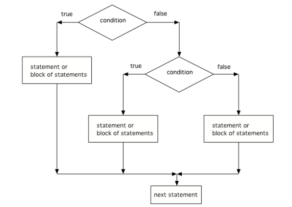

## Course Directory

### Return to the course outline

[← Back to AP CSA / 返回课程目录](../../index.html)

## Topic Intro

### More than two outcomes need structured selection

<span class="term">Nested if statements</span> (嵌套条件语句) place one `if` statement inside another. Java also supports <span class="term">multiway selection</span> with `else if`.

Use these structures when a decision has several possible outcomes.

```java
if (score >= 90)
{
    grade = "A";
}
else if (score >= 80)
{
    grade = "B";
}
else
{
    grade = "C or below";
}
```

## Multiway Selection

### `else if` checks conditions in order

Only the first true branch runs.

```java
if (temperature >= 90)
{
    System.out.println("Hot");
}
else if (temperature >= 70)
{
    System.out.println("Warm");
}
else
{
    System.out.println("Cool");
}
```

Order matters because later conditions are skipped once a branch is chosen.

## Flowchart

### Three possible branches

{fig-align="center" width="38%"}

When tracing, ask:

::: {.tight-list}
- Which condition is checked first?
- If it is true, what gets skipped?
- If it is false, what is checked next?
:::

## Quick Check

### Trace ordered branches

What is printed?

```java
int x = 8;
if (x > 10)
{
    System.out.println("large");
}
else if (x > 5)
{
    System.out.println("medium");
}
else
{
    System.out.println("small");
}
```

Answer: `medium`.

## Debug Task

### Fix branch order

This code has a logic bug.

```java
int score = 95;
if (score >= 60)
{
    System.out.println("Pass");
}
else if (score >= 90)
{
    System.out.println("A");
}
```

Question: why will `"A"` never print?

## Debug Task

### Corrected branch order

Fix: test the more specific condition first.

```java
if (score >= 90)
{
    System.out.println("A");
}
else if (score >= 60)
{
    System.out.println("Pass");
}
```

## Nested `if`

### One decision can live inside another

```java
if (hasTicket)
{
    if (age >= 13)
    {
        System.out.println("Standard admission");
    }
    else
    {
        System.out.println("Child admission");
    }
}
else
{
    System.out.println("Buy a ticket first");
}
```

Nested form is useful when the second decision only matters after the first decision is true.

## Dangling `else`

### An `else` matches the nearest unmatched `if`

Without braces, this is easy to misread:

```java
if (x > 0)
    if (y > 0)
        System.out.println("both positive");
    else
        System.out.println("which condition failed?");
```

The `else` belongs to `if (y > 0)`, not `if (x > 0)`. Use braces to show intent.

## Groupwork Coding Challenge

### Adventure

{fig-align="center" width="28%"}

Build a text adventure with at least:

::: {.tight-list}
- one `if else` decision
- one `else if` chain
- one nested decision where a second choice depends on a first choice
:::

Keep each branch printable so the class can trace possible paths.

## Classroom Check

### A complete answer should...

::: {.tight-list}
- explain why `else if` conditions are checked in order
- trace which branch runs in a multiway selection
- distinguish nested `if` from an `else if` chain
- identify a branch-order bug
- explain how braces prevent dangling-`else` ambiguity
:::

## End

### Return to the course outline

[← Back to AP CSA / 返回课程目录](../../index.html)
