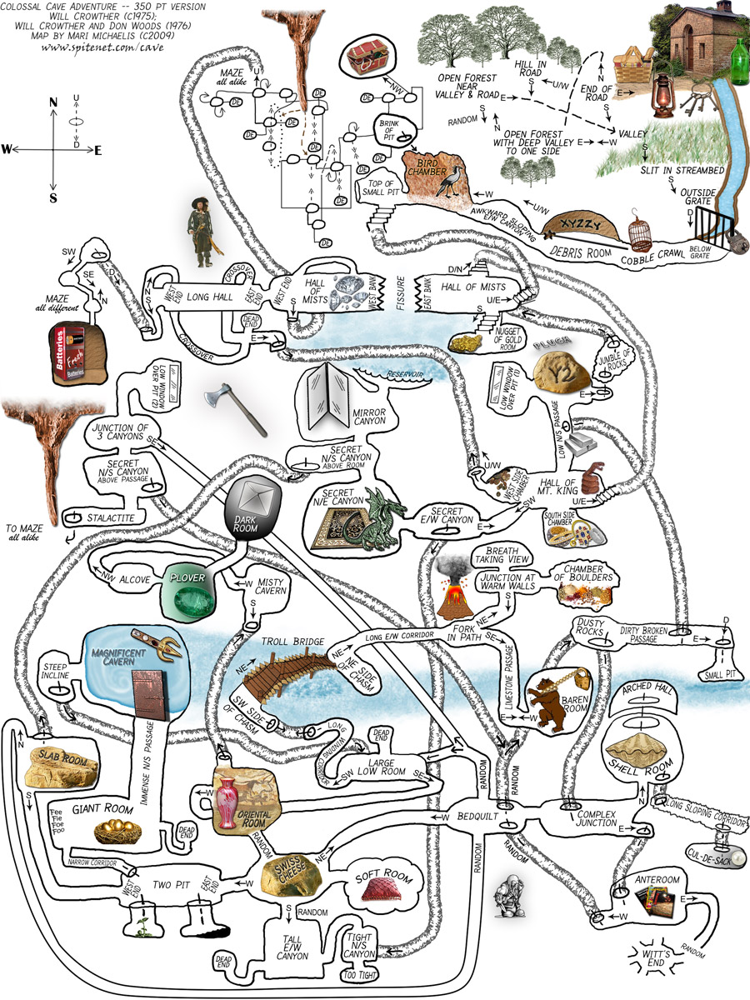

## Course Directory

### Return to the course outline

[← Back to AP CSA / 返回课程目录](../../index.html)

## Groupwork Coding Challenge

### Adventure

{fig-align="center" width="24%"}

One of the first games coded for early computers in the 1970s was called [Colossal Cave Adventure](https://en.wikipedia.org/wiki/Colossal_Cave_Adventure).

It was a text-based interactive fiction game where you had to make your way through an elaborate cave. The program only understood one word or phrase commands like `north`, `south`, `enter`, `take`, etc.

## Challenge Context

### Commands and else-if branches

In a game like Adventure, else if statements can be used to respond to commands from the user like `n`, `s`, `e`, `w`.

This current adventure game asks the user whether they want to move `n`, `s`, `e`, or `w`, but right now only the north direction is coded. It leads to a new method called `forest()`.

## Main Method Task

### Add directions from the starting location

In the main method, add in <span class="term">else if</span> statements to go in the directions of `"s"` for south, `"e"` for east, `"w"` for west, and an else statement that says `"You can't go in that direction"`.

Be creative and come up with different locations in each direction. Have each direction call a static method that you will write.

## Method Task

### Extend locations

The `forest()` and `sea()` methods are shown as examples for two of the diretions.

You will need to change the input below the code to `s` or `e` or `w` and then run to test these branches.

How many test-cases are needed to test all branches of your code?

You can also connect locations to one another by calling their methods.

## Code Task

### `activecode:: challenge-ElseIf-Adventure`

Textbook prompt: This is a text adventure game that lets the user move in 4 different directions. Right now, it only lets the user move north.

Add in `else if` statements to go in the directions of `"s"` for south, `"e"` for east, `"w"` for west, and an else statement that says `"You can't go in that direction"`.

There are <span class="mark">5 TODO steps</span> below.

## Full Code Window

### `activecode:: challenge-ElseIf-Adventure`

::: {.code-scroll .compact}
```java
import java.util.Scanner;

public class Adventure
{
    private static Scanner scan = new Scanner(System.in);

    public static void main(String[] args)
    {
        // TODO #1: Change the adventure text below. Be creative!
        System.out.println("You are on an island surrounded by water.");
        System.out.println("There is a path to the forest to the north, "
                         + "the sea to the south, ? to the east, and ? to the west.");
        System.out.println("Which way do you want to go (n,e,s,w)?");
        String command = scan.next(); // use nextLine() in your own IDE
        if (command.equals("n"))
        {
            System.out.println("You go north.");
            forest();
        }
        // TODO #2: Add else-ifs for command equals s, e, or w,
        //  calling a method you will write below for each location.
        // Add an else error message "You can't go in that direction!"


        System.out.println("End of adventure!");
        scan.close();
   }

  // TODO #3 Complete this method
  // north from main goes to the forest
  public static void forest()
  {
      System.out.println("You enter a dark forest and see ?");
      System.out.println("Do you want to walk e or w?");

      // Add more if/else-if statements for the next action
      //  and call your other methods to move to other locations
      String command = scan.next(); // use nextLine() in your own IDE
      if (command.equals("e"))
      {
          System.out.println("You move east and reach the sea");
          sea();
      }
  }

  // TODO #4: Complete this method.
  // south from main or east from forest goes to the sea
  public static void sea()
  {
      // Print a description
      // Ask for input
      // Add more if/else-if statements for the next action
      // Move to different locations

  }
  // TODO #5: Add at least 2 more static methods for 2 more locations

}
```
:::

## Focused Work Block

### Main branch structure

Use this block as the first place to trace and edit:

```java
if (command.equals("n"))
{
    System.out.println("You go north.");
    forest();
}
// TODO #2: Add else-ifs for command equals s, e, or w,
//  calling a method you will write below for each location.
// Add an else error message "You can't go in that direction!"
```

## Required TODO Steps

### `challenge-ElseIf-Adventure`

::: {.tight-list}
- TODO #1: Change the adventure text.
- TODO #2: Add else-if branches for `s`, `e`, and `w`; add an ending else error message.
- TODO #3: Complete the `forest()` method.
- TODO #4: Complete the `sea()` method.
- TODO #5: Add at least 2 more static methods for 2 more locations.
:::

## Test Requirements

### Runestone tests

Runestone checks that the completed code has:

::: {.tight-list}
- at least `5` occurrences of `if`
- at least `3` occurrences of `else if`
- at least `1` ending `else` statement
- at least `5` occurrences of `public static`
:::

## Classroom Check

### A complete answer should include

::: {.tight-list}
- keep the `Adventure` class and shared `Scanner`
- use `command.equals("n")`, `command.equals("s")`, `command.equals("e")`, and `command.equals("w")`
- add an ending else for unrecognized directions
- call a static method for each location branch
- add at least 2 more static methods beyond `forest()` and `sea()`
- test every starting branch and at least one nested branch
:::

## End

### Return to the course outline

[← Back to AP CSA / 返回课程目录](../../index.html)
