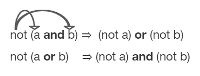
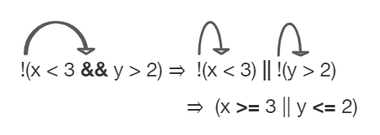

## Course Directory

### Return to the course outline

[← Back to AP CSA / 返回课程目录](../../index.html)

## Topic Intro

### Negating a compound statement

What if you heard a rumor about a senior at your high school? Then you heard that the rumor wasn't true: it wasn't a senior at your high school.

Which part of `"a senior at your high school"` wasn't true?

```java
!(a && b)

a = "senior"
b = "at our high school"
```

This means it is not true that both `(a)` it is a senior and `(b)` someone at our high school.

## De Morgan's Laws

### Move the NOT inside

De Morgan's Laws were developed by Augustus De Morgan in the 1800s.

They show how to rewrite the negation of a complex Boolean expression when there are multiple expressions joined by `&&` or `||`.

{fig-align="center" width="42%"}

## De Morgan's Laws in Java

### Equivalent expressions

In Java, De Morgan's Laws are written with the following operators:

::: {.tight-list}
- `!(a && b)` is equivalent to `!a || !b`
- `!(a || b)` is equivalent to `!a && !b`
:::

Easy way to remember: <span class="mark">move the NOT inside, AND becomes OR</span> and <span class="mark">move the NOT inside, OR becomes AND</span>.

## Rumor Example

### Senior and high school

Going back to the example:

```java
!(a && b) is equivalent to !a || !b

a = "senior"
b = "at our high school"
```

`!(a senior && at our high school)` is equivalent to `!(a senior) || !(at our high school)`.

## Relational Operators

### To move the NOT, flip the sign

You can also rewrite negated Boolean expressions that have relational operators like `<`, `>`, `==`.

Move the negation inside the parentheses by flipping the relational operator to its opposite sign:

::: {.table-fit}
| Expression | Equivalent expression |
|---|---|
| `!(c == d)` | `c != d` |
| `!(c != d)` | `c == d` |
| `!(c < d)` | `c >= d` |
| `!(c > d)` | `c <= d` |
| `!(c <= d)` | `c > d` |
| `!(c >= d)` | `c < d` |
:::

## Truth Tables

### Proving equivalence

Although you do not have to memorize De Morgan's Laws for the CSA Exam, you should be able to show that two Boolean expressions are equivalent.

One way to do this is by using truth tables.

::: {.table-fit}
| a | b | `!(a && b)` | `!a || !b` |
|---|---|---|---|
| `true` | `true` | `false` | `false` |
| `false` | `true` | `true` | `true` |
| `true` | `false` | `true` | `true` |
| `false` | `false` | `true` | `true` |
:::

The last two columns are identical.

## Equivalent Expression Example

### Two steps

Applying De Morgan's Laws to `!(x < 3 && y > 2)` yields:

```java
!(x < 3) || !(y > 2)
```

## Equivalent Expression Example

### Remove the not

Then flip the relational operators to remove the not:

```java
(x >= 3 || y <= 2)
```

{fig-align="center" width="38%"}

## Code Task

### `activecode:: lcdmtest`

Textbook prompt: For what values of `x` and `y` will the code below print true? Try out different values of `x` and `y` to check your answer.

```java
public class Test1
{
    public static void main(String[] args)
    {
        int x = 2;
        int y = 3;
        System.out.println(!(x < 3 && y > 2));
    }
}
```

Runestone checks that the original code has been changed.

## Quick Check

### `mchoice:: compareBool1`

What is printed when the following code executes and `x` equals `4` and `y` equals `3`?

```java
int x = 4, y = 3;
if (!(x < 3 || y > 2))
{
   System.out.println("first case");
}
else
{
   System.out.println("second case");
}
```

Options: `first case`, `second case`.

## Answer Reasoning

### `mchoice:: compareBool1`

Correct answer: `second case`.

This will be printed if `x` is less than `3` or `y` is greater than `2`. In this case the first part is false, but the second is true, so the expression with `||` is true.

## Quick Check

### `mchoice:: compareBool2`

What is printed when the following code executes and `x` equals `4` and `y` equals `3`?

```java
int x = 4, y = 3;
if (!(x < 3 && y > 2))
{
   System.out.println("first case");
}
else
{
   System.out.println("second case");
}
```

Options: `first case`, `second case`.

## Answer Reasoning

### `mchoice:: compareBool2`

Correct answer: `first case`.

This will be printed if `x` is greater than or equal to `3` or `y` is less than or equal to `2`. In this case `x` is greater than `3`, so the first condition is true.

## Classroom Check

### A complete answer should include

::: {.tight-list}
- state both De Morgan equivalences using `&&`, `||`, and `!`
- flip relational operators when moving a negation inside
- use a truth table to prove two Boolean expressions are equivalent
- trace `!(x < 3 || y > 2)` and `!(x < 3 && y > 2)` differently
- avoid relying on memorization alone when a truth table can prove equivalence
:::

## End

### Continue to Part 2

[Next: Object, String, and null comparisons →](2-6-part-2-object-string-and-null-comparisons.html)
