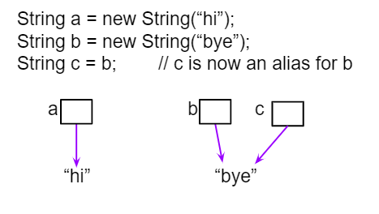
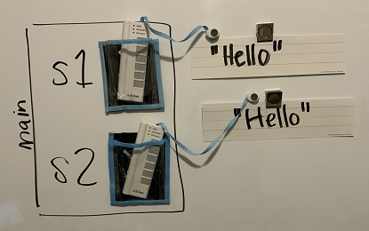
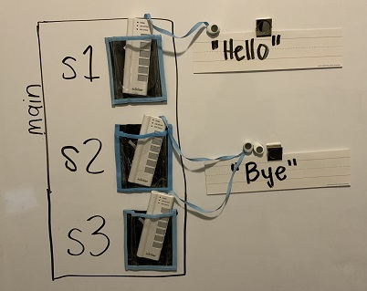

## Course Directory

### Return to the course outline

[← Back to AP CSA / 返回课程目录](../../index.html)

## Topic Intro

### Different expressions can mean the same thing

Two Boolean expressions are <span class="term">equivalent</span> (等价) if they always evaluate to the same value for the same inputs.

This topic focuses on:

::: {.tight-list}
- De Morgan's Laws
- simplifying Boolean expressions
- comparing objects and strings
- safe `null` checks
:::

## De Morgan's Laws

### Distributing `!` flips the operator

{fig-align="center" width="45%"}

Core identities:

```java
!(a && b)  is equivalent to  !a || !b
!(a || b)  is equivalent to  !a && !b
```

The operator changes when the negation moves inward.

## Truth Table Method

### Prove equivalence by matching result columns

| `a` | `b` | `!(a && b)` | `!a || !b` |
|---|---|---|---|
| true | true | false | false |
| true | false | true | true |
| false | true | true | true |
| false | false | true | true |

Because the result columns match in every row, the two expressions are equivalent.

## Simplifying Boolean Expressions

### Choose the more readable form

{fig-align="center" width="42%"}

Example:

```java
!(score >= 60 && submitted)
```

Equivalent form:

```java
score < 60 || !submitted
```

## Quick Check

### Apply De Morgan's Laws

Which expression is equivalent to `!(x < 5 || y == 0)`?

::: {.tight-list}
- A. `x >= 5 && y != 0`
- B. `x >= 5 || y != 0`
- C. `x < 5 && y == 0`
- D. `x > 5 && y != 0`
:::

Answer: <span class="mark">A</span>. Negate both comparisons and change `||` to `&&`.

## Comparing Objects

### `==` asks whether references are identical

For object variables, `==` compares references.

{fig-align="center" width="40%"}

With strings, you almost always want:

```java
s1.equals(s2)
```

because it checks whether the character sequences are equal.

## String Equality

### Same characters, different references

```java
String s1 = new String("hi");
String s2 = new String("hi");

System.out.println(s1 == s2);
System.out.println(s1.equals(s2));
```

Expected output:

```text
false
true
```

`equals` checks content equality.

## Reference Diagrams {.image-fit}

### Trace what each variable points to

::: {.two-col}
::: {}
{width="84%"}
:::
::: {}
{width="84%"}
:::
:::

When a question uses `==` with objects, draw arrows to objects before answering.

## Comparing with `null`

### Check `null` before calling a method

This can crash if `s` is `null`:

```java
if (s.equals("yes"))
{
    System.out.println("matched");
}
```

Safe pattern:

```java
if (s != null && s.equals("yes"))
{
    System.out.println("matched");
}
```

Short circuiting prevents the method call when `s` is `null`.

## Student Response Task

### Truth and tracing table

Complete the reasoning for the code.

```java
String a = new String("cat");
String b = new String("cat");
String c = a;
System.out.println(a == b);
System.out.println(a == c);
System.out.println(a.equals(b));
```

Answer:

```text
false
true
true
```

Explain each line using references versus contents.

## Classroom Check

### A complete answer should...

::: {.tight-list}
- apply De Morgan's Laws by flipping both the comparison and the operator
- use a truth table to test Boolean equivalence
- distinguish `==` from `equals` for strings
- explain why two different string objects can have equal contents
- write safe `obj != null && obj.method()` checks
:::

## End

### Return to the course outline

[← Back to AP CSA / 返回课程目录](../../index.html)
