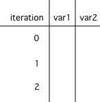

## Course Directory

### Return to the course outline

[← Back to AP CSA / 返回课程目录](../../index.html)

## Indentation Note

### AP free response

Java doesn't require your code to be correctly indented to make it clear what statements are part of the body of the loop, but it is standard practice to do so.

On the free response part of the AP exam, the reader will use the indention when determining the meaning of your code, even if you forget the open or close curly brace.

## Mixed-Up Code

### `parsonsprob:: print_odds_while`

Textbook prompt: The following method has the correct code to print out all the odd values from `1` to `10`, but the code is mixed up.

Drag the blocks into the correct order and indent them correctly.

```text
public static void printOdds()
{
// initialize the loop variable
int i = 1;
while (i <= 10)
{
System.out.println(i);
// update the loop variable
i += 2;
} // end while
} // end method
```

## Correct Order

### `parsonsprob:: print_odds_while`

```java
public static void printOdds()
{
   // initialize the loop variable
   int i = 1;
   while (i <= 10)
   {
      System.out.println(i);
      // update the loop variable
      i += 2;
   } // end while
} // end method
```

## Quick Check

### `mchoice:: while1`

Which replacement for the missing loop header makes the loop print `"0 2 4 6 8 10"`?

```java
int count = 0;
/* missing loop header */
{
    System.out.print(count + " ");
    count += 2;
}
```

Options: `while (count == 10)`, `while (count < 10)`, `while (count <= 10)`, `while (count > 10)`.

Correct answer: `while (count <= 10)`.

## Tracing Loops

### Trace variable values each iteration

A really important skill is the ability to trace the values of variables and how they change during each iteration of a loop.

You can create a <span class="term">tracing table</span> that keeps track of the variable values each time through the loop.

{fig-align="center" width="28%"}

Iteration `0` means before the loop.

## Quick Check

### `mchoice:: while2`

What is `count`'s value after running this code segment?

```java
int count = 1;
while (count <= 10)
{
    count *= 2;
}
count = count - 10;
```

Options: `0`, `1`, `16`, `6`.

Correct answer: `6`.

Reasoning: count becomes `2`, `4`, `8`, `16`, and then `10` is subtracted after the loop.

## Quick Check

### `mchoice:: while3`

What does the following code print?

```java
int x = -5;
while (x < 0)
{
   x++;
   System.out.print(x + " ");
}
```

Options: `5 4 3 2 1`, `-5 -4 -3 -2 -1`, `-4 -3 -2 -1 0`.

Correct answer: `-4 -3 -2 -1 0`.

## Common Errors with Loops

### Infinite loops

One common error with loops is to accidentally create an <span class="term">infinite loop</span>.

An infinite loop is one that never stops because the Boolean condition is always true.

```java
while (true)
{
    System.out.println("This is a loop that never ends");
}
```

## Infinite Loop Example

### Missing update step

```java
int i = 0;
while (i < 10)
{
    System.out.println(i);
}
```

This loop includes steps 1 and 2 but forgot step 3. The loop variable `i` starts at `0`, and `i < 10` will always be true because there is no code in the loop that changes `i`.

## Infinite Loop Fix

### Increment the loop variable

```java
int i = 0;
while (i < 10)
{
    System.out.println(i);
    i++;
}
```

The update step changes the loop variable so the condition can eventually become false.

## Off-by-One Errors

### Test condition problem

Another common error with loops is an <span class="term">off-by-one error</span>, where the loop runs one too many or one too few times.

This is usually a problem with step 2, the test condition, and using the incorrect relational operator `<` or `<=`.

## Debug Task

### `activecode:: whileloopbugs`

Textbook prompt: The while loop should print out the numbers `1` to `8`, but it has 2 errors that cause an infinite loop and an off-by-one error. Can you fix the errors?

```java
public class LoopTest2
{
    public static void main(String[] args)
    {
        int count = 1;
        while (count < 8)
        {
            System.out.println(count);
        }
    }
}
```

## Test Requirements

### `activecode:: whileloopbugs`

Runestone expects:

```text
1
2
3
4
5
6
7
8
```

## False Initially

### Loop body may not execute

Another possible error is not realizing that the loop body of an iterative statement will not execute if the Boolean expression initially evaluates to false.

```java
int i = 10;
while (i < 10)  // This loop will never run!
{
    System.out.println(i);
    i++;
}
```

## Input-Controlled Loops

### Sentinel value

A `while` loop is typically used when you don't know how many times the loop will execute.

It is often used for an <span class="term">input-controlled loop</span> where the user's input indicates when to stop.

The stopping value is often called the <span class="term">sentinel value</span> for the loop.

## Magpie Loop Example

### Stops when input is `Bye`

```java
Scanner in = new Scanner(System.in);
String statement = in.nextLine();
while (!statement.equals("Bye"))
{
    System.out.println(getResponse(statement));
    statement = in.nextLine();
}
```

If you type in `"Bye"` right away, the loop will never run.

## Classroom Check

### A complete answer should include

::: {.tight-list}
- reorder loop blocks using initialize, test, body, update
- use a trace table to record values before and during loop iterations
- identify missing updates that create infinite loops
- identify `<` versus `<=` off-by-one errors
- explain why a loop body may execute zero times
- define a sentinel value in an input-controlled loop
:::

## End

### Continue to Part 3

[Next: Turtle Squares challenge →](2-7-part-3-turtle-squares-challenge.html)
