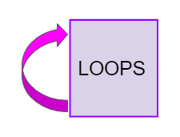
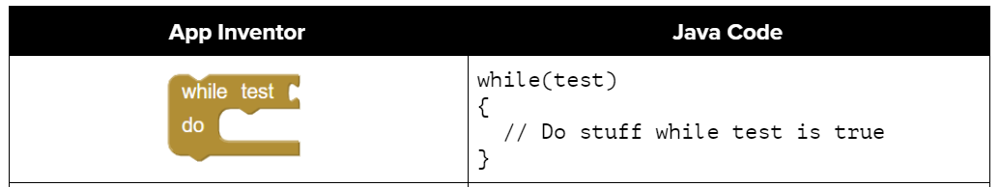
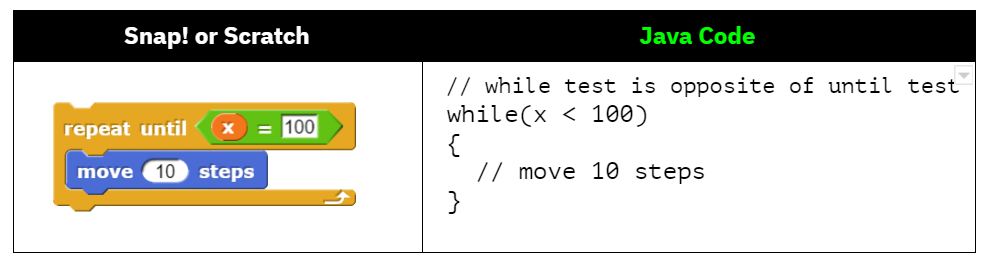
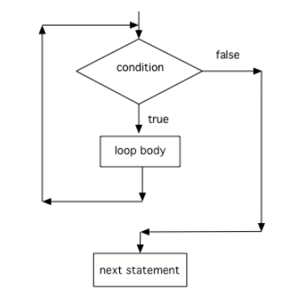
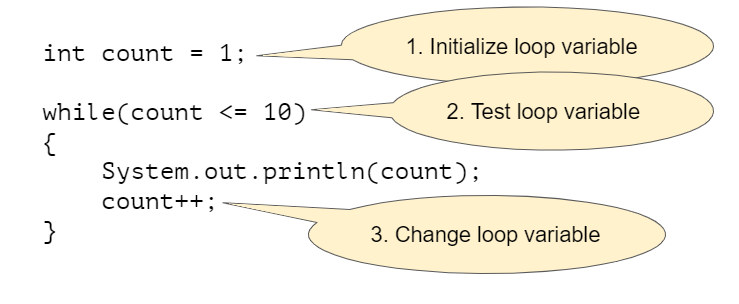

## Course Directory

### Return to the course outline

[← Back to AP CSA / 返回课程目录](../../index.html)

## Looping

### Repetition lets code stay short and general

::: {.two-col}
::: {}
{width="34%"}
:::
::: {.soft-box}
A <span class="term">loop</span> repeats statements.

In Java, `while` is the first full repetition structure students use for general-purpose looping.
:::
:::

## `while` Basics

### Execute the body while the condition stays true

```java
while (condition)
{
    statements;
}
```

::: {.tight-list}
- the condition is checked before each iteration
- if it is false at the start, the body runs zero times
- braces should still be used consistently
:::

## Comparing Loop Models

### `while` is not the same test as Scratch repeat-until

::: {.two-col}
::: {}
{width="100%"}
:::
::: {}
{width="100%"}
:::
:::

Students need this distinction early: Java `while` keeps going <span class="mark">while</span> the condition is true, not until it becomes true.

## Control Flow

### The program loops back to the condition each time

{fig-align="center" width="32%"}

This matters for tracing:

::: {.tight-list}
- test condition
- run body
- update values
- return to the test
:::

## Three Steps to Writing a Loop

### Initialize, test, update

{fig-align="center" width="56%"}

::: {.tight-list}
- initialize the loop variable before the loop
- test it in the loop header
- update it inside the loop body
:::

If one of these is missing, the loop is usually wrong.

## Tracing Loops

### Trace tables make loop behavior visible

{fig-align="center" width="22%"}

Loop tracing should track:

::: {.tight-list}
- current iteration
- variable values before and after updates
- output produced during each pass
:::

This is exam-critical, not optional enrichment.

## Common Errors and Input-Controlled Loops

### Infinite loops and sentinel-controlled repetition

```java
String statement = in.nextLine();
while (!statement.equals("Bye"))
{
    System.out.println(getResponse(statement));
    statement = in.nextLine();
}
```

::: {.tight-list}
- forgetting the update step can cause an <span class="term">infinite loop</span>
- `while` is useful when you do not know the number of repetitions in advance
- user input can act as a <span class="term">sentinel value</span>
:::

## Classroom Tasks

### Practice worth keeping

Retained classroom work for this topic:

::: {.tight-list}
- counter-controlled while tracing
- loop-header replacement and Parsons ordering tasks
- infinite-loop debugging checks
- input-controlled loop reading
- <span class="term">2.7.5 Coding Challenge: Turtle Squares</span>
:::

## Classroom Check

### A complete answer should...

::: {.tight-list}
- explain that `while` checks the condition before each iteration
- apply the initialize / test / update model
- trace variable changes through repeated iterations
- identify how infinite loops happen
- explain sentinel-based input-controlled loops
:::

## End

### Return to the course outline

[← Back to AP CSA / 返回课程目录](../../index.html)
