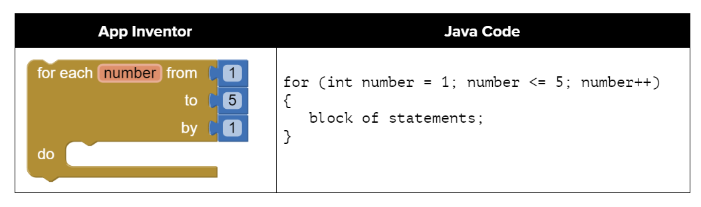
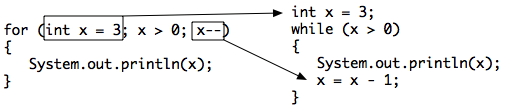
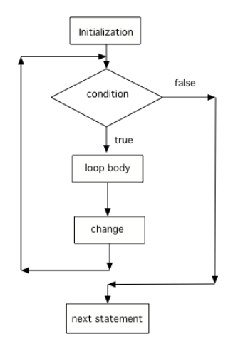

## Course Directory

### Return to the course outline

[← Back to AP CSA / 返回课程目录](../../index.html)

## for Loops

### Use `for` when the repetition pattern is counted

`for` loops are the standard Java pattern when students know the counting structure in advance.

{fig-align="center" width="84%"}

## Three Parts in One Line

### Initialize, test, and update sit together in the header

```java
for (initialize; test; update)
{
    loop body
}
```

::: {.tight-list}
- initialization runs once
- the Boolean test controls whether the body continues
- the update runs after each iteration
:::

The semicolons are required even when one part is omitted.

## `for` and `while`

### They can express the same loop in different forms

::: {.two-col}
::: {}
{width="100%"}
:::
::: {}
{width="64%"}
:::
:::

Students should be able to rewrite:

::: {.tight-list}
- a counted `while` loop as a `for` loop
- a `for` loop as an equivalent `while` loop
:::

## Common Counting Patterns

### Start value determines the stopping comparison

```java
for (int i = 0; i < 10; i++)
for (int i = 1; i <= 10; i++)
```

::: {.tight-list}
- if you start at `0`, a common pattern uses `<`
- if you start at `1`, a common pattern uses `<=`
- `i` is often used as the loop control variable
:::

## Decrementing Loops

### Count backward by changing all three parts together

```java
for (int i = 5; i > 0; i--)
{
    System.out.println(i);
}
```

To loop backward correctly:

::: {.tight-list}
- initialize at the high value
- test against the lower stopping point
- update with `i--` or another decrement
:::

## Classroom Tasks

### Practice worth keeping

Retained classroom work for this topic:

::: {.tight-list}
- converting counted while loops to `for` loops
- tracing `for` loop output and iteration counts
- even-number and counter-step construction checks
- decrementing-loop reading
- <span class="term">2.8.3 Coding Challenge: Turtles Drawing Shapes</span>
:::

## Classroom Check

### A complete answer should...

::: {.tight-list}
- identify the three parts of a `for` loop header
- explain the execution order of initialize, test, body, update
- convert simple counted `while` loops into `for` loops
- trace loop output and iteration counts correctly
- write decrementing loops by changing start, test, and update together
:::

## End

### Return to the course outline

[← Back to AP CSA / 返回课程目录](../../index.html)
