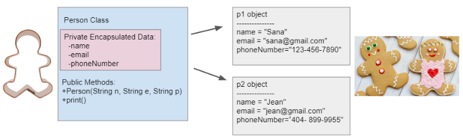

## Course Directory

### Return to the course outline

[← Back to AP CSA / 返回课程目录](../../index.html)

## Anatomy of a Class

### A class is the blueprint for making objects

In Java, a <span class="term">class</span> defines the structure and behaviors for objects.

::: {.tight-list}
- objects are <span class="term">instances</span> of a class
- each object can hold its own data
- the class decides what the object can do
:::

This topic keeps the textbook move from using built-in classes to designing our own.

## Parts of a Class

### Instance variables, constructors, and methods form the main structure

```java
public class Person
{
    private String name;
    private String email;
    private String phoneNumber;

    public Person(String initialName, String initialEmail, String initialPhoneNumber)
    {
        name = initialName;
        email = initialEmail;
        phoneNumber = initialPhoneNumber;
    }

    public void print()
    {
        System.out.println(name);
        System.out.println(email);
    }
}
```

At this level, students need to identify the role of the class body, instance variables, constructors, and methods.

## Designing a Class

### The data depends on the problem the class is solving

The textbook uses `Person` as a simple model.

::: {.tight-list}
- an address-book program might track `name`, `email`, and `phoneNumber`
- a medical program might track very different data
- class design begins with deciding <span class="mark">what information matters</span>
:::

This is why class design happens before full implementation.

## Data Encapsulation

### Keep implementation details inside the class

<span class="term">Data encapsulation</span> means the class hides its internal details from outside code.

::: {.compare-grid}
::: {.soft-box}
**`public`**

- accessible from other classes
- used for class declarations in this course
- commonly used on constructors and methods
:::
::: {.soft-box}
**`private`**

- accessible only inside the declaring class
- preferred for instance variables
- protects the internal state of the object
:::
:::

For AP CSA, instance variables should generally be declared `private`.

## Instance Variables

### Each object gets its own copy of the data

{fig-align="center" width="76%"}

::: {.tight-list}
- instance variables are also called attributes, fields, or properties
- they belong to the object, not to all objects together
- each instance can store different values
:::

This is why two `Person` objects can share the same class definition but still hold different data.

## Instance Methods

### Methods act on the specific object that receives the call

```java
public void print()
{
    System.out.println(name);
    System.out.println(email);
    System.out.println(phoneNumber);
}
```

::: {.tight-list}
- instance methods are called on objects such as `p1.print()`
- they are <span class="mark">not</span> marked `static`
- they have direct access to the object's instance variables
- `void` means the method performs an action but returns no value
:::

## Classroom Tasks

### Practice worth keeping

{fig-align="center" width="42%"}

Retained classroom work for this topic:

::: {.tight-list}
- identify the main parts of a class definition
- read and trace the `Person` example
- explain why instance variables are usually `private`
- add or analyze a simple `print` instance method
- <span class="term">3.3.6 Coding Challenge: Virtual Pet Class</span>
:::

## Classroom Check

### A complete answer should...

::: {.tight-list}
- identify the roles of instance variables, constructors, and methods
- explain the difference between `public` and `private`
- justify why instance variables are usually private
- explain what makes a method an <span class="term">instance method</span>
- trace how one method call uses the data of one specific object
:::

## End

### Return to the course outline

[← Back to AP CSA / 返回课程目录](../../index.html)
