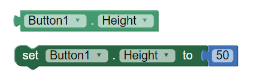

## Course Directory

### Return to the course outline

[← Back to AP CSA / 返回课程目录](../../index.html)

## Accessors / Getters

### Reading private instance variables

Since the instance variables in a class are usually marked as `private`, code outside the class cannot directly access their values.

If you want code outside the class to access the value of an instance variable, you need to write what is formally called an **accessor method**.

Everyone actually just calls it a **getter**.

## Getter Definition

### Public, no arguments, returns the value

A getter is a `public` method that:

::: {.tight-list}
- takes no arguments
- returns the value of the `private` instance variable
:::

You do not need to write a getter for every instance variable.

## App Inventor Connection {.image-fit}

### Get/set method idea

{fig-align="center" width="42%"}

If you used a language like App Inventor in AP CSP, you may have used setter and getter blocks.

In Java, we write getter methods inside our own classes.

## Getter Template

### Return type matches instance variable type

```java
class ExampleTemplate
{
    // Instance variable declaration
    private typeOfVar varName;

    // Accessor (getter) method template
    public typeOfVar getVarName()
    {
        return varName;
    }
}
```

## Getter Rule

### Same type, returned value

The getter's return type is the same as the type of the instance variable.

All the body of the getter does is return the value of the variable using a `return` statement.

The expression after `return` must be the same type as the return type in the method header.

## Student `getName`

### Accessor example

```java
class Student
{
    //Instance variable name
    private String name;

    /** getName() example
     *  @return name */
    public String getName()
    {
       return name;
    }
}
```

Getters only return the **value** of the variable.

## Calling a Getter

### Use the object

```java
public static void main(String[] args)
{
    // To call a get method, use objectName.getVarName()
    Student s = new Student();
    System.out.println("Name: " + s.getName());
}
```

## Multiple Classes Note

### Tester or driver class

The active code below has two classes.

The `main` method is in a separate **Tester** or **Driver** class.

It does not have access to the `private` instance variables in the other `Student` class.

In active code and IDEs, you can put two classes in one file, but only one of them can be `public` and have a `main` method in it.

## Coding Exercise

### `activecode:: StudentObjExample`

Try the following code.

It has a bug: it tries to access the private instance variable `email` from outside the class `Student`.

Change the `main` method in `TesterClass` so that it uses the appropriate public accessor method, or get method, to access the email value instead.

## StudentObjExample Starter

::: {.code-scroll}
```java
public class TesterClass
{
    // main method for testing
    public static void main(String[] args)
    {
        Student s1 = new Student("Skyler", "skyler@sky.com", 123456);
        System.out.println("Name:" + s1.getName());
        // TODO: Fix the bug here!
        System.out.println("Email:" + s1.email);
        System.out.println("ID: " + s1.getId());
    }
}

/** Class Student keeps track of name, email, and id of a Student. */
class Student
{
    private String name;
    private String email;
    private int id;

    public Student(String initName, String initEmail, int initId)
    {
        name = initName;
        email = initEmail;
        id = initId;
    }

    // accessor methods - getters
    /** getName() @return name */
    public String getName()
    {
        return name;
    }

    /** getEmail() @return email */
    public String getEmail()
    {
        return email;
    }

    /** getName() @return id */
    public int getId()
    {
        return id;
    }
}
```
:::

## StudentObjExample Expected Output

### Runestone output check

Expected output:

```text
Name:Skyler
Email:skyler@sky.com
ID: 123456
```

## StudentObjExample Code Target

### Runestone accessor check

The test also checks that the code contains:

```java
s1.getEmail()
```

## `toString`

### Returns a String representation

While not strictly speaking a getter, another important method that returns a value is the `toString` method.

This method is called automatically by Java in a number of situations when it needs to convert an object to a `String`.

## When Java Calls `toString`

### Printing and string concatenation

Most notably, `System.out.print` and `System.out.println` use `toString` to convert an object argument into a `String` to be printed.

When objects are added to `String`s with `+` and `+=`, their `String` representation comes from calling their `toString` method.

## Student `toString`

### Automatic call from `println`

Here is the `Student` class again, but this time with a `toString` method.

When we call:

```java
System.out.println(s1);
```

Java will automatically call the `toString` method to get a `String` representation of the `Student` object.

## StudentToString Starter

::: {.code-scroll}
```java
public class TesterClass
{
    // main method for testing
    public static void main(String[] args)
    {
        Student s1 = new Student("Skyler", "skyler@sky.com", 123456);
        System.out.println(s1);
        // TODO: add another student s2 and print it out


    }
}

class Student
{
    private String name;
    private String email;
    private int id;

    public Student(String initName, String initEmail, int initId)
    {
        name = initName;
        email = initEmail;
        id = initId;
    }

    // toString() method
    public String toString()
    {
        return id + ": " + name + ", " + email;
    }
}
```
:::

## StudentToString Task

### `activecode:: StudentToString`

See the `toString()` method in action.

Add another student object and print it out.

The Runestone test checks that your code contains:

```java
System.out.println(s2)
```

## Classroom Check

### A complete answer should include

::: {.tight-list}
- define an accessor/getter as a public method that returns a private instance variable
- write getter return types to match instance variable types
- explain why outside code must use `s1.getEmail()` instead of `s1.email`
- identify `toString` as a method that returns a `String` representation of an object
- explain how `System.out.println(s1)` can call `toString` automatically
- preserve the starter bugs/TODOs in both activecode tasks until students fix them
:::

## End

### 3.5 Part 2 complete

Next: Mutators, setters, and parameters.
