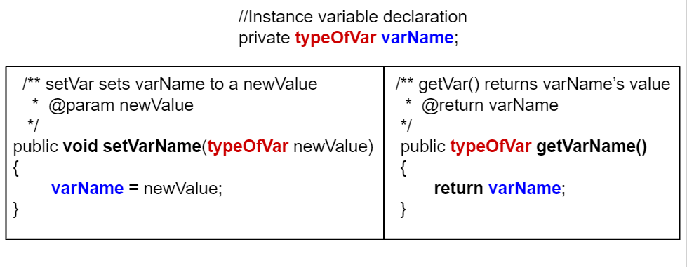

## Course Directory

### Return to the course outline

[← Back to AP CSA / 返回课程目录](../../index.html)

## Mutators / Setters

### Changing private instance variables

In complement to accessor/getter methods, if we want to allow code outside the class to change the value of an instance variable, we provide a **mutator method**.

Everyone actually calls it a **setter**.

A setter is a `void` method with a name that starts with `set` and takes a single argument of the same type as the instance variable to be set.

## Setter Effect

### Assign provided value

The effect of a setter is to assign the provided value to the instance variable.

```java
class ExampleTemplate
{
    // Instance variable declaration
    private typeOfVar varName;

    // Setter method template
    public void setVarName(typeOfVar newValue)
    {
        varName = newValue;
    }
}
```

## Setter Design Caution

### Do not write every setter automatically

Just as you should not reflexively write a getter for every instance variable, you should think even harder about whether you want to write a setter.

Not all instance variables are meant to be manipulated directly by code outside the class.

In general, you should not write a setter until you find a real reason to do so.

## Turtle Example

### Controlled movement instead of direct setters

The `Turtle` class provides getters `getXPos` and `getYPos`, but it does not provide corresponding setters.

There are methods that change a `Turtle`'s position like `forward` and `moveTo`.

They do more than just changing instance variables; they also take care of drawing lines on the screen if the pen is down.

## Student `setName`

### Setter example and call

```java
class Student
{
    // Instance variable name
    private String name;

    /**
     * setName sets name to newName
     *
     * @param newName
     */
    public void setName(String newName)
    {
        name = newName;
    }
}
```

To call a set method, use `objectName.setVar(newValue)`, for example `s.setName("Ayanna");`.

## Getters and Setters {.image-fit}

### Compare return and parameter roles

{fig-align="center" width="70%"}

Getters return an instance variable's value and have the same return type as this variable and no parameters.

Setters have a `void` return type and take a new value as a parameter to change the value of the instance variable.

## Coding Exercise

### `activecode:: StudentObjExample2`

Try the `Student` class below, which has had some setters added.

Notice that there is no `setId` method even though there is a `getId`.

This is presumably because, while it makes sense for a student to change their name or email, their id should never change.

## StudentObjExample2 Task

### Fix private access

You need to fix one error.

The `main` method is in a separate class `TesterClass` and does not have access to the `private` instance variables in the `Student` class.

Change the `main` method so that it uses a `public` setter to change the value instead.

## StudentObjExample2 Starter

::: {.code-scroll}
```java
public class TesterClass
{
    // main method for testing
    public static void main(String[] args)
    {
        Student s1 = new Student("Skyler", "skyler@sky.com", 123456);
        System.out.println(s1);
        s1.setName("Skyler 2");
        // TODO: Main doesn't have access to email, use set method!
        s1.email = "skyler2@gmail.com";
        System.out.println(s1);
    }
}

class Student
{
    private String name;
    private String email;
    private int id;

    public Student(String initName, String initEmail, int initId)
    {
        name = initName;
        email = initEmail;
        id = initId;
    }

    // Setters
    public void setName(String newName)
    {
        name = newName;
    }

    public void setEmail(String newEmail)
    {
        email = newEmail;
    }

    // Getters
    public String getName()
    {
        return name;
    }

    public String getEmail()
    {
        return email;
    }

    public int getId()
    {
        return id;
    }

    public String toString()
    {
        return id + ": " + name + ", " + email;
    }
}
```
:::

## StudentObjExample2 Test Targets

### Code target

The test checks that the code contains:

```java
s1.setEmail("skyler2@gmail.com");
```

## StudentObjExample2 Expected Output

### Runestone output check

Expected output:

```text
123456: Skyler, skyler@sky.com
123456: Skyler 2, skyler2@gmail.com
```

## Focused Fix

### Replace direct private access with setter call

The broken line is direct access to a private instance variable: `s1.email = "skyler2@gmail.com";`

The repair should use the provided public setter: `s1.setEmail("skyler2@gmail.com");`

## Check Your Understanding

### `mchoice:: setSignature`

Consider the class `Party`, which keeps track of the number of people at the party.

```java
public class Party
{
    // number of people at the party
    private int numOfPeople;

    /* Missing header of set method */
    {
        numOfPeople = people;
    }
}
```

Which method signature could replace the missing header so the method works as intended?

## Setter Signature Options 1/2

### A-C

::: {.tight-list}
- A. `public int getNum(int people)`
- B. `public int setNum()`
- C. `public int setNum(int people)`
:::

## Setter Signature Options 2/2

### D-E

::: {.tight-list}
- D. `public void setNum(int people)`
- E. `public int setNumOfPeople(int p)`
:::

## Setter Signature Reasoning {.fit-small}

### Why D works

`public void setNum(int people)` matches the method body because:

::: {.tight-list}
- the method changes object state, so it should not return a value
- the body uses the parameter name `people`
- the parameter type is `int`, matching `numOfPeople`
:::

## Mutator Method Note

### Name and parameters

Mutator methods do not have to have a name with `set` in it, although most do.

They can be any methods that change the value of an instance variable in the class.

Most mutator methods are non-void methods.

Mutator methods do not have to have parameters, but they usually do.

## Parameters

### Variables in method headers

The setter methods above contained parameters.

A **parameter** (参数) is a variable in a method's header that is used to pass in data that the method needs to do its job.

In a setter, the parameter is the new value that you want to assign to the instance variable.

## Arguments

### Values in method calls

An **argument** (实参) is a value that is passed into a method when the method is called.

It is saved into a parameter variable.

The arguments passed to a method must be compatible in number and order with the types identified in the parameter list of the method signature.

## Call by Value {.image-fit}

### Arguments copied into parameters

{fig-align="center" width="72%"}

When calling methods, arguments are passed using **call by value**.

Call by value initializes the parameters with copies of the arguments.

When an argument is a primitive value, the parameter is initialized with a copy of that value.

Changes to the parameter have no effect on the corresponding argument.

## Methods with Parameters that Return Calculated Values

### Not all return methods are getters

Not all methods that return values are accessor/get methods.

Some methods have parameters and return values that are found or calculated in a more complex algorithm.

The following method uses a loop to find a letter in a text string given as a parameter.

## StringFind Task

### `activecode:: StringFind`

Run the program, which contains a method called `findLetter`.

It takes a letter and a text as parameters and uses a loop to see if that letter is in the text.

It returns `true` if the letter is found and `false` otherwise.

Then change the code of the `findLetter` method to return how many times it finds `letter` in `text`, using a new variable called `count`.

How would the return type change?

## StringFind Starter

::: {.code-scroll}
```java
public class StringFind
{
    /**
     * findLetter looks for a letter in a String
     *
     * @param String letter to look for
     * @param String text to look in
     * @return boolean true if letter is in text TODO: After running the code, change
     *     this method to return an int count of how many times letter is in the
     *     text.
     */
    public boolean findLetter(String letter, String text)
    {
        boolean flag = false;
        for (int i = 0; i < text.length(); i++)
        {
            if (text.substring(i, i + 1).equalsIgnoreCase(letter))
            {
                flag = true;
            }
        }
        return flag;
    }

    public static void main(String args[])
    {
        StringFind test = new StringFind();
        String message = "Apples and Oranges";
        String letter = "p";
        System.out.println("Does " + message + " contain a " + letter + "?");
        System.out.println(test.findLetter(letter, message));
    }
}
```
:::

## StringFind Test Targets

### Runestone checks after modification

The tests expect:

::: {.tight-list}
- `findLetter("p", "Apples and Oranges")` returns `2`
- `findLetter("s", "Test strings")` returns `3`
- method header changes to `public int findLetter(String letter, String text)`
- a variable `int count = 0;`
- a count increment such as `count++`, `count = count + 1`, `count += 1`, or `++count`
:::

## Classroom Check

### A complete answer should include

::: {.tight-list}
- define a setter as a method that changes an instance variable
- explain why setters should not be written automatically for every variable
- fix private access by calling a public setter
- choose a setter signature with `void` return type and a matching parameter
- distinguish parameters from arguments
- explain call by value for primitive arguments
- preserve the `StringFind` starter and convert it to a counting method only after the task prompt
:::

## End

### 3.5 Part 3 complete

Next: Class Pet Challenge.
