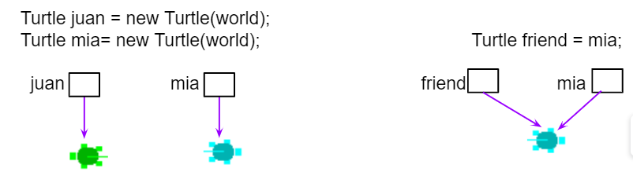

## Course Directory

### Return to the course outline

[← Back to AP CSA / 返回课程目录](../../index.html)

## Passing and Returning Object References

### Classes often interact through other objects

This topic keeps the textbook shift from single-class examples to interacting classes.

::: {.tight-list}
- one object can be stored inside another object
- one object reference can be passed into a method
- a method can also return an object reference
:::

That power creates both flexibility and risk.

## Objects as Instance Variables

### A class can have a has-a relationship with another class

Example from the textbook:

::: {.tight-list}
- a `Person` can have an `Address`
- the `Address` object has its own instance variables
- the `Person` class stores that object as part of its own state
:::

This is a has-a relationship.

## Objects as Arguments

### Java still uses call by value, but the copied value may be a reference

{fig-align="center" width="74%"}

::: {.tight-list}
- when an argument is an object reference, Java copies the reference
- it does not copy the whole object
- the parameter and argument can become aliases for the same object
:::

This is why object parameters behave differently from primitive parameters.

## Mutable vs Immutable

### Shared references matter only when the object can change

::: {.compare-grid}
::: {.soft-box}
**Immutable**

- examples include `String`
- methods do not change the original object
- sharing the reference is usually safe
:::
::: {.soft-box}
**Mutable**

- custom classes with setters are often mutable
- one reference can change the object's state
- all aliases see that changed state
:::
:::

The textbook's rule of thumb is not to modify mutable parameter objects unless the specification requires it.

## Copying Parameter Objects

### Copy when the class should not share outside state

When a constructor receives a mutable object, storing the original reference can cause surprising side effects.

::: {.tight-list}
- changing the original object later may also change the object's internal state
- one fix is to create a new object using values from the parameter object
- another fix is to use a copy constructor
:::

For AP CSA, this protects the instance variable from pointing at the caller's original mutable object.

## Same-Class Parameters

### A method can access private data of another object only when it is the same class type

The textbook makes this boundary explicit:

::: {.tight-list}
- `Person` methods can access private fields of another `Person` object
- they cannot directly access private fields of an `Address` object
- access still depends on the enclosing class type
:::

This is a precise rule that students often miss.

## Returning Objects

### Returning a reference shares access to the same object

If a method returns an object reference:

::: {.tight-list}
- the returned value is the reference, not a copied object
- the caller may now have another alias to the same object
- if the object is mutable, the caller may change it through that returned reference
:::

Returning objects is powerful, but it reintroduces the same mutability concern seen with parameters.

## Classroom Tasks

### Practice worth keeping

{fig-align="center" width="42%"}

Retained classroom work for this topic:

::: {.tight-list}
- identify has-a relationships between classes
- trace aliasing when object references are passed as arguments
- explain when a mutable object should be copied
- distinguish returning a reference from returning a copied object
- apply same-class private-access rules correctly
- 3.6.7 Coding Challenge: Friends and Birthdays
:::

## Classroom Check

### A complete answer should...

::: {.tight-list}
- explain that object arguments pass a copied reference, not a copied object
- define aliasing in the context of object references
- distinguish mutable from immutable objects
- explain why copying a parameter object can protect class state
- describe the risk of returning a mutable object reference directly
:::

## End

### Return to the course outline

[← Back to AP CSA / 返回课程目录](../../index.html)
