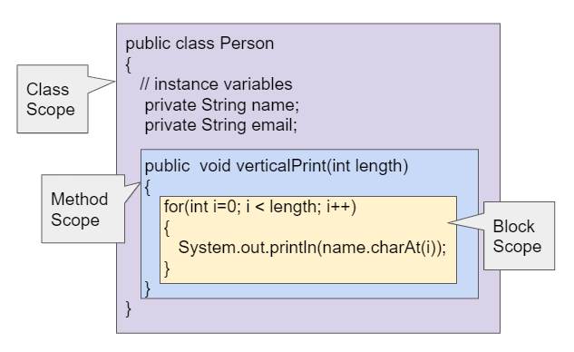

## Course Directory

### Return to the course outline

[← Back to AP CSA / 返回课程目录](../../index.html)

## Scope and Access

### Scope tells us where a variable exists and can be used

The textbook defines scope as where a variable is accessible.

When students declare a variable, the first check is:

::: {.tight-list}
- where was the variable declared?
- what is the closest enclosing pair of `{ }`?
:::

That boundary determines where the variable lives.

## Three Levels of Scope

### Java uses class, method, and block scope

{fig-align="center" width="78%"}

::: {.tight-list}
- class-level scope for instance variables
- method-level scope for local variables and parameters
- block-level scope for loop variables and inner-block variables
:::

## Class Scope vs Local Scope

### Instance variables live with the object; local variables live inside one method or block

::: {.compare-grid}
::: {.soft-box}
**Instance variables**

- declared in the class body
- available to methods in the class
- can be marked `public` or `private`
:::
::: {.soft-box}
**Local variables**

- declared in a method, constructor, or block
- only usable inside that region
- cannot be declared `public` or `private`
:::
:::

Parameters are also local variables.

## Local Variables

### Local variables exist only for the duration of that method or block

The textbook keeps two linked ideas:

::: {.tight-list}
- local variables are good for data used by only one method
- variables outside the scope do not merely become hidden; they do not exist there
- block variables such as loop counters disappear outside the block
:::

This is a frequent source of debugging errors.

## Name Shadowing

### The closer local name wins

If a local variable or parameter has the same name as an instance variable:

::: {.tight-list}
- the bare variable name refers to the local variable
- the instance variable is shadowed inside that method or constructor
- the next topic uses `this` to resolve that conflict clearly
:::

Students usually miss this when constructors use the same names as fields.

## Classroom Tasks

### Practice worth keeping

Retained classroom work for this topic:

::: {.tight-list}
- identify the scope of variables by reading braces and declarations
- distinguish class, method, and block scope
- classify parameters as local variables
- trace what happens when a local variable shadows an instance variable
- 3.8.3 Coding Challenge: Debugging
:::

## Classroom Check

### A strong answer should...

::: {.tight-list}
- define scope as where a variable can be accessed
- distinguish class-level, method-level, and block-level scope
- explain why parameters are local variables
- state that local variables cannot be `public` or `private`
- explain what happens when a local name shadows an instance variable
:::

## End

### Return to the course outline

[← Back to AP CSA / 返回课程目录](../../index.html)
