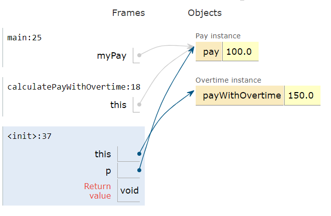

## Course Directory

### Return to the course outline

[← Back to AP CSA / 返回课程目录](../../index.html)

## this Keyword

### Current object

Within an instance method or a constructor, the keyword `this` acts as a special variable that holds a reference to the current object.

The current object is the object whose method or constructor is being called.

## Person Example

### `this` changes with the object

In the following class `Person`, when we create an object `p1` and call the constructor or `p1.setEmail()`, the word `this` refers to `p1`.

When we make the same method calls with object `p2`, `this` refers to `p2`.

The source Java visualizer direction is omitted; the trace task is retained.

## Coding Exercise

### `activecode:: PersonClassThis`

Observe the use of the keyword `this` in the code below.

Trace the memory and watch how `this` refers to different objects when the code is run.

## PersonClassThis Code

::: {.code-scroll}
```java
public class Person
{
    // instance variables
    private String name;
    private String email;
    private String phoneNumber;

    // constructor
    public Person(String name)
    {
        this.name = name;
    }

    // accessor methods - getters
    public String getName()
    {
        return this.name;
    }

    public String getEmail()
    {
        return this.email;
    }

    public String getPhoneNumber()
    {
        return this.phoneNumber;
    }

    // mutator methods - setters
    public void setName(String name)
    {
        this.name = name;
    }

    public void setEmail(String email)
    {
        this.email = email;
    }

    public void setPhoneNumber(String phoneNumber)
    {
        this.phoneNumber = phoneNumber;
    }

    public String toString()
    {
        return this.name + " " + this.email + " " + this.phoneNumber;
    }

    // main method for testing
    public static void main(String[] args)
    {
        Person p1 = new Person("Sana");
        System.out.println(p1);
        Person p2 = new Person("Jean");
        p2.setEmail("jean@gmail.com");
        p2.setPhoneNumber("404 899-9955");
        System.out.println(p2);
    }
}
```
:::

## Expected Output

### Runestone check

The expected output from `main` is:

```text
Sana null null
Jean jean@gmail.com 404 899-9955
```

Trace focus: in each constructor or setter call, `this` is the object receiving the call.

## Static Methods and this

### No current object in class methods

The `this` variable can only be used in instance methods and constructors.

Class methods cannot refer to `this` or instance variables because they are called with the class name, not an object.

Therefore, there is no `this` object in a class method.

## this.instanceVariable

### Distinguish same-name variables

The keyword `this` is sometimes used by programmers to distinguish between variables.

Programmers can give the parameter variables the same names as the instance variables.

`this` can distinguish them and avoid a naming conflict.

## Constructor Pattern

### Local parameter vs instance variable

Both the instance variable and the parameter variable are called `name` in the code below.

`name` on its own looks for the closest local variable, the parameter variable.

`this.name` refers to this object's instance variable.

```java
// instance variables
private String name;

// constructor
public Person(String name)
{
    // Set this object's instance variable name to the parameter variable name
    this.name = name;
}
```

## Note

### Source rule

`this.instanceVariable` can be used to distinguish between this object's instance variables and local parameter variables that may have the same variable names.

## this as an Argument

### Pass the current object

The `this` variable can be used anywhere you would use an object variable.

You can even pass it to another method as an argument.

Consider the classes `Pay` and `Overtime`.

The `Pay` class declares an `Overtime` object and passes in `this`, the current `Pay` object, to its constructor.

## this Trace {.image-fit}

### Same object reference

{fig-align="center" width="52%"}

The image shows how `this`, `myPay`, and `p` all refer to the same object in memory.

## Coding Exercise

### `activecode:: PayClassThis`

What does this code print out?

Trace through the code and notice how the `this` `Pay` object is passed to the `Overtime` constructor.

## PayClassThis Code

::: {.code-scroll}
```java
public class Pay
{
    private double pay;

    public Pay(double p)
    {
        pay = p;
    }

    public double getPay()
    {
        return pay;
    }

    public void calculatePayWithOvertime()
    {
        // this Pay object is passed to the Overtime constructor
        Overtime ot = new Overtime(this);
        pay = ot.getOvertimePay();
    }

    public static void main(String[] args)
    {
        Pay myPay = new Pay(100.0);
        myPay.calculatePayWithOvertime();
        System.out.println(myPay.getPay());
    }
}

class Overtime
{
    private double payWithOvertime;

    public Overtime(Pay p)
    {
        payWithOvertime = p.getPay() * 1.5;
    }

    public double getOvertimePay()
    {
        return payWithOvertime;
    }
}
```
:::

## Expected Output

### Runestone check

The expected output from `main` is:

```text
150.0
```

`myPay` starts with `100.0`, and the `Overtime` constructor uses that `Pay` object to calculate `100.0 * 1.5`.

## Quick Check

### `mchoice:: AP-this-arg`

The following code segment appears in a class other than `Pay` or `Overtime`.

```java
Pay one = new Pay(20.0);
one.calculatePayWithOvertime();
System.out.println(one.getPay());
```

What, if anything, is printed as a result of executing the code segment?

## Answer Choices

### Trace `this` as an argument

::: {.tight-list}
- A. `10.0`
- B. `15.0`
- C. `20.0`
- D. `30.0`
- E. Nothing is printed because the code will not compile.
:::

## Answer Reasoning

### Correct answer: D

The pay starts at `20.0`.

Then `calculatePayWithOvertime()` passes the current `Pay` object to the `Overtime` constructor.

The overtime calculation multiplies by `1.5`, so the printed value is:

```text
30.0
```

## Classroom Check

### A complete answer should include

::: {.tight-list}
- define `this` as a reference to the current object
- explain why `this` changes from `p1` to `p2` in the Person trace
- state that class methods cannot use `this`
- use `this.instanceVariable` to distinguish a field from a same-name parameter
- trace `Overtime ot = new Overtime(this)`
- answer the Pay quick check as `30.0`
:::

## End

### 3.9 Part 1 complete

Next: Bank Account challenge.
