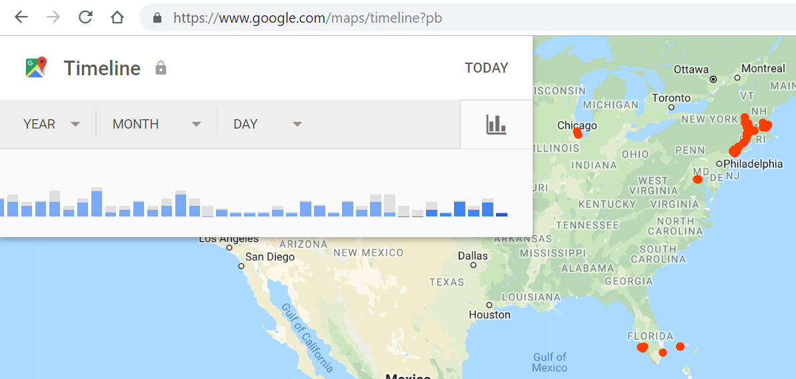

## Course Directory

### Return to the course outline

[← Back to AP CSA / 返回课程目录](../../index.html)

## Topic Intro

### Data collections affect people

Programs that collect, store, and analyze data can create value, but they can also create risk.

This topic focuses on:

::: {.tight-list}
- <span class="term">data privacy</span> (数据隐私)
- consent and transparency
- bias in collected data
- consequences of using incomplete or biased datasets
:::

## Data Privacy

### Location data can reveal patterns

{fig-align="center" width="50%"}

Even when a single data point seems harmless, a collection of data points can reveal habits, location history, relationships, and routines.

## Student Response

### Privacy tradeoff

Choose one app or system that collects user data.

Respond:

::: {.tight-list}
- What data is collected?
- What useful feature does the data support?
- What privacy risk could the same data create?
- What design choice could reduce the risk?
:::

## Data and Bias

### A dataset can overrepresent or underrepresent groups

<span class="term">Bias</span> (偏差) can enter a dataset when the data collection process does not represent the full population or situation.

Examples:

::: {.tight-list}
- training data collected from only one region
- survey responses from only one age group
- images that do not represent different lighting, devices, or users
:::

## Bias Response

### Connect data source to outcome

Prompt:

```text
If a school prediction tool is trained mostly on data from one type of school,
what problem might occur when it is used for a different type of school?
```

A strong answer connects dataset limits to a possible unfair or inaccurate prediction.

## Dataset Questions

### Questions before using data

::: {.tight-list}
- Who or what is represented in the data?
- Who or what is missing?
- How was the data collected?
- Was permission or consent involved?
- What harm could occur if predictions are wrong?
:::

These questions belong in design discussions before implementation.

## Classroom Check

### A complete answer should...

::: {.tight-list}
- explain why data privacy matters when programs collect data
- distinguish a useful data-driven feature from a privacy risk
- explain how biased datasets can lead to biased outcomes
- identify missing or underrepresented data as a design concern
- propose a concrete mitigation such as minimizing data, anonymizing data, or checking representation
:::

## End

### Return to the course outline

[← Back to AP CSA / 返回课程目录](../../index.html)
