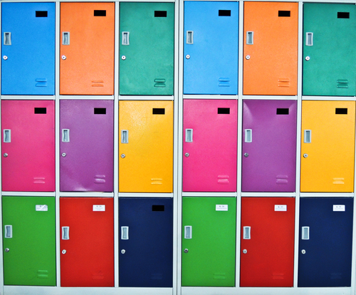
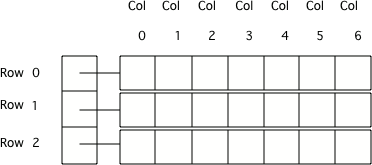
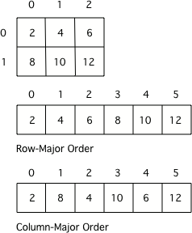

## Course Directory

### Return to the course outline

[← Back to AP CSA / 返回课程目录](../../index.html)

## Topic Intro

### 2D arrays organize data in rows and columns

{fig-align="center" width="42%"}

A <span class="term">2D array</span> (二维数组) is an array whose elements are arrays.

Use two indices:

```java
grid[row][col]
```

## Row and Column Model

### First index is row, second index is column

{fig-align="center" width="50%"}

```java
int[][] nums = new int[3][4];
```

This creates 3 rows and 4 columns.

## Array Storage

### Row-major view

{fig-align="center" width="48%"}

Java stores a 2D array as an array of row arrays. The first bracket chooses a row array.

## Declaring 2D Arrays

### Create with dimensions

```java
int[][] matrix = new int[2][3];
String[][] seats = new String[5][4];
```

For `matrix`, valid row indices are `0` and `1`; valid column indices are `0`, `1`, and `2`.

## Initializer Lists

### Fill rows explicitly

```java
int[][] grid =
{
    {1, 2, 3},
    {4, 5, 6}
};
```

`grid[0][0]` is `1`; `grid[1][2]` is `6`.

## Set Values

### Assign with row and column

```java
int[][] grid = new int[2][3];
grid[0][1] = 7;
grid[1][2] = 9;
```

Read the access as: row first, column second.

## Get Values

### Use two brackets

```java
int[][] grid =
{
    {1, 2, 3},
    {4, 5, 6}
};

System.out.println(grid[1][0]);
```

Output: `4`.

## Row and Column Length

### Rows and columns use different expressions

```java
int rows = grid.length;
int cols = grid[0].length;
```

For rectangular 2D arrays:

::: {.tight-list}
- `grid.length` gives number of rows
- `grid[row].length` gives number of columns in that row
:::

## Groupwork Coding Challenge

### ASCII Art

Use a 2D array of characters or strings to store an image pattern.

```java
String[][] art =
{
    {"*", " ", "*"},
    {" ", "*", " "},
    {"*", " ", "*"}
};
```

Access and modify specific row-column cells to change the design.

## Classroom Check

### A complete answer should...

::: {.tight-list}
- create a 2D array with row and column dimensions
- access values using `array[row][col]`
- distinguish row count from column count
- use initializer lists for small 2D arrays
- explain why row index comes before column index
:::

## End

### Return to the course outline

[← Back to AP CSA / 返回课程目录](../../index.html)
