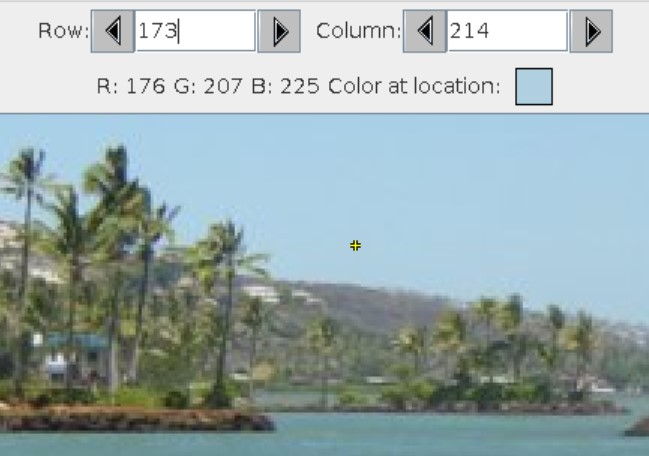
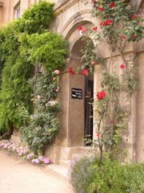

## Course Directory

### Return to the course outline

[← Back to AP CSA / 返回课程目录](../../index.html)

## 2D Array of Objects

### Pixels in images

Photographs and images are made up of a 2D array of **pixels**, which are tiny picture elements that color in the image.

For example, a pixel is shown at row `173` and column `214` of the image below.

## Pixel Example {.image-fit}



The color of a pixel is represented using the RGB model.

RGB stores values for red, green, and blue, each ranging from `0` to `255`.

## Pixel Class

### Represent a pixel in Java

In Java, we can write a `Pixel` class to represent a pixel in an image at a given x and y coordinate.

```java
public class Pixel
{
    private int x;
    private int y;
    /** Implementation not shown */
}
```

## Picture and Pixel Arrays

### `Picture` objects and `Pixel[][]`

The College Board Picture Lab contains a `Pixel` class and a `Picture` class.

The `Picture` constructor loads an image, and the `getPixels2D` method returns its 2D array of pixels.

```java
Picture pict = new Picture("beach.jpg");
// A 2D array of pixels
Pixel[][] pixels = pict.getPixels2D();
Pixel p = pixels[0][0]; // get the first pixel
int blue = p.getBlue(); // get its blue value
System.out.println("Pixel (0,0) has a blue value of " + blue);
p.setBlue(255);  // set its blue value to 255
```

## `zeroBlue` Method

### Traverse all Pixel objects

You can loop through all the `Pixel` objects in the two-dimensional array to modify the picture.

The following code is the `zeroBlue` method in the `Picture` class.

It uses nested loops to visit each pixel and sets all the blue values to `0`.

```java
public void zeroBlue()
{
    Pixel[][] pixels = this.getPixels2D();
    for (Pixel[] rowArray : pixels)
    {
        for (Pixel p : rowArray)
        {
            p.setBlue(0);
        }
    }
}
```

## Groupwork Coding Challenge

### Picture Lab

{.image-fit}

In this challenge, you will do a part of the Picture Lab to modify the pixels of a digital photo.

Scroll down to the bottom of the code and take a look at the `zeroBlue` method.

Run the code and watch what it does.

## Challenge Tasks

### `activecode:: challenge-picture`

1. Write a method called `keepOnlyBlue()` that visits every pixel and sets the red and green values to zero but does not change the blue values.
2. Write a method called `switchColors()` that swaps the red pixels with green pixels or blue pixels to change the colors around.

Use `getRed`, `getGreen`, `getBlue`, `setRed`, `setGreen`, and `setBlue`.

Datafile: `pictureClasses.jar`, `arch.jpg`.

## Picture Starter

::: {.code-scroll .compact style="max-height: 430px;"}
```java
import java.awt.*;
import java.awt.font.*;
import java.awt.geom.*;
import java.awt.image.BufferedImage;
import java.text.*;
import java.util.*;

/**
 * A class that represents a picture. This class inherits from SimplePicture and
 * allows the student to add functionality to the Picture class.
 *
 * @author Barbara Ericson ericson@cc.gatech.edu
 */
public class Picture extends SimplePicture
{
    ///////////////////// constructors //////////////////////////////////

    /** Constructor that takes no arguments */
    public Picture()
    {
        /* not needed but use it to show students the implicit call to super()
         * child constructors always call a parent constructor
         */
        super();
    }

    /**
     * Constructor that takes a file name and creates the picture
     *
     * @param fileName the name of the file to create the picture from
     */
    public Picture(String fileName)
    {
        // let the parent class handle this fileName
        super(fileName);
    }

    /**
     * Constructor that takes the height and width
     *
     * @param height the height of the desired picture
     * @param width the width of the desired picture
     */
    public Picture(int height, int width)
    {
        // let the parent class handle this width and height
        super(width, height);
    }

    /**
     * Constructor that takes a picture and creates a copy of that picture
     *
     * @param copyPicture the picture to copy
     */
    public Picture(Picture copyPicture)
    {
        // let the parent class do the copy
        super(copyPicture);
    }

    /**
     * Constructor that takes a buffered image
     *
     * @param image the buffered image to use
     */
    public Picture(BufferedImage image)
    {
        super(image);
    }

    ////////////////////// methods ///////////////////////////////////////

    /**
     * Method to return a string with information about this picture.
     *
     * @return a string with information about the picture such as fileName, height
     *     and width.
     */
    public String toString()
    {
        String output =
                "Picture, filename "
                        + getFileName()
                        + " height "
                        + getHeight()
                        + " width "
                        + getWidth();
        return output;
    }

    /** zeroBlue() method sets the blue values at all pixels to zero */
    public void zeroBlue()
    {
        Pixel[][] pixels = this.getPixels2D();

        for (Pixel[] rowArray : pixels)
        {
            for (Pixel p : rowArray)
            {
                p.setBlue(0);
            }
        }
    }

    /* Add new methods here.
       keepOnlyBlue() method sets the red and green values at all pixels to zero.
       switchColors() method switches colors, for example the red values with green values, etc.
    */

    /* Main method for testing
     */
    public static void main(String[] args)
    {
        Picture arch = new Picture("arch.jpg");
        arch.show();
        arch.zeroBlue();
        arch.show();

        // Uncomment the follow code to test your keepOnlyBlue method.
        /*
        Picture arch2 = new Picture("arch.jpg");
        System.out.println("Keep only blue: ");
        arch2.keepOnlyBlue();// using new method
        arch2.show();
        */
        System.out.println();

        // Uncomment the follow code to test your swithColors method.
        /*
        Picture arch3 = new Picture("arch.jpg");
        System.out.println("Switch colors: ");
        arch3.switchColors();// using new method
        arch3.show();
        */
    }
}
```
:::

## Picture Lab Test Targets

### `keepOnlyBlue`

The Runestone tests check that the code contains:

```java
public void keepOnlyBlue()
```

They also check that `keepOnlyBlue()` sets green pixels to `0`.

Target fragment:

```java
.setGreen(0);
```

## Picture Lab Test Targets

### Nested loops and `switchColors`

The Runestone tests check that the `keepOnlyBlue()` method contains 2 `for` loops.

They also check that the code contains:

```java
public void switchColors()
```

and that `switchColors()` uses:

```java
.getGreen()
```

## Additional Picture Lab Exercises

### Retained as optional follow-up tasks

Here are some more exercises from Picture Lab A5:

- Write a `negate` method to set each red value to `255 - current red`, each green value to `255 - current green`, and each blue value to `255 - current blue`.
- Write the `gray scale` method to turn the picture into shades of gray by setting red, green, and blue to the average of the current red, green, and blue values.

## Classroom Check

### A complete answer should include

- identify an image as a 2D array of `Pixel` objects
- use nested loops or nested enhanced `for` loops to visit every pixel
- call `getPixels2D()` before traversing the pixels
- use `setRed`, `setGreen`, and `setBlue` to modify color channels
- preserve the required `keepOnlyBlue()` and `switchColors()` method signatures

## End

### 4.12 Picture Lab Challenge

Next: Implementing 2D Array Algorithms.
