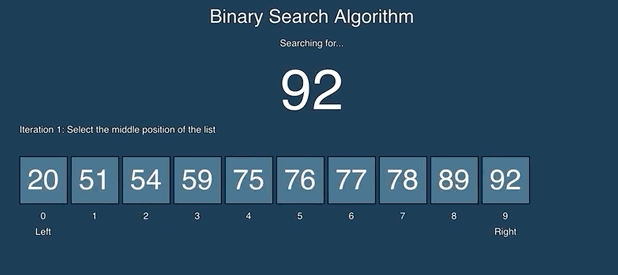

## Course Directory

### Return to the course outline

[← Back to AP CSA / 返回课程目录](../../index.html)

## Algorithm Idea

### Binary search halves a sorted search space

<span class="term">Binary search</span> requires sorted data.

{fig-align="center" width="46%"}

At each step, compare the target with the middle element, then discard half the remaining values.

## Full Code {.fit-small}

### Iterative binary search

```java
public static int binarySearch(int[] values, int target)
{
    int low = 0;
    int high = values.length - 1;

    while (low <= high)
    {
        int mid = (low + high) / 2;
        if (values[mid] == target)
        {
            return mid;
        }
        else if (values[mid] < target)
        {
            low = mid + 1;
        }
        else
        {
            high = mid - 1;
        }
    }
    return -1;
}
```

## Focused Trace

### Search sorted values for `15`

```java
int[] values = {2, 5, 8, 12, 15, 19, 24};
```

| Step | `low` | `high` | `mid` | `values[mid]` | action |
|---:|---:|---:|---:|---:|---|
| 1 | 0 | 6 | 3 | 12 | move `low` to 4 |
| 2 | 4 | 6 | 5 | 19 | move `high` to 4 |
| 3 | 4 | 4 | 4 | 15 | return 4 |

## Binary Search with Strings

### Use `compareTo`

```java
int comparison = words.get(mid).compareTo(target);
if (comparison == 0)
{
    return mid;
}
else if (comparison < 0)
{
    low = mid + 1;
}
else
{
    high = mid - 1;
}
```

For strings, sorted order is checked with `compareTo`.

## Quick Check

### Why sorted data matters

Binary search decides which half to discard based on the middle value.

If data is not sorted, discarding half can remove the target by mistake.

Class prompt: give a small unsorted array where binary search would make the wrong decision after the first comparison.

## Classroom Check

### A complete answer should...

::: {.tight-list}
- explain why binary search requires sorted data
- update `low` and `high` correctly
- compute and use the middle index
- trace how the search space shrinks
- use `compareTo` when binary searching strings
:::

## End

### Continue or return to the course outline

[Next: Search Runtimes](4-14-part-3-search-runtimes.html)  
[← Back to AP CSA / 返回课程目录](../../index.html)
