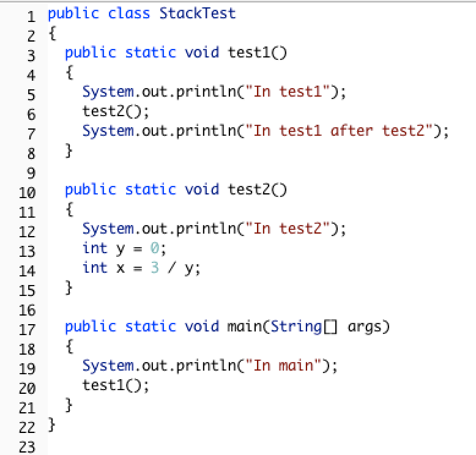
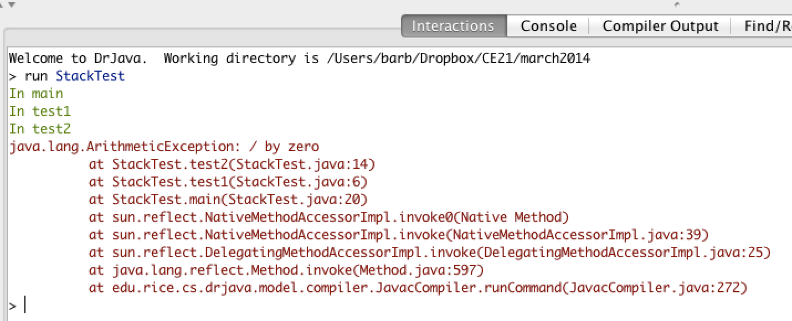
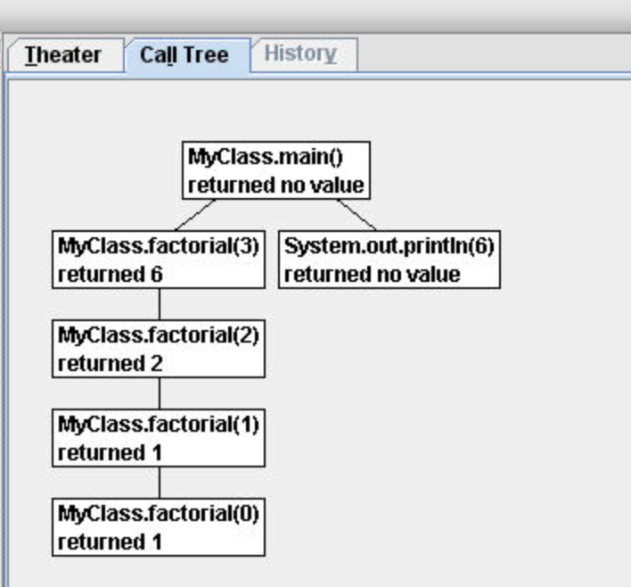

## Course Directory

### Return to the course outline

[← Back to AP CSA / 返回课程目录](../../index.html)

## Recursion

### Recursion is when a method calls itself

This topic defines recursion as another form of <span class="term">repetition</span>.

::: {.tight-list}
- a recursive method contains a call to the same method
- recursion without a stopping condition becomes <span class="term">infinite recursion</span>
- in practice, infinite recursion crashes with a stack error
:::

## Recursive Call and Base Case

### Every useful recursive method needs a stopping point

Retained core rule:

::: {.tight-list}
- a <span class="term">recursive call</span> solves a smaller version of the same problem
- a <span class="term">base case</span> returns an answer directly
- each recursive step must move closer to the base case
- this is the recursion version of loop progress
:::

## Why Use Recursion?

### Recursion is powerful when a problem breaks into similar smaller problems

{fig-align="center" width="50%"}

Retained uses:

::: {.tight-list}
- recursive structure appears in folders, trees, and self-similar graphics
- recursion can also traverse `String`s, arrays, and `ArrayList`s
- simple linear tasks can often be written iteratively instead
:::

## Factorial Method

### Factorial is the standard AP model for reading recursive flow

```java
public static int factorial(int n)
{
    if (n == 0)
        return 1;
    else
        return n * factorial(n - 1);
}
```

Students should retain:

::: {.tight-list}
- the base case is `n == 0`
- the recursive call uses `n - 1`
- the return value is built while the calls unwind
:::

## Base Case Reasoning

### A recursive method must know when it can answer directly

Retained base-case logic:

::: {.tight-list}
- factorial stops at the smallest legal case
- base cases are often guarded by an `if`
- if the method never reaches a base case, the recursion does not terminate
:::

## Call Stack Model

### Each recursive call gets its own frame and local variables

{fig-align="center" width="28%"}

{fig-align="center" width="46%"}

Retained model:

::: {.tight-list}
- the <span class="term">call stack</span> records active method calls
- each call has its own parameter values
- execution returns to the caller after the current call finishes
:::

## Reading Stack Behavior

### Runtime errors expose the order of active calls

{fig-align="center" width="72%"}

The retained reasoning is:

::: {.tight-list}
- the top of the stack is the most recent active call
- recursive calls accumulate on the stack
- stack information helps explain both recursion flow and failure points
:::

## Tracing Recursive Methods

### Write down each call, then substitute return values on the way back

{fig-align="center" width="34%"}

Retained AP tracing move:

::: {.tight-list}
- list `factorial(5)`, `factorial(4)`, `factorial(3)` ... down to the base case
- once the base case returns, substitute values back upward
- tracing is often the fastest way to answer exam questions about recursion
:::

## Classroom Tasks

### Practice worth keeping

Retained classroom work for this topic:

::: {.tight-list}
- identify whether a method is actually recursive
- locate the recursive call and the base case
- explain why each recursive step gets closer to termination
- trace factorial-style recursion using a call stack or call tree
- explain what information each recursive call frame stores
- <span class="term">4.16.6 Tracing Challenge: Recursion</span>
:::

## Classroom Check

### A complete answer should...

::: {.tight-list}
- define recursion as a method calling itself
- identify the purpose of a base case
- explain how recursive calls shrink the problem
- describe the role of the call stack in recursive execution
- trace a simple recursive method by following calls down and returns back up
:::

## End

### Return to the course outline

[← Back to AP CSA / 返回课程目录](../../index.html)
