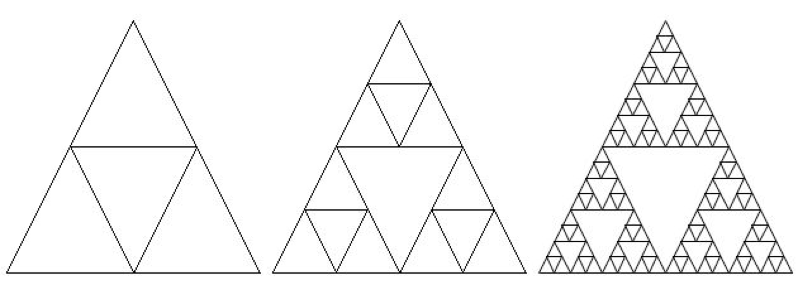

## Course Directory

### Return to the course outline

[← Back to AP CSA / 返回课程目录](../../index.html)

## Topic Intro

### Recursion is a method calling itself

<span class="term">Recursion</span> (递归) happens when a method calls itself to solve a smaller version of the same problem.

Every recursive method needs:

::: {.tight-list}
- a <span class="term">base case</span> that stops recursion
- a recursive call that moves toward the base case
:::

## Recursive Call

### The method appears inside its own body

```java
public static void countdown(int n)
{
    if (n == 0)
    {
        System.out.println("Blastoff");
    }
    else
    {
        System.out.println(n);
        countdown(n - 1);
    }
}
```

The call `countdown(n - 1)` solves a smaller problem.

## Base Case

### Stop before the calls continue forever

In `countdown`, the base case is:

```java
if (n == 0)
{
    System.out.println("Blastoff");
}
```

Without a base case, or without progress toward it, recursion can cause a stack overflow.

## Why Use Recursion?

### Some problems naturally split into smaller copies

{fig-align="center" width="42%"}

Recursive thinking is useful when a problem can be described as:

::: {.tight-list}
- solve a small case directly
- otherwise solve one or more smaller versions of the same problem
:::

## Quick Check

### Identify the base case

```java
public static int sumToN(int n)
{
    if (n == 1)
    {
        return 1;
    }
    return n + sumToN(n - 1);
}
```

Base case: `n == 1`.

## Classroom Check

### A complete answer should include

::: {.tight-list}
- define recursion as a method calling itself
- identify the base case in a recursive method
- identify the recursive call
- explain how the argument moves toward the base case
- explain why missing progress can cause infinite recursion
:::

## End

### Continue or return to the course outline

[Next: Factorial](4-16-part-2-factorial.html)  
[← Back to AP CSA / 返回课程目录](../../index.html)
