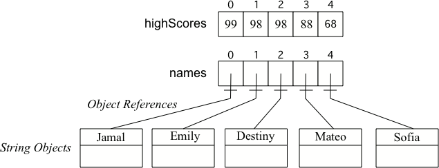
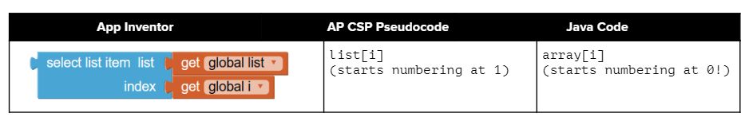

## Course Directory

### Return to the course outline

[← Back to AP CSA / 返回课程目录](../../index.html)

## Array Creation and Access

### Arrays store many related values under one name

Instead of writing `score1`, `score2`, `score3`, and so on, Java uses the array data structure.

::: {.tight-list}
- an <span class="term">array</span> stores elements of the <span class="mark">same type</span>
- the elements are accessed using an <span class="term">index</span>
- arrays are useful when there are many related values
:::

## Array Analogy

### Think of an array as a fixed row of lockers

{fig-align="center" width="74%"}

Each locker stores one value.  
The array name identifies the whole structure, and the index identifies one position.

## Declaring and Creating an Array

### Declaring the variable is not the same as creating the array object

```java
int[] scores;
scores = new int[5];
```

::: {.tight-list}
- `int[] scores` declares an array variable
- arrays in Java are <span class="term">objects</span>
- before creation, the variable can hold `null`
- `new` allocates memory for the array
:::

## Two Ways to Create Arrays

### Use `new` for size-first creation or use an initializer list for value-first creation

::: {.compare-grid}
::: {.soft-box}
**Using `new`**

```java
int[] scores = new int[5];
```

- size is specified directly
- elements begin with default values
:::
::: {.soft-box}
**Using an initializer list**

```java
int[] scores = {90, 85, 100, 77, 92};
```

- values are given immediately
- size is inferred from the list
:::
:::

## Length and Default Values

### Array size is fixed once the array is created

{fig-align="center" width="76%"}

::: {.tight-list}
- `arrayName.length` gives the number of elements
- the length cannot change after creation
- `new int[...]` uses default values like `0`
- reference-type arrays begin with `null` references
:::

## Access and Modify Values

### Use square brackets with a valid index

{fig-align="center" width="72%"}

```java
scores[0] = 95;
int first = scores[0];
```

Indices start at `0`, and the valid range is:

::: {.tight-list}
- `0`
- through `arrayName.length - 1`
:::

## Index Range and Parallel Arrays

### Array access depends on staying within bounds

{fig-align="center" width="74%"}

::: {.tight-list}
- an invalid index causes an <span class="term">ArrayIndexOutOfBoundsException</span>
- variables can be used as indices as long as they hold integers
- related information can be tracked in <span class="term">parallel arrays</span>
:::

Parallel arrays work only when the same index always refers to matching information.

## Classroom Tasks

### Practice worth keeping

Retained classroom work for this topic:

::: {.tight-list}
- declare an array variable and create it correctly
- compare `new` creation with initializer-list creation
- use `length` correctly
- access and modify array elements with valid indices
- explain default values and bounds errors
- <span class="term">4.3.6 Coding Challenge: Countries Array</span>
:::

## Classroom Check

### A complete answer should...

::: {.tight-list}
- define what an array stores
- distinguish declaring an array variable from creating an array object
- explain the two main ways to create an array
- state that indices start at `0`
- explain how to determine the valid index range with `length`
:::

## End

### Return to the course outline

[← Back to AP CSA / 返回课程目录](../../index.html)
