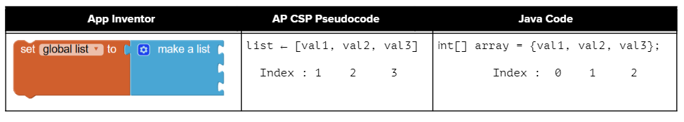

## Course Directory

### Return to the course outline

[← Back to AP CSA / 返回课程目录](../../index.html)

## Array Creation and Access

### Why arrays

To keep track of 10 exam scores, we could declare 10 separate variables: `int score1`, `int score2`, `int score3`, through `int score10`.

But what if we had 100 exam scores?

That would be a lot of variables.

Most programming languages have a simple **data structure** for a collection of related data that makes this easier.

In Java and many programming languages, this is called an **array**.

## Array Definition

### Same type, one name

An **array** is a block of memory that stores a collection of data items, called **elements**, of the same type under one name.

Arrays are useful whenever you have many elements of data of the same type that you want to keep track of, but you do not need to name each one.

Instead, you use the array name and a number, called an **index**, for the position of an item in the array.

You can make arrays of `int`, `double`, `String`, and even classes that you have written like `Student`.

## Row of Lockers {.image-fit}

### One value per place

{fig-align="center" width="48%"}

An array is like a row of small lockers, except that you cannot cram lots of stuff into it.

You can only store one value at each locker.

The source intro video is omitted; the locker analogy is retained.

## Array Index

### Location in the array

You can store a value in an array using an **index**, a location in the array.

An array index is like a locker number.

It helps you find a particular place to store and retrieve values.

You can get or store a value from or to an array using an index.

## Index Starts at 0 {.image-fit}

### Java arrays and App Inventor lists

{fig-align="center" width="74%"}

Arrays and lists in most programming languages start counting elements from `0`, so the first element in a Java array is at index `0`.

This is similar to how `String` objects are indexed in Java.

## Student Response

### `shortanswer:: arrayAnalogy`

Can you think of another example of something that is like an array, like a row of lockers?

Your example should include:

::: {.tight-list}
- many positions under one shared name
- one value or object per position
- a way to identify a position, like an index
:::

## Declaring an Array

### Type and square brackets

When we declare a variable, we specify its type and then the variable name.

To make a variable into an array, we put square brackets after the data type.

For example, `int[] scores` means we have an array called `scores` that contains `int` values.

```java
// Declaration for a single int variable
int score;
// Declaration for an array of ints
int[] scores;
```

## Array Variables Hold References

### Declaration does not create the array

The declarations do not create the array.

Arrays are **objects** in Java, so any variable that declares an array holds a reference to an object.

If the array has not been created yet and you try to print the value of the variable, it will print **null**, meaning it does not reference any object yet.

There are two ways to create an array:

::: {.tight-list}
- use the keyword `new` to get new memory
- use an **initializer list** to set up the values in the array
:::

## Using new to Create Arrays

### Type and size

To create an empty array after declaring the variable, use the **new** keyword with the type and the size of the array.

The size is the number of elements it can hold.

This will actually create the array in memory.

The size of an array is set at the time of creation and cannot be changed after that.

```java
// declare an array variable
int[] highScores;
// create the array
highScores = new int[5];
// declare and create array in 1 step
String[] names = new String[5];
```

## Quick Check

### `mchoice:: createarray`

Which of the following creates an array of 10 doubles called `prices`?

::: {.tight-list}
- A. `int[] prices = new int[10];`
- B. `double[] prices = new double[10];`
- C. `double[] prices;`
- D. `double[10] prices = new double[];`
:::

Correct answer: **B**.

## Coding Exercise

### `activecode:: arrayex1`

In the following code, add another two more array declarations:

::: {.tight-list}
- one that creates an array of 5 doubles called `prices`
- another that creates an array of 5 Strings called `names`
:::

Then add `System.out.println` calls to print their lengths.

## arrayex1 Starter

```java
public class Test1
{
    public static void main(String[] args)
    {
        // Array example
        int[] highScores = new int[10];
        // Add an array of 5 doubles called prices.

        // Add an array of 5 Strings called names.

        System.out.println(
                "Array highScores declared with size " + highScores.length);
        // Print out the length of the new arrays
    }
}
```

## Test Targets

### Runestone checks

The tests check that the code contains:

::: {.tight-list}
- `new double[5];`
- `new String[5];`
:::

The classroom task also asks students to print the lengths of the new arrays.

## Default Values {.image-fit}

### Elements after `new`

Array elements are initialized to default values:

::: {.tight-list}
- `0` for elements of type `int`
- `0.0` for elements of type `double`
- `false` for elements of type `boolean`
- `null` for elements of type `String`
:::

{fig-align="center" width="42%"}

## Initializer Lists

### Create and fill at the same time

Another way to create an array is to use an **initializer list**.

You can initialize the values in the array to a list of values in curly braces when you create it.

In this case you do not specify the size of the array; it is determined from the number of values you specify.

```java
int[] highScores = {99, 98, 98, 88, 68};
String[] names = {"Jamal", "Emily", "Destiny", "Mateo", "Sofia"};
```

## Primitive and Object Arrays {.image-fit}

### Values vs object references

{fig-align="center" width="58%"}

When you create an array of a **primitive type** with initial values specified, space is allocated for the specified number of items of that type and the values in the array are set.

When you create an array of an **object type** like `String`, space is set aside for that number of object references.

## Array length

### Public final instance variable

Arrays know their **length**, how many elements they can store.

The length of an array is established at the time of creation and cannot be changed.

The length can be accessed through the `length` attribute, a public final instance variable.

Use dot-notation:

```java
arrayName.length
```

## Coding Exercise

### `activecode:: arrayex2`

Try running the code below to see the length.

Try adding another value to the `highScores` initializer list and run again to see the length value change.

```java
public class Test2
{
    public static void main(String[] args)
    {
        int[] highScores = {99, 98, 98, 88, 68};
        System.out.println(highScores.length);
    }
}
```

## arrayex2 Test Targets

### Runestone checks

After students add another value to the initializer list, the expected output is:

```text
6
```

The test also checks that the original code has been changed.

## length Note

### No parentheses

`length` is an instance variable and not a method, unlike the `String` `length()` method.

So you do not add parentheses after `length`.

However, if you use parentheses after `length` during the AP exam, you will not lose any points.

The `length` instance variable is declared as `public final int`.

`public` means you can access it and `final` means the value cannot change.

## Quick Check

### `mchoice:: qarrayLength`

Which index is for the last element of an array called `highScores`?

::: {.tight-list}
- A. `highScores.length`
- B. `highScores.length - 1`
:::

Correct answer: **B**.

Since the first element in an array is at index `0`, the last element is the length minus `1`.

## Classroom Check

### A complete answer should include

::: {.tight-list}
- define an array as same-type elements stored under one name
- explain why array indices start at `0`
- declare an array variable with brackets after the type
- distinguish declaring an array variable from creating an array object
- create arrays with `new` and with initializer lists
- use `arrayName.length` and identify the last index as `length - 1`
:::

## End

### 4.3 Part 1 complete

Next: access and modify array values.
